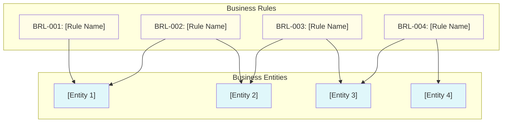

## Business Requirements and Rules

### Business Objectives

#### BO-001: [Business Objective Title]

- **Objective Name**: [full objective name]
- **Description**: [detailed description of the business objective, background, and expected business outcome]
- **Stakeholders**: [primary stakeholders and their interests]
- **Success Metrics**: [reference to metrics defined in Overall Description, e.g., metric-1, metric-2]
- **Priority**: [critical/high/medium/low]
- **Target Date**: [expected achievement timeframe]

#### BO-002: [Business Objective Title]

- **Objective Name**: [full objective name]
- **Description**: [detailed description of the business objective and expected outcome]
- **Stakeholders**: [primary stakeholders and their interests]
- **Success Metrics**: [reference to metrics defined in Overall Description, e.g., metric-3, metric-4]
- **Priority**: [critical/high/medium/low]
- **Target Date**: [expected achievement timeframe]

---

### Business Requirements

#### BR-001: [Business Requirement Title]

- **Requirement Name**: [full requirement name]
- **Description**: [detailed description of what the business needs]
- **Rationale**: [why this requirement is needed from business perspective]
- **Related Business Objective**: [BO-XXX]
- **Stakeholders**: [stakeholder roles affected by this requirement]
- **Priority**: [critical/high/medium/low]
- **Acceptance Criteria**:
    1. [business-level acceptance criterion 1]
    2. [business-level acceptance criterion 2]
    3. [business-level acceptance criterion 3]
- **Dependencies**: [BR-XXX, external dependency description]
- **Constraints**: [business constraints or limitations]

#### BR-002: [Business Requirement Title]

- **Requirement Name**: [full requirement name]
- **Description**: [detailed description of what the business needs]
- **Rationale**: [why this requirement is needed from business perspective]
- **Related Business Objective**: [BO-XXX]
- **Stakeholders**: [stakeholder roles affected by this requirement]
- **Priority**: [critical/high/medium/low]
- **Acceptance Criteria**:
    1. [business-level acceptance criterion 1]
    2. [business-level acceptance criterion 2]
- **Dependencies**: [BR-XXX]
- **Constraints**: [business constraints or limitations]

---

### Business Rules

#### Business Rules Diagram

#### Business Rule Specifications

##### BRL-001: [Business Rule Title]

- **Rule Name**: [full rule name]
- **Rule ID**: BRL-001
- **Description**: [detailed description of the rule, what it enforces, and why it exists]
- **Type**: [constraint/derivation/inference/state transition/dependency]
- **Priority**: [critical/high/medium/low]
- **Scope**: [where this rule applies - entity, process, or system-wide]
- **Trigger Condition**: [when or under what circumstances this rule is evaluated]
- **Rule Logic**: [the specific logic or formula, if applicable]
- **Action**: [what must happen when rule is triggered]
- **Related Business Requirement**: [BR-XXX]
- **Affected Entities**: [entity 1, entity 2]
- **Source**: [source of authority for this rule - regulation, policy, domain expert]
- **Exceptions**: [conditions under which rule may not apply]

##### BRL-002: [Business Rule Title]

- **Rule Name**: [full rule name]
- **Rule ID**: BRL-002
- **Description**: [detailed description of the rule]
- **Type**: [constraint/derivation/inference/state transition/dependency]
- **Priority**: [critical/high/medium/low]
- **Scope**: [where this rule applies]
- **Trigger Condition**: [when or under what circumstances this rule is evaluated]
- **Rule Logic**: [the specific logic or formula]
- **Action**: [what must happen when rule is triggered]
- **Related Business Requirement**: [BR-XXX]
- **Affected Entities**: [entity 1, entity 2]
- **Source**: [source of authority for this rule]
- **Exceptions**: [conditions under which rule may not apply]

##### BRL-003: [Business Rule Title]

- **Rule Name**: [full rule name]
- **Rule ID**: BRL-003
- **Description**: [detailed description of the rule]
- **Type**: [constraint/derivation/inference/state transition/dependency]
- **Priority**: [critical/high/medium/low]
- **Scope**: [where this rule applies]
- **Trigger Condition**: [when or under what circumstances this rule is evaluated]
- **Rule Logic**: [the specific logic or formula]
- **Action**: [what must happen when rule is triggered]
- **Related Business Requirement**: [BR-XXX]
- **Affected Entities**: [entity 1]
- **Source**: [source of authority for this rule]
- **Exceptions**: [none/conditions under which rule may not apply]

---

### Business Objectives Summary

| Objective ID | Objective Name | Priority | Target Date | Related Business Requirements |
|-------------|----------------|----------|-------------|------------------------------|
| BO-001 | [name] | critical | [date/quarter] | BR-001, BR-002, BR-003 |
| BO-002 | [name] | high | [date/quarter] | BR-004, BR-005 |
| BO-003 | [name] | medium | [date/quarter] | BR-006 |

**Total**: [X] business objectives driving [Y] business requirements.

---

### Business Requirements Traceability Matrix

| Requirement ID | Requirement Name | Priority | Related Business Objective | Related Business Rules | Related Use Cases |
|----------------|------------------|----------|---------------------------|------------------------|-------------------|
| BR-001 | [name] | critical | BO-001 | BRL-001, BRL-002 | UC-XXX-001, UC-XXX-002 |
| BR-002 | [name] | high | BO-001 | BRL-003 | UC-XXX-003 |
| BR-003 | [name] | high | BO-001, BO-002 | BRL-001, BRL-004 | UC-XXX-004 |
| BR-004 | [name] | medium | BO-002 | BRL-005 | UC-XXX-005 |

**Total**: [X] business requirements, enforced by [Y] business rules, realized through [Z] use cases.

---

### Business Rules Summary

| Rule ID | Rule Name | Type | Priority | Related Business Requirements | Affected Entities |
|---------|-----------|------|----------|------------------------------|-------------------|
| BRL-001 | [name] | constraint | critical | BR-001, BR-003 | [entity 1, entity 2] |
| BRL-002 | [name] | state transition | high | BR-001 | [entity 1] |
| BRL-003 | [name] | dependency | high | BR-002 | [entity 2, entity 3] |
| BRL-004 | [name] | derivation | medium | BR-003 | [entity 3] |

**Total**: [X] business rules governing [Y] business entities.
