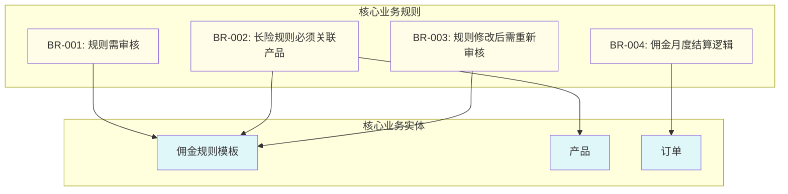

## Business Requirements and Rules (业务需求和规则)

### Business Objectives (业务目标)

*在这里简要概述项目的核心业务目标，它们是驱动所有后续需求的根本原因。*

#### **BO-01: [业务目标1的简明标题，例如：降低财务风险]**

- **描述 (Description)**: [详细阐述这个业务目标的具体内容、背景和期望达成的业务状态。例如：通过将佣金结算模式从“日结”调整为“月结”，减少公司的现金流压力，并避免因保单状态延迟更新导致的佣金错发风险。]
- **衡量指标 (Metrics)**: [关联到 `Overall Description` 中的成功指标ID，例如：关联 `metric-1`, `metric-2`]
- **优先级 (Priority)**: [例如：关键 (Critical) / 高 (High) / 中 (Medium) / 低 (Low)]

#### **BO-02: [业务目标2的简明标题，例如：提升运营效率]**

- **描述 (Description)**: [详细阐述这个业务目标的具体内容。例如：通过提供一个灵活的后台配置功能，使运营人员能够自主、快速地调整不同产品的佣金生效日规则，而无需开发人员介入。]
- **衡量指标 (Metrics)**: [关联到 `Overall Description` 中的成功指标ID，例如：关联 `metric-3`]
- **优先级 (Priority)**: [例如：高 (High)]

### Key Business Rules (关键业务规则)

*本节定义了独立于任何特定功能、必须在整个系统中得到遵守的核心业务策略、约束和逻辑。它们是系统的“法律”。*

#### Business Rules Diagram (业务规则总览图)

*此图用于可视化展示核心业务规则之间的关系，以及它们作用于哪些核心业务实体上。*

#### Business Rule Specifications (业务规则规格说明)

##### **BR-001**

- **规则名称**: 规则需审核
- **描述 (Description)**: 任何佣金生效日规则模板（无论是新建还是修改后）都必须经过审核流程，且只有在审核通过后才能变为“待生效”或“有效”状态。
- **类型 (Type)**: 约束 (Constraint)
- **触发条件 (Condition)**: 当一个规则被保存或修改时。
- **执行动作 (Action)**: 规则的审核状态必须被置为“待送审”或“待审核”。
- **来源 (Source)**: [例如：财务合规政策]

##### **BR-002**

- **规则名称**: 长险规则必须关联产品
- **描述 (Description)**: 对于业务类型为“长险”的佣金规则模板，即使已审核通过，也必须至少关联一个产品（Ware ID），该规则才对该产品实际生效。
- **类型 (Type)**: 依赖 (Dependency)
- **触发条件 (Condition)**: 当系统需要为一份长险保单计算佣金生效日时。
- **执行动作 (Action)**: 系统必须查找该保单对应产品所关联的、有效的佣金规则。如果找不到，则应用默认规则或报错。
- **来源 (Source)**: [例如：运营管理规定]

##### **BR-003**

- **规则名称**: 规则修改后需重新审核
- **描述 (Description)**: 一旦一个已经审核通过的规则被修改，其自身以及所有与之关联的产品的审核状态都将重置，需要重新发起审核流程。
- **类型 (Type)**: 状态流转 (State Transition)
- **触发条件 (Condition)**: 当用户修改一个“审核通过”的规则并保存时。
- **执行动作 (Action)**: 1. 规则的审核状态变为“待送审”。 2. 所有已关联的产品的审核状态变为“待送审”。
- **来源 (Source)**: [例如：风险控制要求]

---
