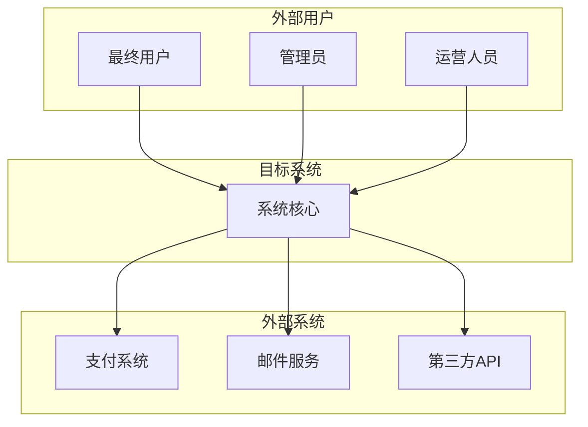

## Overall Description (整体描述)

### Project background and Purpose (项目背景与目标)**: [简述本项目的背景、商业目标和要解决的核心问题]

#### Project background

#### Project Purpose

### Feature Positioning

#### position-1
对于 [目标用户群体]，他们遇到 [具体问题/需求]，我们的 [功能名称] 是一个 [功能类别]，它能够 [核心价值/解决方案]，不同于 [竞争对手/替代方案]，我们的优势在于 [独特差异化价值]。

#### position-2
...

### Scope and Metrics
**Scope Overview (范围概述)**: [用一两段话高度概括系统的核心功能和边界]

#### System Scope and Context (系统范围与上下文)
**System Context Diagram (系统上下文图)**:

**Boundary Definition (边界定义)**:

- **In Scope (系统包含)**:
    - [功能1]: [简要描述]
    - [功能2]: [简要描述]

- **Out of Scope (系统不包含)**:
    - [排除功能1]: [排除原因]
    - [排除功能2]: [排除原因]

**Major External Interfaces (主要外部接口)**:

- [外部系统1]: [接口描述和交互方式]
- [外部系统2]: [接口描述和交互方式]

#### Success Metrics

- metric-1
    - Name 
    - base value
    - target value
    - time boundry
    - data source <!-- how to get and verify data -->
    - owner

- metric-2
...

#### Operating Environment (操作环境)

**User Environment (用户环境)**:

- **目标用户特征**: [用户群体描述]
- **使用场景**: [主要使用场景]
- **设备偏好**: [PC、移动设备、平板等]

**System Environment (系统环境)**:

- **操作系统**: [支持的操作系统]
- **浏览器兼容性**: [支持的浏览器版本]
- **部署平台**: [云服务商、私有化部署等]

