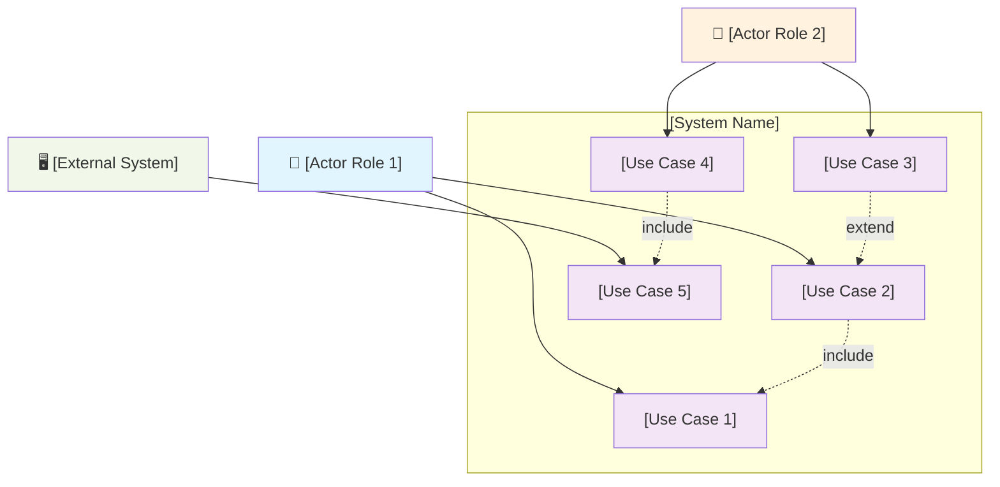

## Use Cases

### Use Case Diagram

### Use Case Specifications

#### UC-[CATEGORY]-001: [Use Case Title]

- **Use Case Name**: [full use case name]
- **Use Case ID**: UC-[CATEGORY]-001
- **Primary Actor**: [actor role]
- **Secondary Actors**: [other actor roles, if any]
- **Stakeholders**: [stakeholder roles and their interests]
- **Description**: [brief description of what this use case accomplishes]
- **Priority**: [critical/high/medium/low]
- **Complexity**: [high/medium/low]
- **Related Business Objective**: [BO-XXX]
- **Trigger**: [what initiates this use case]
- **Preconditions**:
    1. [precondition 1]
    2. [precondition 2]
    3. [precondition 3]
- **Main Success Scenario**:
    1. [actor action step 1]
    2. [system response step 2]
    3. [actor action step 3]
    4. [system response step 4]
    5. [system response step 5]
    6. [final step]
- **Extensions/Alternative Flows**:
    - **E1: [Exception Name]** - At step [X], if [condition], then [system behavior]. [Flow may return to step Y or terminate]
    - **E2: [Exception Name]** - At step [X], if [condition], then [system behavior]. [Flow may return to step Y or terminate]
    - **A1: [Alternative Path Name]** - At step [X], [actor] may choose to [alternative action]. Then [alternative flow description]
- **Postconditions**:
    - **Success**: [state of system after successful completion]
    - **Failure**: [state of system after failure]
- **Special Requirements**:
    - [non-functional requirement 1, reference NFR-XXX-XXX]
    - [non-functional requirement 2, reference NFR-XXX-XXX]
- **Relationships**:
    - **Includes**: [UC-XXX-XXX]
    - **Extends**: [UC-XXX-XXX]
    - **Generalizes**: [UC-XXX-XXX]
- **Open Issues**: [any unresolved questions or TBD items]

---

#### UC-[CATEGORY]-002: [Use Case Title]

- **Use Case Name**: [full use case name]
- **Use Case ID**: UC-[CATEGORY]-002
- **Primary Actor**: [actor role]
- **Secondary Actors**: [other actor roles, if any]
- **Stakeholders**: [stakeholder roles and their interests]
- **Description**: [brief description of what this use case accomplishes]
- **Priority**: [critical/high/medium/low]
- **Complexity**: [high/medium/low]
- **Related Business Objective**: [BO-XXX]
- **Trigger**: [what initiates this use case]
- **Preconditions**:
    1. [precondition 1]
    2. [precondition 2]
- **Main Success Scenario**:
    1. [actor action step 1]
    2. [system response step 2]
    3. [actor action step 3]
    4. [system response step 4]
    5. [final step]
- **Extensions/Alternative Flows**:
    - **E1: [Exception Name]** - At step [X], if [condition], then [system behavior]
    - **A1: [Alternative Path Name]** - At step [X], [actor] may choose to [alternative action]
- **Postconditions**:
    - **Success**: [state of system after successful completion]
    - **Failure**: [state of system after failure]
- **Special Requirements**:
    - [non-functional requirement, reference NFR-XXX-XXX]
- **Relationships**:
    - **Includes**: [UC-XXX-XXX]
- **Open Issues**: [any unresolved questions or TBD items]

---

### Use Case Summary Table

| Use Case ID | Use Case Name | Primary Actor | Priority | Complexity | Related Business Objective |
|-------------|---------------|---------------|----------|------------|---------------------------|
| UC-XXX-001 | [name] | [actor] | high | medium | BO-001 |
| UC-XXX-002 | [name] | [actor] | critical | high | BO-001, BO-002 |
| UC-XXX-003 | [name] | [actor] | medium | low | BO-003 |
| UC-XXX-004 | [name] | [actor] | high | medium | BO-002 |

**Total**: [X] use cases, covering [Y] primary actors and [Z] business objectives.

---

### Use Case Traceability Matrix

| Use Case ID | Related Business Objectives | Related Functional Requirements | Related NFRs |
|-------------|----------------------------|--------------------------------|--------------|
| UC-XXX-001 | BO-001 | FR-XXX-001, FR-XXX-002 | NFR-SEC-001, NFR-PERF-001 |
| UC-XXX-002 | BO-001, BO-002 | FR-XXX-003, FR-XXX-004 | NFR-PERF-002 |
| UC-XXX-003 | BO-003 | FR-XXX-005 | NFR-USE-001 |
| UC-XXX-004 | BO-002 | FR-XXX-006, FR-XXX-007 | NFR-SEC-002, NFR-REL-001 |

---

### Use Case Relationships

| Use Case ID | Includes | Extended By | Generalizes | Specialized By |
|-------------|----------|-------------|-------------|----------------|
| UC-XXX-001 | none | UC-XXX-003 | none | none |
| UC-XXX-002 | UC-XXX-001 | none | none | none |
| UC-XXX-003 | UC-XXX-001 | none | none | UC-XXX-005 |
| UC-XXX-004 | UC-XXX-006 | none | UC-XXX-007 | none |
