## Use Cases

### Use Case Diagram

```mermaid
graph TD
    Actor1["👤 [Actor Role 1]"]
    Actor2["👤 [Actor Role 2]"]
    System["🖥️ [External System]"]

    subgraph "[System Name]"
        UC1["[Use Case 1]"]
        UC2["[Use Case 2]"]
        UC3["[Use Case 3]"]
        UC4["[Use Case 4]"]
        UC5["[Use Case 5]"]
    end

    Actor1 --> UC1
    Actor1 --> UC2
    Actor2 --> UC3
    Actor2 --> UC4
    System --> UC5

    UC2 -.->|include| UC1
    UC3 -.->|extend| UC2
    UC4 -.->|include| UC5

    style Actor1 fill:#e1f5fe
    style Actor2 fill:#fff3e0
    style System fill:#f1f8e9
    style UC1 fill:#f3e5f5
    style UC2 fill:#f3e5f5
    style UC3 fill:#f3e5f5
    style UC4 fill:#f3e5f5
    style UC5 fill:#f3e5f5
```

### Use Case Specifications

#### UC-[CATEGORY]-001: [Use Case Title]

- **Use Case Name**: [full use case name]
- **Use Case ID**: UC-[CATEGORY]-001
- **Primary Actor**: [actor role]
- **Secondary Actors**: [other actor roles, if any]
- **Stakeholders**: [stakeholder roles and their interests]
- **Description**: [brief description of what this use case accomplishes]
- **Priority**: [critical/high/medium/low]
- **Complexity**: [high/medium/low]
- **Related Business Objective**: [BO-XXX]
- **Trigger**: [what initiates this use case]
- **Preconditions**:
    1. [precondition 1]
    2. [precondition 2]
    3. [precondition 3]
- **Main Success Scenario**:
    1. [actor action step 1]
    2. [system response step 2]
    3. [actor action step 3]
    4. [system response step 4]
    5. [system response step 5]
    6. [final step]
- **Extensions/Alternative Flows**:
    - **E1: [Exception Name]** - At step [X], if [condition], then [system behavior]. [Flow may return to step Y or terminate]
    - **E2: [Exception Name]** - At step [X], if [condition], then [system behavior]. [Flow may return to step Y or terminate]
    - **A1: [Alternative Path Name]** - At step [X], [actor] may choose to [alternative action]. Then [alternative flow description]
- **Postconditions**:
    - **Success**: [state of system after successful completion]
    - **Failure**: [state of system after failure]
- **Special Requirements**:
    - [describe non-functional requirement 1 in natural language, e.g., "Response time must be under 2 seconds"]
    - [describe non-functional requirement 2 in natural language, e.g., "Data must be encrypted at rest"]
- **Relationships**:
    - **Includes**: [UC-XXX-XXX]
    - **Extends**: [UC-XXX-XXX]
    - **Generalizes**: [UC-XXX-XXX]
- **Open Issues**: [any unresolved questions or TBD items]

---

#### UC-[CATEGORY]-002: [Use Case Title]

- **Use Case Name**: [full use case name]
- **Use Case ID**: UC-[CATEGORY]-002
- **Primary Actor**: [actor role]
- **Secondary Actors**: [other actor roles, if any]
- **Stakeholders**: [stakeholder roles and their interests]
- **Description**: [brief description of what this use case accomplishes]
- **Priority**: [critical/high/medium/low]
- **Complexity**: [high/medium/low]
- **Related Business Objective**: [BO-XXX]
- **Trigger**: [what initiates this use case]
- **Preconditions**:
    1. [precondition 1]
    2. [precondition 2]
- **Main Success Scenario**:
    1. [actor action step 1]
    2. [system response step 2]
    3. [actor action step 3]
    4. [system response step 4]
    5. [final step]
- **Extensions/Alternative Flows**:
    - **E1: [Exception Name]** - At step [X], if [condition], then [system behavior]
    - **A1: [Alternative Path Name]** - At step [X], [actor] may choose to [alternative action]
- **Postconditions**:
    - **Success**: [state of system after successful completion]
    - **Failure**: [state of system after failure]
- **Special Requirements**:
    - [describe non-functional requirement in natural language]
- **Relationships**:
    - **Includes**: [UC-XXX-XXX]
- **Open Issues**: [any unresolved questions or TBD items]

---

### Use Case Summary Table

| Use Case ID | Use Case Name | Primary Actor | Priority | Complexity | Related Business Objective |
|-------------|---------------|---------------|----------|------------|---------------------------|
| UC-XXX-001 | [name] | [actor] | high | medium | BO-001 |
| UC-XXX-002 | [name] | [actor] | critical | high | BO-001, BO-002 |
| UC-XXX-003 | [name] | [actor] | medium | low | BO-003 |
| UC-XXX-004 | [name] | [actor] | high | medium | BO-002 |

**Total**: [X] use cases, covering [Y] primary actors and [Z] business objectives.

---

### Use Case Traceability Matrix

| Use Case ID | Related Business Objectives | Complexity | Priority |
|-------------|----------------------------|------------|----------|
| UC-XXX-001 | BO-001 | medium | high |
| UC-XXX-002 | BO-001, BO-002 | high | critical |
| UC-XXX-003 | BO-003 | low | medium |
| UC-XXX-004 | BO-002 | medium | high |

---

### Use Case Relationships

| Use Case ID | Includes | Extended By | Generalizes | Specialized By |
|-------------|----------|-------------|-------------|----------------|
| UC-XXX-001 | none | UC-XXX-003 | none | none |
| UC-XXX-002 | UC-XXX-001 | none | none | none |
| UC-XXX-003 | UC-XXX-001 | none | none | UC-XXX-005 |
| UC-XXX-004 | UC-XXX-006 | none | UC-XXX-007 | none |
