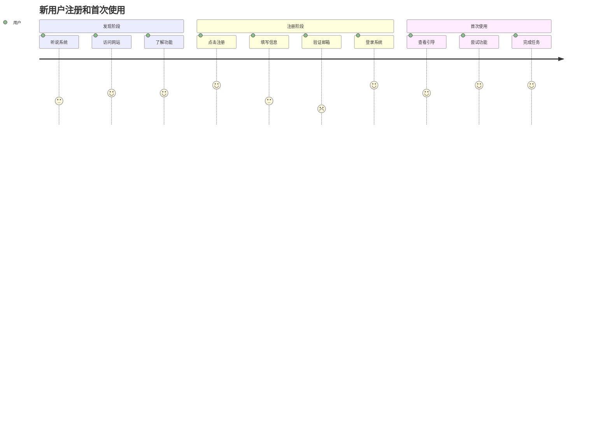

## User Journeys

### 用户角色定义
#### 主要用户 - 普通用户
- **背景**: 需要使用系统完成日常工作的员工
- **技能水平**: 中等计算机操作技能
- **目标**: 高效完成工作任务，减少操作复杂度
- **痛点**: 系统复杂、响应慢、操作繁琐

### 用户旅程
#### 用户注册和首次使用旅程

**旅程图**

**Journey Description (旅程描述)**:
[对上述用户旅程的关键阶段和用户情绪（如果适用）进行简要文字说明，并可链接到对应的用户故事和/或用例。例如：注册账号阶段对应 UC-002。]

**用户痛点与机会**
[对上述用户旅程中用户情绪值较低的部分进行阐述，同时指出提升的机会。并可链接到对应的用户故事和/或用例。 ]

#### 用户浏览、挑选并购买商品旅程
...

---
