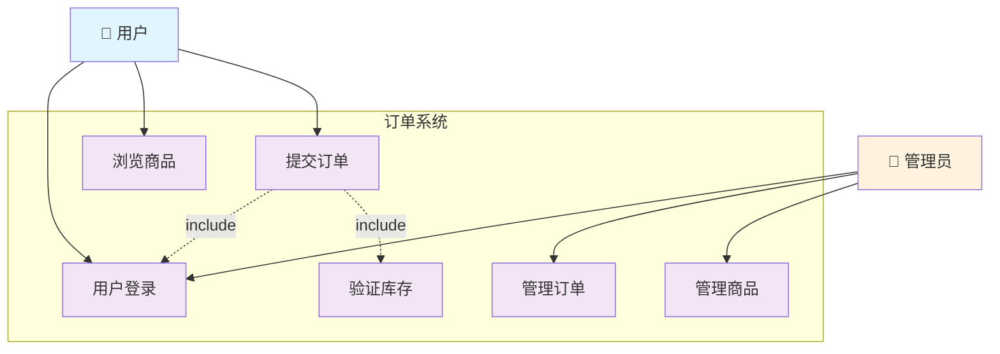

## User Stories and use-cases

### User Stories

#### **US-REGISTER-001**
- **name**: 用户注册账户
- **作为**: 新用户
- **我希望**: 快速注册账户
- **以便**: 开始使用系统功能
- **验收标准**:
    - 注册流程不超过3个步骤
    - 5分钟内完成整个注册过程
    - 有清晰的进度提示

#### **US-LOGIN-001**
- **name**: 用户登录
- **作为**: 已注册用户
- **我希望**: 快速登录账户
- **以便**: 开始使用系统功能
- **验收标准**:
    - 登录流程不超过2个步骤
    - 1分钟内完成整个登录过程
    - 确保是我本人登录

### Use-Cases（用例）

#### Use-Case Diagram (用例总览图)

#### Use-Case Specifications (用例规格说明)

##### **UC-ORDER-001**
- **用例名称**: 提交订单
- **参与者 (Actor)**: 用户 (User)
- **描述 (Description)**: 用户将购物车中的商品生成一个待支付的订单。
- **前置条件**: 
    - 1. 用户已登录.
    - 2. 购物车中至少有一件商品。
- **主成功流**:
    - 1. 用户在购物车页面点击"去结算"。
    - 2. 系统显示订单确认页面，包含商品列表、收货地址、总金额。
    - 3. 用户确认信息无误，点击"提交订单"。
    - 4. 系统验证商品库存。 (include: UC-XXX 验证库存)
    - 5. 系统创建订单，状态为"待支付"。
    - 6. 系统返回订单号，并跳转到支付页面。
- **扩展/异常流**:
    - **E1: 库存不足**  - 在步骤4，如果任一商品库存不足，系统将提示用户"部分商品已售罄"，并引导用户返回购物车修改。
    - **E2: 支付失败**  - 在步骤6，如果支付失败，系统将提示用户"支付失败"，并引导用户返回订单页面重新支付。
- **后置条件**：
    - **成功**：生成一个状态为"待支付"的订单。
    - **失败**：订单未生成，购物车内容保持不变。

##### **UC-LOGIN-001**
- **用例名称**: 用户登录
- **参与者 (Actor)**: 用户 (User) 
- **描述 (Description)**: 用户通过账号密码或第三方授权登录系统。
- **前置条件**:
    - 1. 用户已拥有有效账号。
    - 2. 用户处于未登录状态。
- **主成功流**:
    - 1. 用户点击"登录"按钮。
    - 2. 系统显示登录页面。
    - 3. 用户输入邮箱和密码。
    - 4. 系统验证凭据有效性。
    - 5. 系统生成会话令牌并跳转到首页。
- **扩展/异常流**:
    - **E1: 凭据无效**: 在步骤4，如果凭据无效，系统提示"邮箱或密码错误"。
    - **E2: 第三方登录**: 用户可选择OAuth第三方登录流程。
- **后置条件**:
    - **成功**：用户获得会话令牌，处于已登录状态。
    - **失败**：用户仍处于未登录状态。

---
