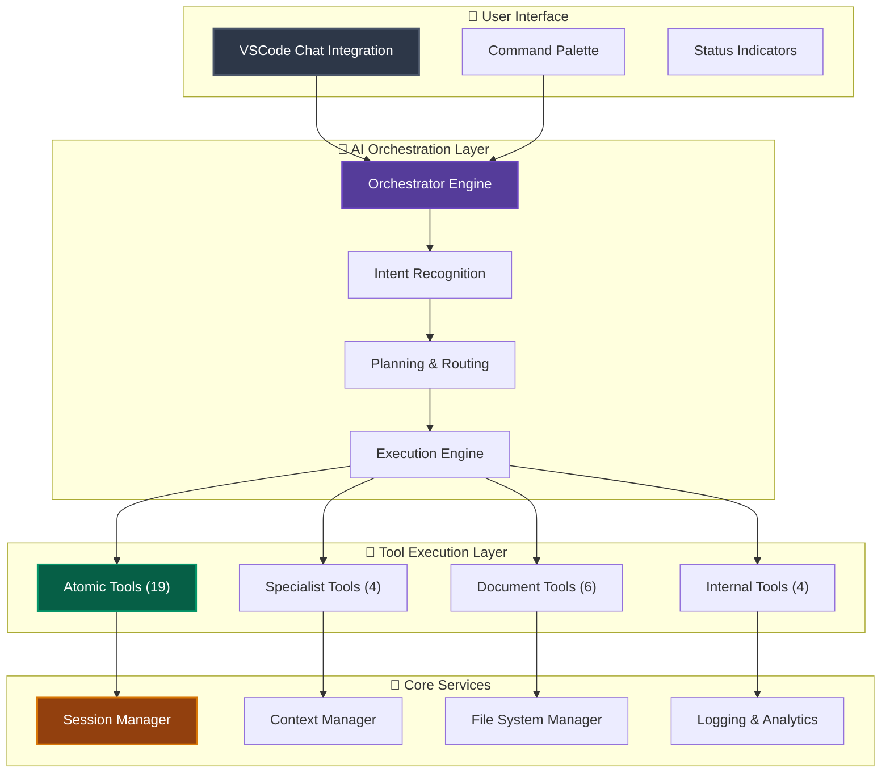

# SRS Writer - AI-Powered Requirements Engineering for VSCode

<div align="center">


[](https://github.com/srs-writer-team/srs-writer-plugin)
[](https://opensource.org/licenses/Apache-2.0)
[](https://code.visualstudio.com/)
[](https://www.typescriptlang.org/)

**Professional AI Assistant for Software Requirements Specification Creation**

[Quick Start](#-quick-start) • [Features](#-features) • [Architecture](#-architecture) • [Tool Ecosystem](#-tool-ecosystem) • [Documentation](#-documentation)

</div>

---

## 🎯 Overview

SRS Writer is a production-ready VSCode extension that transforms natural language conversations into comprehensive, professional-grade Software Requirements Specification (SRS) documents. Built with intelligent AI orchestration and a sophisticated tool architecture, it automates the entire requirements engineering process while maintaining IEEE standards compliance.

**Core Capabilities:**
- **Intelligent Conversation Processing** - Understands project intent from natural language
- **Automated SRS Generation** - Creates complete, structured requirement documents
- **Multi-Project Management** - Handles multiple projects with isolated contexts
- **Professional Tool Ecosystem** - 33+ specialized tools across 4 architectural layers
- **Smart Session Management** - Persistent project state with automatic recovery

## ✨ Key Features

### 🤖 Intelligent AI Orchestration

**Advanced Intent Recognition**: Automatically detects project creation needs from conversations like "I want to write requirements for a webapp that helps teachers schedule classes" and intelligently routes to appropriate workflows.

**Context-Aware Processing**: Maintains project context across sessions, understands file structures, and operates within correct project directories automatically.

**Smart Tool Selection**: Dynamically selects appropriate tools based on task complexity and user intent, with built-in risk assessment and confirmation workflows.

### 📋 Professional Document Generation

**IEEE-Compliant SRS Documents**: Generates comprehensive requirements specifications with structured sections including:
- Executive summaries and project overviews
- Functional requirements with unique IDs and traceability
- Non-functional requirements with measurable criteria
- Acceptance criteria and validation standards
- Professional formatting and consistent terminology

**Multi-Format Support**: 
- **Markdown SRS**: Human-readable, version-control friendly
- **YAML Requirements**: Machine-readable, structured data
- **Tabular Requirements**: Organized functional and non-functional requirements

### 🏗️ Robust Project Management

**Automatic Project Structure**: Creates and manages project directories with proper file organization, ensuring each project has its own isolated workspace.

**Session Persistence**: Maintains project state across VSCode sessions with automatic restoration of context, active files, and conversation history.

**Multi-Project Support**: Handle multiple projects simultaneously without context pollution or file conflicts.

### 🛠️ Four-Layer Tool Architecture

**Production-grade tool ecosystem designed for scalability:**

```
🟡 Atomic Layer (19 tools)     - Direct VSCode and filesystem operations
🟠 Specialist Layer (4 tools)  - Complex business logic workflows  
🔴 Document Layer (6 tools)    - Advanced document processing
🟣 Internal Layer (4 tools)    - System control and management
```

**Tool Intelligence Features**:
- Risk-based execution with automatic confirmations
- Real-time progress tracking and status reporting
- Graceful error handling with automatic recovery
- Dynamic tool registration and hot-reload capability

## 🚀 Quick Start

### Prerequisites

- **VSCode 1.85.0+** with chat feature enabled
- **Node.js 18+** for development
- **AI Provider**: GitHub Copilot, Claude, or compatible language model

### Installation & Setup

```bash
# Clone the repository
git clone https://github.com/srs-writer-team/srs-writer-plugin.git
cd srs-writer-plugin

# Install dependencies
npm install

# Build the extension
npm run compile

# Package the extension (optional)
npm run package
```

### Creating Your First SRS Document

1. **Open VSCode Chat Panel** (`Ctrl+Shift+I` or `Cmd+Shift+I`)
2. **Start a conversation with @srs-writer**:

   ```text
   @srs-writer I want to create requirements for a task management webapp that helps development teams track sprints and assignments
   ```

3. **Watch the AI orchestration**:
   - Automatically detects new project intent
   - Creates project directory structure
   - Generates comprehensive SRS document
   - Validates document completeness and quality

### Example Workflows

**Comprehensive Project Creation**:
```text
@srs-writer Create a healthcare management system with patient records, appointment scheduling, and billing integration
```

**Requirement Enhancement**:
```text
@srs-writer Add mobile app support and offline synchronization to my existing project
```

**Quality Assurance**:
```text
@srs-writer Review my requirements document for completeness and suggest improvements
```

## 🏗️ Architecture

### System Overview

SRS Writer employs a sophisticated multi-layer architecture optimized for professional requirements engineering:



### Core Engine Components

| Component | Purpose | Key Capabilities |
|-----------|---------|------------------|
| **Orchestrator** | AI decision engine and task routing | Intent detection, conflict resolution, multi-modal execution |
| **Session Manager** | Project state and context management | Persistent sessions, multi-project support, automatic recovery |
| **Specialist Executor** | Complex workflow coordination | Business logic execution, tool chaining, error recovery |
| **Tool Registry** | Tool management and access control | Dynamic registration, risk assessment, permission management |
| **Context Manager** | Memory and conversation management | Context optimization, history tracking, state persistence |

## 🛠️ Tool Ecosystem

### Tool Distribution & Capabilities

```
📊 Total: 33 Specialized Tools

🟡 Atomic Layer (19 tools) - 57.6%
├── File Operations: readFile, writeFile, appendTextToFile, createDirectory
├── Editor Integration: insertText, replaceText, openAndShowFile
├── User Interaction: askQuestion, showProgressIndicator, suggestNextAction
└── Knowledge Access: readLocalKnowledge, internetSearch

🟠 Specialist Layer (4 tools) - 12.1%
├── SRS Creation: createComprehensiveSRS (autonomous document generation)
├── SRS Editing: editSRSDocument (intelligent content modification)
├── Quality Assurance: lintSRSDocument (compliance checking)
└── Project Analysis: classifyProjectComplexity (scope assessment)

🔴 Document Layer (6 tools) - 18.2%
├── Requirements: addNewRequirement, listRequirements
├── Generation: generateFullSrsReport, generateSectionFromYaml
└── Import/Export: importFromMarkdown, parseMarkdownTable

🟣 Internal Layer (4 tools) - 12.1%
├── System Control: finalAnswer, reportProgress
├── Project Management: createNewProjectFolder
└── Knowledge Retrieval: customRAGRetrieval
```

### Advanced Tool Features

**Intelligent File Operations**: Tools automatically determine correct project directories and maintain file organization without manual path specification.

**Risk-Aware Execution**: Each tool is classified by risk level (low/medium/high) with appropriate confirmation workflows for user safety.

**Progress Tracking**: Real-time status reporting with detailed execution logs and error recovery mechanisms.

**Context Integration**: Tools automatically access project context, session history, and user preferences for intelligent operation.

### Example Tool Usage

```typescript
// Specialist Layer - Autonomous SRS Creation
await createComprehensiveSRS({
    userInput: "E-commerce platform with payment processing",
    projectName: "ShopMaster",
    sessionData: currentProjectContext
});

// Document Layer - Professional Report Generation  
await generateFullSrsReport({
    projectPath: "ShopMaster",
    outputFileName: "SRS_ShopMaster_v1.0.md",
    includeMetadata: true
});

// Atomic Layer - Smart File Operations
await createDirectory({
    path: "mobile-app-requirements",
    isProjectDirectory: true  // Auto-updates session context
});
```

## 📊 Technical Specifications

### Performance Characteristics

- **Response Time**: <2 seconds for most operations
- **Memory Footprint**: <50MB typical working set
- **Tool Execution**: <500ms average per atomic tool
- **Session Loading**: <100ms for existing projects
- **Document Generation**: 30-60 seconds for comprehensive SRS

### Reliability Features

- **Automatic Error Recovery**: Intelligent rollback on operation failures
- **Session Persistence**: Crash-resistant project state management
- **Context Validation**: Automatic detection and correction of inconsistent states
- **Graceful Degradation**: Fallback modes for network or AI service interruptions

### Compatibility

- **VSCode Versions**: 1.85.0+ (requires chat feature)
- **Node.js**: 18.0+ for development and packaging
- **AI Models**: Compatible with GitHub Copilot, Claude, OpenAI GPT series
- **Operating Systems**: Windows, macOS, Linux
- **File Formats**: Markdown, YAML, JSON, plain text

## 📁 Project Structure

```
srs-writer-plugin/
├── 📦 src/                          # Core TypeScript source code
│   ├── 🧠 core/                     # AI orchestration and execution engines
│   │   ├── orchestrator.ts          # Main AI decision engine (310+ rules)
│   │   ├── srsAgentEngine.ts        # Autonomous task execution
│   │   ├── specialistExecutor.ts    # Complex workflow coordination
│   │   ├── session-manager.ts       # Project state management
│   │   ├── engine/                  # Core engine components (7 modules)
│   │   └── orchestrator/            # Orchestration sub-systems (8 modules)
│   ├── 🛠️ tools/                    # Four-layer tool architecture
│   │   ├── atomic/                  # VSCode and filesystem operations (19 tools)
│   │   ├── specialist/              # Business logic workflows (4 tools)
│   │   ├── document/                # Document processing (6 tools)
│   │   └── internal/                # System control (4 tools)
│   ├── 💬 chat/                     # VSCode chat participant integration
│   ├── 🔍 parser/                   # Document processing (Markdown, YAML)
│   ├── 🗂️ filesystem/               # File management and organization
│   ├── ✅ quality/                  # Document validation and linting
│   ├── 🎨 types/                    # TypeScript type definitions
│   └── 🔧 utils/                    # Utilities (logging, error handling)
├── 📋 rules/                        # AI behavior and decision rules
│   ├── orchestrator.md              # Main orchestration logic (400+ lines)
│   └── specialists/                 # Task-specific specialist rules (9 files)
├── ⚙️ config/                       # Configuration and settings
├── 📚 docs/                         # Architecture and implementation guides
├── 📄 templates/                    # SRS templates and examples
└── 🧪 src/test/                     # Comprehensive test suites
    ├── integration/                 # End-to-end workflow testing
    ├── performance/                 # Performance benchmarks
    └── fixtures/                    # Test data and mock scenarios
```

## 💡 Usage Examples

### Professional SRS Creation

**Input**:
```text
@srs-writer Create a comprehensive requirements document for a university course management system. Include student enrollment, grade tracking, course scheduling, and instructor management features.
```

**Generated Output**:
- Complete SRS document with IEEE-standard structure
- Functional requirements table with unique IDs
- Non-functional requirements with measurable criteria
- Acceptance criteria and validation standards
- Project classification and complexity analysis

### Multi-Project Management

**Scenario**: Managing multiple concurrent projects

```text
@srs-writer Create requirements for a mobile fitness tracking app
# Creates Project A with isolated context

@srs-writer Now create requirements for an inventory management system  
# Automatically switches to Project B, maintains separate contexts

@srs-writer Switch back to the fitness app and add social features
# Intelligently returns to Project A context
```

### Intelligent Document Enhancement

```text
@srs-writer Review my current requirements and suggest improvements for scalability

@srs-writer Add requirements for API integration and third-party data sources

@srs-writer Generate a final presentation-ready document with executive summary
```

## 🧪 Quality Assurance

### Comprehensive Testing Strategy

- **Unit Tests**: Individual component functionality and edge cases
- **Integration Tests**: Cross-component interactions and data flow
- **Architecture Tests**: Design principle compliance and dependency validation
- **Performance Tests**: Response time, memory usage, and scalability metrics
- **End-to-End Tests**: Complete user workflows and real-world scenarios

### Quality Standards

- **TypeScript Strict Mode**: Comprehensive type safety and compile-time validation
- **ESLint Configuration**: Enforced coding standards and best practices
- **Test Coverage**: >85% code coverage requirement with quality metrics
- **Architecture Compliance**: Automated validation of four-layer design principles
- **Documentation Standards**: Comprehensive inline documentation and API references

### Reliability Mechanisms

- **Graceful Error Handling**: User-friendly error messages with recovery suggestions
- **Automatic State Recovery**: Database-style transactions with rollback capabilities
- **Resource Management**: Proper cleanup and memory leak prevention
- **Logging & Analytics**: Comprehensive operational monitoring and debugging support

## 🚀 Development & Contributing

### Development Environment

```bash
# Setup development environment
git clone https://github.com/srs-writer-team/srs-writer-plugin.git
cd srs-writer-plugin
npm install

# Development workflow
npm run compile          # TypeScript compilation
npm run watch           # Development with hot reload
npm run test            # Run all test suites
npm run package         # Create distributable VSIX

# Quality assurance
npm run lint            # Code style validation
npm run test:coverage   # Coverage analysis
npm run test:integration # End-to-end testing
```

### Architecture Guidelines

1. **Four-Layer Compliance**: All new tools must fit within the established architectural layers
2. **Type Safety**: Strict TypeScript with comprehensive interface definitions
3. **Error Handling**: Graceful failure modes with user-friendly messaging
4. **Testing Requirements**: Minimum 85% coverage for new components
5. **Documentation**: Comprehensive inline documentation and usage examples

### Contributing Workflow

1. **Fork & Clone**: Create your development environment
2. **Feature Development**: Implement changes following architecture guidelines
3. **Testing**: Ensure all tests pass and coverage requirements are met
4. **Documentation**: Update relevant documentation and examples
5. **Pull Request**: Submit with detailed description and test coverage report

## 📚 Documentation & Resources

### User Guides

- **[Quick Start Guide](docs/quick-start.md)** - Get productive in minutes
- **[Tool Reference](docs/tool-reference.md)** - Complete tool documentation
- **[Best Practices](docs/best-practices.md)** - Professional usage patterns
- **[Troubleshooting](docs/troubleshooting.md)** - Common issues and solutions

### Technical Documentation

- **[Architecture Overview](docs/architecture.md)** - System design and principles
- **[API Reference](docs/api-reference.md)** - Programmatic interfaces
- **[Tool Development Guide](docs/tool-development.md)** - Creating custom tools
- **[Testing Framework](docs/testing.md)** - Quality assurance methodology

### Configuration & Setup

- **[AI Model Configuration](docs/model-configuration.md)** - AI provider setup
- **[Access Control Matrix](docs/tool-access-control-matrix.md)** - Security configuration
- **[Performance Tuning](docs/performance-tuning.md)** - Optimization guidelines

## 🎯 Roadmap & Future Vision

### Current Capabilities (v1.5.8)

- ✅ **Production-Ready Architecture**: Stable four-layer tool ecosystem
- ✅ **Intelligent Orchestration**: Advanced intent recognition and smart routing
- ✅ **Professional Output**: IEEE-compliant SRS generation with quality validation
- ✅ **Multi-Project Support**: Isolated project contexts with session persistence
- ✅ **Comprehensive Tool Suite**: 33 specialized tools across all architectural layers

### Upcoming Enhancements

**Enhanced AI Intelligence**
- Context-aware requirement suggestions based on industry patterns
- Automatic consistency validation and gap detection across requirements
- Multi-language support for international development teams

**Integration & Workflow**
- Git integration for version control and collaboration
- CI/CD pipeline integration for automated requirement validation
- Third-party tool connectivity (JIRA, Azure DevOps, GitHub Issues)

**Advanced Document Processing**
- Template-based document generation with organizational standards
- Automated traceability matrix generation and maintenance
- Export capabilities for multiple enterprise formats (Word, PDF, Confluence)

### Long-Term Vision

- **Cloud Collaboration Platform**: Real-time multi-user editing and review workflows
- **Enterprise Security**: SSO integration, compliance reporting, and audit trails
- **AI Evolution**: Continuous learning from organizational patterns and preferences
- **Marketplace Ecosystem**: Third-party plugin support and community tool sharing

## 📄 License

This project is licensed under the Apache License 2.0 - see the [LICENSE](LICENSE) file for complete details.

**License Highlights:**
- ✅ Commercial use permitted
- ✅ Modification and distribution allowed
- ✅ Patent protection included
- ✅ Private use authorized
- ⚠️ Trademark use not permitted
- ⚠️ No warranty provided

---

<div align="center">

**Built with ❤️ for the software engineering community**

[⭐ Star on GitHub](https://github.com/srs-writer-team/srs-writer-plugin) • [🐛 Report Bug](https://github.com/srs-writer-team/srs-writer-plugin/issues) • [💡 Request Feature](https://github.com/srs-writer-team/srs-writer-plugin/issues)

</div>
