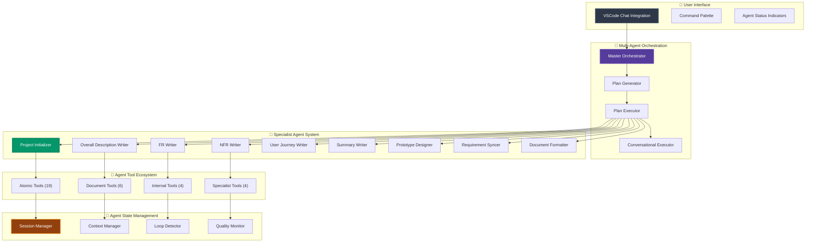
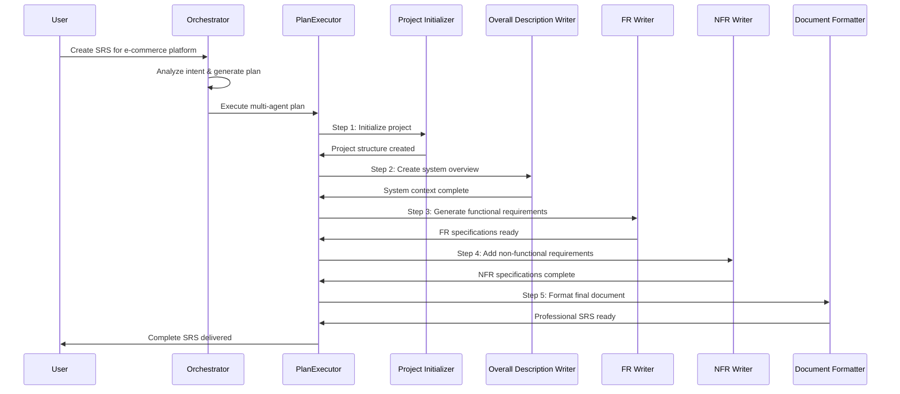

# SRS Writer - AI-Powered Requirements Engineering for VSCode

<div align="center">


[](https://github.com/Testany-io/srs-writer-plugin)
[](https://opensource.org/licenses/Apache-2.0)
[](https://code.visualstudio.com/)
[](https://www.typescriptlang.org/)
[![DeepWiki](https://img.shields.io/badge/DeepWiki-TestAny--io%2Fsrs--writer--plugin-blue.svg?logo=data:image/png;base64,iVBORw0KGgoAAAANSUhEUgAAACwAAAAyCAYAAAAnWDnqAAAAAXNSR0IArs4c6QAAA05JREFUaEPtmUtyEzEQhtWTQyQLHNak2AB7ZnyXZMEjXMGeK/AIi+QuHrMnbChYY7MIh8g01fJoopFb0uhhEqqcbWTp06/uv1saEDv4O3n3dV60RfP947Mm9/SQc0ICFQgzfc4CYZoTPAswgSJCCUJUnAAoRHOAUOcATwbmVLWdGoH//PB8mnKqScAhsD0kYP3j/Yt5LPQe2KvcXmGvRHcDnpxfL2zOYJ1mFwrryWTz0advv1Ut4CJgf5uhDuDj5eUcAUoahrdY/56ebRWeraTjMt/00Sh3UDtjgHtQNHwcRGOC98BJEAEymycmYcWwOprTgcB6VZ5JK5TAJ+fXGLBm3FDAmn6oPPjR4rKCAoJCal2eAiQp2x0vxTPB3ALO2CRkwmDy5WohzBDwSEFKRwPbknEggCPB/imwrycgxX2NzoMCHhPkDwqYMr9tRcP5qNrMZHkVnOjRMWwLCcr8ohBVb1OMjxLwGCvjTikrsBOiA6fNyCrm8V1rP93iVPpwaE+gO0SsWmPiXB+jikdf6SizrT5qKasx5j8ABbHpFTx+vFXp9EnYQmLx02h1QTTrl6eDqxLnGjporxl3NL3agEvXdT0WmEost648sQOYAeJS9Q7bfUVoMGnjo4AZdUMQku50McDcMWcBPvr0SzbTAFDfvJqwLzgxwATnCgnp4wDl6Aa+Ax283gghmj+vj7feE2KBBRMW3FzOpLOADl0Isb5587h/U4gGvkt5v60Z1VLG8BhYjbzRwyQZemwAd6cCR5/XFWLYZRIMpX39AR0tjaGGiGzLVyhse5C9RKC6ai42ppWPKiBagOvaYk8lO7DajerabOZP46Lby5wKjw1HCRx7p9sVMOWGzb/vA1hwiWc6jm3MvQDTogQkiqIhJV0nBQBTU+3okKCFDy9WwferkHjtxib7t3xIUQtHxnIwtx4mpg26/HfwVNVDb4oI9RHmx5WGelRVlrtiw43zboCLaxv46AZeB3IlTkwouebTr1y2NjSpHz68WNFjHvupy3q8TFn3Hos2IAk4Ju5dCo8B3wP7VPr/FGaKiG+T+v+TQqIrOqMTL1VdWV1DdmcbO8KXBz6esmYWYKPwDL5b5FA1a0hwapHiom0r/cKaoqr+27/XcrS5UwSMbQAAAABJRU5ErkJggg==)](https://deepwiki.com/TestAny-io/srs-writer-plugin)

**AI-Powered Requirements Engineering for VSCode**

[Quick Start](#-quick-start) • [Features](#-features) • [Architecture](#-architecture) • [Installation](#-installation) • [Documentation](#-documentation)

</div>

---

## 🎯 Overview

SRS Writer is an intelligent VSCode extension that transforms natural language conversations into professional Software Requirements Specification (SRS) documents. Using a sophisticated multi-specialist system, it automatically generates structured, standardized requirement documents from user descriptions.

**Core Capabilities:**

- **Conversational Interface** - Create requirements through natural VSCode Chat interactions with @srs-writer
- **Specialist System** - 13 specialized content and process agents for different document sections
- **Project Management** - Workspace isolation with multi-project support and template system
- **Intelligent Editing** - Semantic content editing with real-time synchronization
- **Session Persistence** - Maintains project context and state across conversations

**Key Features:**

- **Complete SRS Generation** - Functional requirements, non-functional requirements, user journeys, and more
- **Workspace Management** - Automatic project structure creation with professional templates
- **Multi-Format Support** - Markdown documents with synchronized YAML data structures
- **Template System** - Built-in professional templates ensuring document standardization

## ✨ Key Features

### 🤖 Intelligent Specialist System

**Conversational Requirements Engineering**: Simply chat with @srs-writer in VSCode to describe your project, and watch as specialized agents automatically generate comprehensive SRS documents.

**Content Specialists**:

- **ADC Writer** - Architecture Decision Capture
- **FR Writer** - Functional Requirements
- **NFR Writer** - Non-Functional Requirements
- **Overall Description Writer** - System Overview and Context
- **User Journey Writer** - User Experience Mapping
- **Summary Writer** - Executive Summaries
- **Story & Case Writer** - User Stories and Use Cases
- **IFR & DAR Writer** - Interface Requirements and Design Analysis
- **Prototype Designer** - System Design and Prototyping

**Process Specialists**:

- **Project Initializer** - Workspace and Project Setup
- **Document Formatter** - Professional Document Formatting
- **Requirement Syncer** - Data Synchronization
- **Git Operator** - Version Control Integration

### 📋 Professional Document Generation

**Comprehensive SRS Documents**: Generate structured requirements specifications with:

- **Executive Summary** - Project overviews and key insights
- **System Context** - Overall system description and environment  
- **Functional Requirements** - Detailed feature specifications with traceability
- **Non-Functional Requirements** - Performance, security, and quality criteria
- **User Journeys** - User experience flows and interaction scenarios
- **Use Cases & User Stories** - Structured requirement scenarios
- **Architecture Decisions** - Design rationale and technical choices

**Multi-Format Output**:

- **Markdown Documents** - Human-readable, version-control friendly
- **YAML Data** - Machine-readable, structured requirement data
- **Professional Templates** - Industry-standard formatting

### 🏗️ Project Management Features

**Workspace Setup**: Automatic project structure creation with professional templates and organized file layouts.

**Session Persistence**: Maintains project context and conversation history across VSCode sessions.

**Multi-Project Support**: Handle multiple projects with isolated contexts and clean separation.

### 🛠️ Tool Architecture

**Professional tool ecosystem for intelligent document generation:**

```text
📊 Tool Categories Overview

🟡 Atomic Layer - Core Operations
├── File Operations: readFile, writeFile, createFile, appendTextToFile
├── Directory Management: createDirectory, listAllFiles
├── Editor Integration: openAndShowFile, executeMarkdownEdits, executeYAMLEdits
├── User Interaction: askQuestion, confirmAction, suggestNextAction
└── Smart Editing: semantic locators, unified edit execution

🔴 Document Layer - Document Processing  
├── Requirements: requirement scaffolding, YAML synchronization
├── Document Generation: structured content creation
├── Markdown Conversion: markitdown integration for file imports
├── Template System: professional SRS templates
└── Traceability: requirement completion and linking

🟣 Internal Layer - System Control
├── Session Management: project state, context persistence  
├── Project Setup: createNewProjectFolder, workspace initialization
├── Task Completion: finalAnswer, taskComplete
└── System Tools: recordThought, status reporting
```

### ⚡ Additional Features

**Smart Context Management**: Maintains project state and specialist context across conversation sessions.

**Quality Assurance**: Built-in validation and consistency checks for generated content.

**Template Integration**: Professional SRS templates with customizable sections and formatting.

**VSCode Integration**: Seamless integration with VSCode's chat interface and file management.

## 🚀 Quick Start

### Prerequisites

- **VSCode 1.85.0+** with chat feature enabled
- **AI Provider**: GitHub Copilot, Claude, or compatible language model

### Installation

1. **From VSCode Marketplace** (Recommended):
   - Open VSCode Extensions panel (`Ctrl+Shift+X`)
   - Search for "SRS Writer"
   - Click Install

2. **Manual Installation**:
   - Download the latest `.vsix` file from [Releases](https://github.com/Testany-io/srs-writer-plugin/releases)
   - Run `code --install-extension srs-writer-plugin-x.x.x.vsix`

### First-Time Setup

After installation, set up your workspace:
1. Open Command Palette (`Ctrl+Shift+P`)
2. Run "SRS Writer: Show Status"
3. Select "Create Workspace and Initialize" 
4. Choose a parent directory and workspace name
5. SRS Writer will create the workspace with templates

### Creating Your First SRS Document

1. **Open VSCode Chat Panel** (`Ctrl+Shift+I` or `Cmd+Shift+I`)
2. **Start a conversation with @srs-writer**:

   ```text
   @srs-writer I want to create requirements for a task management webapp that helps development teams track sprints and assignments
   ```

3. **Available Chat Commands**:

   - `@srs-writer create` - Create a new SRS document
   - `@srs-writer edit` - Edit existing SRS document  
   - `@srs-writer lint` - Check document quality
   - `@srs-writer help` - Show help information
   - `@srs-writer new` - Start a fresh conversation session

### Usage Examples

**Create a New Project**:

```text
@srs-writer create a mobile e-commerce app with user authentication, product catalog, shopping cart, and payment processing
```

**Edit Existing Requirements**:

```text
@srs-writer edit the user authentication section to add two-factor authentication and social login options
```

**Quality Check**:

```text
@srs-writer lint my current requirements document and suggest improvements
```

**Add New Features**:

```text
@srs-writer I need to add real-time notifications and offline mode capabilities to my existing project
```

## 🏗️ System Architecture

### Overview

SRS Writer uses a specialist-based architecture where different agents handle specific aspects of SRS document generation:



### Core Components

| Component | Purpose | Capabilities |
|-----------|---------|--------------|
| **Chat Participant** | VSCode chat integration | Natural language processing, command handling |
| **Orchestrator** | Task coordination | Intent analysis, specialist selection, workflow management |
| **Specialists** | Content generation | Domain-specific document creation (FR, NFR, etc.) |
| **Session Manager** | State management | Project context, session persistence |
| **Tool Executor** | Action execution | File operations, editing, validation |

### Agent Execution Flow



## 📊 Technical Information

### System Requirements

- **VSCode**: Version 1.85.0 or higher
- **AI Provider**: GitHub Copilot, Claude, or compatible language model
- **Platform**: Cross-platform (Windows, macOS, Linux)

### Performance

- **Document Generation**: Typically 10-15 minutes for a comprehensive SRS
- **Session Persistence**: Project state maintained across VSCode restarts
- **Template System**: Pre-built templates for consistent formatting

### Compatibility

- **VSCode Chat**: Full integration with VSCode's native chat interface
- **File Formats**: Markdown (.md) and YAML (.yml) output
- **Multi-Project**: Support for multiple concurrent projects

## 📁 Project Structure

```text
srs-writer-plugin/
├── 📦 src/                          # TypeScript source code
│   ├── 🧠 core/                     # Core system components
│   │   ├── orchestrator.ts          # Task coordination
│   │   ├── specialistExecutor.ts    # Specialist management
│   │   ├── session-manager.ts       # Project state management
│   │   └── srsAgentEngine.ts        # Execution engine
│   ├── 🛠️ tools/                    # Tool implementations
│   │   ├── atomic/                  # Basic operations (file I/O, editing)
│   │   ├── document/                # Document processing tools
│   │   └── internal/                # System control tools
│   ├── 💬 chat/                     # VSCode chat integration
│   │   └── srs-chat-participant.ts # Chat participant implementation
│   ├── 🎨 types/                    # TypeScript type definitions
│   └── 🔧 utils/                    # Utility functions
├── 📋 rules/                        # Specialist behavior rules
│   ├── orchestrator.md              # Orchestrator behavior
│   ├── base/                        # Common specialist behaviors
│   └── specialists/                 # Specialist-specific rules
│       ├── content/                 # Content generation specialists
│       └── process/                 # Process automation specialists
├── 📄 .templates/                   # Professional SRS templates
│   ├── ADC/                         # Architecture Decision Capture
│   ├── functional_requirements/     # FR templates
│   ├── NFR/                         # Non-functional requirements
│   └── ...                          # Other specialist templates
├── 🧪 src/test/                     # Test suite
├── ⚙️ config/                       # Configuration files
└── 📚 docs/                         # Documentation
```

## 💡 Usage Examples

### Complex SRS Creation

**Input**:
```text
@srs-writer Create a comprehensive requirements document for a university course management system with student enrollment, grade tracking, course scheduling, instructor management, and mobile app integration.
```

**What happens**:
1. **Project Setup**: Creates workspace structure and initializes templates
2. **Content Generation**: Multiple specialists generate different document sections
3. **Quality Assurance**: Reviews and validates generated content
4. **Final Output**: Professional SRS document with structured requirements

### Enhancing Existing Projects

**Adding new features**:
```text
@srs-writer Add real-time chat, video conferencing, and mobile notifications to my existing e-learning platform project
```

**Document review**:
```text
@srs-writer Review my requirements document for completeness, consistency, and industry best practices
```

## 🧪 Testing & Quality

- **Unit Tests**: Individual component functionality
- **Integration Tests**: End-to-end workflow testing  
- **Template Validation**: Ensures template integrity
- **Content Quality**: Validates generated document structure
- **Error Handling**: Graceful error recovery and user feedback

## 🚀 Development

### Development Environment

```bash
# Setup development environment
git clone https://github.com/Testany-io/srs-writer-plugin.git
cd srs-writer-plugin
npm install

# Development workflow
npm run build           # Build the extension
npm run watch          # Development with hot-reload
npm run test           # Run test suite
npm run package        # Create VSIX package

# Quality assurance
npm run lint           # Code validation
npm run test:coverage  # Test coverage analysis
npm run test:integration # Integration testing
```

### Contributing Guidelines

1. **Code Quality**: Follow TypeScript best practices and linting rules
2. **Testing**: Include tests for new features and bug fixes
3. **Documentation**: Update documentation for new functionality
4. **Template Updates**: Ensure template changes maintain compatibility

## 📚 Documentation

### Getting Help

- **Chat Commands**: Use `@srs-writer help` in VSCode Chat for assistance
- **Status Check**: Run "SRS Writer: Show Status" from Command Palette
- **Templates**: Explore `.templates/` folder for available document templates

### Resources

- **GitHub Repository**: [Source code and issues](https://github.com/Testany-io/srs-writer-plugin)
- **VSCode Marketplace**: [Extension page and reviews](https://marketplace.visualstudio.com/items?itemName=Testany.srs-writer-plugin)
- **Documentation**: See `docs/` folder for detailed guides

## 🎯 Roadmap

### Current Features

- ✅ **13 Specialized Specialists**: Complete coverage of SRS document sections
- ✅ **Template System**: Professional templates for consistent output
- ✅ **VSCode Integration**: Native chat interface and workspace management
- ✅ **Session Persistence**: Project state maintained across sessions
- ✅ **Multi-Project Support**: Handle multiple projects simultaneously

### Planned Improvements

- **Enhanced Templates**: More industry-specific template options
- **Better Integration**: Improved VSCode workspace features
- **Quality Enhancements**: Advanced content validation and suggestions  
- **User Experience**: Streamlined workflows and better feedback
- **Documentation**: Expanded guides and examples

## 📄 License

This project is licensed under the Apache License 2.0 - see the [LICENSE](LICENSE) file for complete details.

**License Highlights:**

- ✅ Commercial use permitted
- ✅ Modification and distribution allowed
- ✅ Patent protection included
- ✅ Private use authorized
- ⚠️ Trademark use not permitted
- ⚠️ No warranty provided

---

<div align="center">

**Built with ❤️ for the software engineering community**

**Powered by Advanced Multi-Agent AI Architecture**

[⭐ Star on GitHub](https://github.com/Testany-io/srs-writer-plugin) • [🐛 Report Bug](https://github.com/Testany-io/srs-writer-plugin/issues) • [💡 Request Feature](https://github.com/Testany-io/srs-writer-plugin/issues)

</div>
