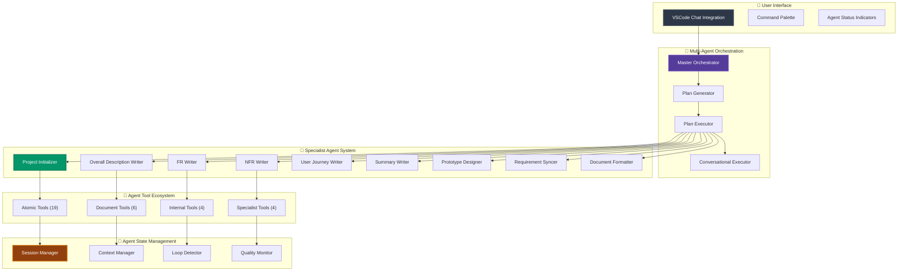
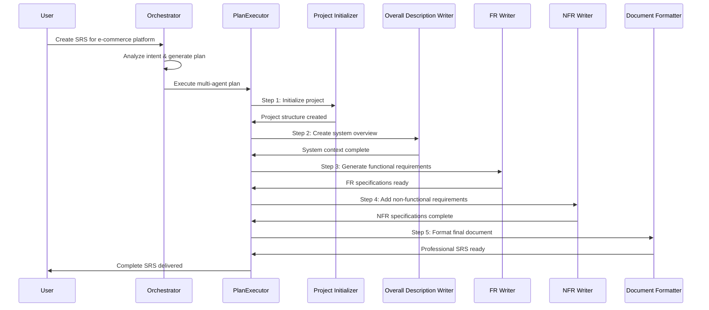

# SRS Writer - AI-Powered Requirements Engineering for VSCode

<div align="center">


[](https://github.com/srs-writer-team/srs-writer-plugin)
[](https://opensource.org/licenses/Apache-2.0)
[](https://code.visualstudio.com/)
[](https://www.typescriptlang.org/)
[![DeepWiki](https://img.shields.io/badge/DeepWiki-TestAny--io%2Fsrs--writer--plugin-blue.svg?logo=data:image/png;base64,iVBORw0KGgoAAAANSUhEUgAAACwAAAAyCAYAAAAnWDnqAAAAAXNSR0IArs4c6QAAA05JREFUaEPtmUtyEzEQhtWTQyQLHNak2AB7ZnyXZMEjXMGeK/AIi+QuHrMnbChYY7MIh8g01fJoopFb0uhhEqqcbWTp06/uv1saEDv4O3n3dV60RfP947Mm9/SQc0ICFQgzfc4CYZoTPAswgSJCCUJUnAAoRHOAUOcATwbmVLWdGoH//PB8mnKqScAhsD0kYP3j/Yt5LPQe2KvcXmGvRHcDnpxfL2zOYJ1mFwrryWTz0advv1Ut4CJgf5uhDuDj5eUcAUoahrdY/56ebRWeraTjMt/00Sh3UDtjgHtQNHwcRGOC98BJEAEymycmYcWwOprTgcB6VZ5JK5TAJ+fXGLBm3FDAmn6oPPjR4rKCAoJCal2eAiQp2x0vxTPB3ALO2CRkwmDy5WohzBDwSEFKRwPbknEggCPB/imwrycgxX2NzoMCHhPkDwqYMr9tRcP5qNrMZHkVnOjRMWwLCcr8ohBVb1OMjxLwGCvjTikrsBOiA6fNyCrm8V1rP93iVPpwaE+gO0SsWmPiXB+jikdf6SizrT5qKasx5j8ABbHpFTx+vFXp9EnYQmLx02h1QTTrl6eDqxLnGjporxl3NL3agEvXdT0WmEost648sQOYAeJS9Q7bfUVoMGnjo4AZdUMQku50McDcMWcBPvr0SzbTAFDfvJqwLzgxwATnCgnp4wDl6Aa+Ax283gghmj+vj7feE2KBBRMW3FzOpLOADl0Isb5587h/U4gGvkt5v60Z1VLG8BhYjbzRwyQZemwAd6cCR5/XFWLYZRIMpX39AR0tjaGGiGzLVyhse5C9RKC6ai42ppWPKiBagOvaYk8lO7DajerabOZP46Lby5wKjw1HCRx7p9sVMOWGzb/vA1hwiWc6jm3MvQDTogQkiqIhJV0nBQBTU+3okKCFDy9WwferkHjtxib7t3xIUQtHxnIwtx4mpg26/HfwVNVDb4oI9RHmx5WGelRVlrtiw43zboCLaxv46AZeB3IlTkwouebTr1y2NjSpHz68WNFjHvupy3q8TFn3Hos2IAk4Ju5dCo8B3wP7VPr/FGaKiG+T+v+TQqIrOqMTL1VdWV1DdmcbO8KXBz6esmYWYKPwDL5b5FA1a0hwapHiom0r/cKaoqr+27/XcrS5UwSMbQAAAABJRU5ErkJggg==)](https://deepwiki.com/TestAny-io/srs-writer-plugin)

**Advanced Multi-Agent AI System for Professional Requirements Engineering**

[Quick Start](#-quick-start) • [Features](#-features) • [Architecture](#-architecture) • [Multi-Agent System](#-multi-agent-system) • [Documentation](#-documentation)

</div>

---

## 🎯 Overview

SRS Writer is a production-ready VSCode extension that leverages advanced multi-agent AI architecture to transform natural language conversations into comprehensive, professional-grade Software Requirements Specification (SRS) documents. Built with sophisticated agent orchestration and intelligent specialist coordination, it represents a breakthrough in automated requirements engineering.

**Revolutionary Multi-Agent Architecture:**

- **Intelligent Orchestrator** - Master coordinator with 400+ decision rules
- **Specialist Agent System** - 9 specialized content and process experts
- **Plan Execution Engine** - Complex multi-step task coordination
- **Context-Aware Coordination** - Seamless agent-to-agent communication
- **Iterative Refinement** - Self-improving agent loops with quality validation

**Enterprise-Grade Capabilities:**

- **Complete SRS Generation** - IEEE-standard compliant documentation
- **Multi-Project Management** - Isolated agent contexts per project
- **Professional Tool Ecosystem** - 33+ specialized tools across 4 layers
- **Persistent Session Management** - Stateful multi-agent coordination

## ✨ Key Features

### 🤖 Advanced Multi-Agent Orchestration

**Intelligent Agent Coordination**: Master orchestrator automatically analyzes user intent and creates detailed execution plans, coordinating multiple specialist agents in complex workflows. Each agent maintains full context awareness and can iteratively refine their work.

**Specialist Agent System**:

- **Content Specialists**: `project_initializer`, `overall_description_writer`, `fr_writer`, `nfr_writer`, `user_journey_writer`, `summary_writer`, `prototype_designer`
- **Process Specialists**: `requirement_syncer`, `document_formatter`, `git_operator`

**Plan Execution Engine**: Sophisticated multi-step task coordination with dependency management, allowing agents to work in sequence while maintaining complete context sharing and state consistency.

**Context-Aware Processing**: Each agent receives complete project context, execution history, and inter-agent communication logs, enabling intelligent decision-making and consistent output across the entire workflow.

### 📋 Professional Document Generation

**IEEE-Compliant SRS Documents**: Multi-agent collaboration produces comprehensive requirements specifications with structured sections including:

- Executive summaries and project overviews (Summary Writer Agent)
- System context and use-case modeling (Overall Description Writer Agent)
- Detailed functional requirements with traceability (FR Writer Agent)
- Non-functional requirements with measurable criteria (NFR Writer Agent)
- User journeys and acceptance criteria (User Journey Writer Agent)
- Professional formatting and consistency (Document Formatter Agent)

**Multi-Format Support**:

- **Markdown SRS**: Human-readable, version-control friendly
- **YAML Requirements**: Machine-readable, structured data with auto-synchronization
- **Tabular Requirements**: Organized functional and non-functional requirements
- **Professional Templates**: Industry-standard formats with customizable sections

### 🏗️ Robust Multi-Agent Project Management

**Automatic Project Initialization**: Project Initializer Agent creates comprehensive project structures with proper file organization, session context establishment, and workspace isolation.

**Agent State Persistence**: Multi-agent system maintains coordinated state across VSCode sessions with automatic restoration of agent contexts, execution history, and inter-agent communication logs.

**Multi-Project Coordination**: Handle multiple projects simultaneously with isolated agent contexts, preventing cross-project contamination and maintaining clean separation of concerns.

**Agent Loop Management**: Sophisticated iteration control allowing agents to refine their work through multiple cycles while preventing infinite loops and ensuring convergence.

### 🛠️ Four-Layer Multi-Agent Tool Architecture

**Production-grade tool ecosystem designed for agent coordination:**

```text
📊 Total: 33 Specialized Tools for Agent Coordination

🟡 Atomic Layer (19 tools) - 57.6%
├── File Operations: readFile, writeFile, appendTextToFile, createDirectory
├── Editor Integration: openAndShowFile, semantic editing tools
├── User Interaction: askQuestion, suggestNextAction, confirmAction
├── Knowledge Access: readLocalKnowledge, internetSearch, customRAGRetrieval
└── Smart Editing: unified edit execution, semantic locators

🔴 Document Layer (6 tools) - 18.2%
├── Import/Export: importFromMarkdown, parseMarkdownTable
├── Document Processing: enhanced file reading, requirement management
├── Content Generation: structured document creation
└── Semantic Editing: intelligent content modification

🟣 Internal Layer (4 tools) - 12.1%
├── Agent Control: taskComplete, finalAnswer, reportProgress
├── Project Management: createNewProjectFolder, session management
├── Knowledge Retrieval: customRAGRetrieval, context management
└── System Coordination: agent handoff, state synchronization

🟠 Specialist Layer (4 tools) - 12.1%
├── Agent Coordination: specialist handoff protocols
├── Context Management: inter-agent communication
├── Quality Assurance: agent output validation
└── Workflow Control: execution plan management
```

### Advanced Multi-Agent Features

**Intelligent Agent Handoff**: Seamless transfer of control between specialist agents with complete context preservation and state synchronization.

**Agent Loop Support**: Sophisticated iteration management allowing agents to refine their work through multiple cycles with automatic convergence detection.

**Context Sharing**: Advanced context management ensuring all agents have access to relevant project state, execution history, and inter-agent communications.

**Quality Validation**: Built-in quality assurance with agent-specific validation rules and automatic refinement loops.

## 🚀 Quick Start

### Prerequisites

- **VSCode 1.85.0+** with chat feature enabled
- **Node.js 18+** for development
- **AI Provider**: GitHub Copilot, Claude, or compatible language model

### Installation & Setup

```bash
# Clone the repository
git clone https://github.com/srs-writer-team/srs-writer-plugin.git
cd srs-writer-plugin

# Install dependencies
npm install

# Build the extension
npm run compile

# Package the extension (optional)
npm run package
```

### Creating Your First Multi-Agent SRS Document

1. **Open VSCode Chat Panel** (`Ctrl+Shift+I` or `Cmd+Shift+I`)
2. **Start a conversation with @srs-writer**:

   ```text
   @srs-writer I want to create requirements for a task management webapp that helps development teams track sprints and assignments
   ```

3. **Watch the Multi-Agent Orchestration**:
   - Orchestrator analyzes intent and creates execution plan
   - Project Initializer Agent creates project structure
   - Overall Description Writer Agent creates system context
   - FR Writer Agent generates functional requirements
   - NFR Writer Agent adds non-functional requirements
   - Document Formatter Agent ensures professional presentation

### Advanced Multi-Agent Workflows

**Complex Project Creation with Agent Coordination**:

```text
@srs-writer Create a comprehensive healthcare management system with patient records, appointment scheduling, billing integration, and mobile app support
```

**Iterative Requirement Enhancement**:

```text
@srs-writer Add real-time collaboration features and audit trail capabilities to my existing project
```

**Multi-Agent Quality Assurance**:

```text
@srs-writer Review my requirements document for completeness and compliance, then suggest improvements
```

## 🏗️ Multi-Agent System Architecture

### System Overview

SRS Writer employs a sophisticated multi-agent architecture with intelligent orchestration and specialist coordination:



### Core Multi-Agent Components

| Component | Purpose | Agent Coordination Capabilities |
|-----------|---------|--------------------------------|
| **Master Orchestrator** | Central AI coordinator and decision engine | Intent analysis, agent selection, execution planning |
| **Plan Executor** | Multi-agent workflow coordination | Sequential agent execution, dependency management, state synchronization |
| **Specialist Agents** | Domain-specific expert systems | Content generation, process automation, quality validation |
| **Context Manager** | Inter-agent communication | State sharing, history tracking, context propagation |
| **Loop Detector** | Agent iteration control | Convergence detection, infinite loop prevention, quality assurance |

### Agent Execution Flow



## 📊 Technical Specifications

### Multi-Agent Performance Characteristics

- **Agent Coordination Overhead**: <500ms per agent handoff
- **Plan Execution Time**: 2-5 minutes for comprehensive SRS
- **Agent Memory Footprint**: <50MB per active agent
- **Context Sharing Latency**: <100ms between agents
- **Quality Validation Time**: <30 seconds per agent output

### Agent Reliability Features

- **Automatic Agent Recovery**: Intelligent rollback and retry for failed agents
- **State Synchronization**: Distributed state management across agent network
- **Context Validation**: Automatic detection and correction of agent inconsistencies
- **Graceful Agent Degradation**: Fallback modes for individual agent failures

### Agent Compatibility

- **VSCode Integration**: Full chat participant protocol support
- **AI Model Support**: Compatible with all major language models
- **Concurrent Agents**: Up to 10 agents per workflow
- **Agent Persistence**: Stateful agent coordination across sessions

## 📁 Project Structure

```text
srs-writer-plugin/
├── 📦 src/                          # Multi-Agent TypeScript Implementation
│   ├── 🧠 core/                     # Agent Orchestration & Coordination
│   │   ├── orchestrator.ts          # Master Orchestrator (400+ rules)
│   │   ├── specialistExecutor.ts    # Specialist Agent Coordinator
│   │   ├── srsAgentEngine.ts        # Agent Execution Engine
│   │   ├── session-manager.ts       # Multi-Agent State Management
│   │   ├── engine/                  # Agent Engine Components (7 modules)
│   │   │   ├── AgentState.ts        # Agent state management
│   │   │   ├── ContextManager.ts    # Inter-agent context sharing
│   │   │   ├── LoopDetector.ts      # Agent iteration control
│   │   │   └── UserInteractionHandler.ts # Agent-user communication
│   │   ├── orchestrator/            # Orchestration Sub-Systems (8 modules)
│   │   │   ├── PlanExecutor.ts      # Multi-agent plan coordination
│   │   │   ├── PlanGenerator.ts     # Agent workflow planning
│   │   │   ├── ConversationalExecutor.ts # Conversational agent management
│   │   │   └── PromptManager.ts     # Agent prompt orchestration
│   │   ├── prompts/                 # Agent Communication Protocols
│   │   │   └── PromptAssemblyEngine.ts # Agent prompt coordination
│   │   └── quality/                 # Agent Quality Assurance
│   │       └── SpecialistQualityMonitor.ts # Agent output validation
│   ├── 🛠️ tools/                    # Multi-Agent Tool Ecosystem
│   │   ├── atomic/                  # Basic agent operations (19 tools)
│   │   ├── document/                # Document processing agents (6 tools)
│   │   ├── internal/                # Agent control systems (4 tools)
│   │   └── specialist/              # Agent coordination tools (4 tools)
│   ├── 💬 chat/                     # VSCode Chat Agent Integration
│   │   └── srs-chat-participant.ts # Chat protocol implementation
│   ├── 🎨 types/                    # Multi-Agent Type Definitions
│   │   ├── index.ts                 # Core agent interfaces
│   │   ├── semanticEditing.ts       # Agent editing protocols
│   │   └── taskCompletion.ts        # Agent task completion
│   └── 🔧 utils/                    # Agent Utilities
│       ├── logger.ts                # Agent execution logging
│       └── error-handler.ts         # Agent error management
├── 📋 rules/                        # Agent Behavior Rules & Protocols
│   ├── orchestrator.md              # Master orchestration logic (400+ lines)
│   ├── base/                        # Common agent behaviors
│   │   ├── content-specialist-workflow.md # Content agent protocols
│   │   ├── common-role-definition.md # Agent role definitions
│   │   └── output-format-schema.md  # Agent output standards
│   └── specialists/                 # Agent-Specific Rules (9 specialist types)
│       ├── content/                 # Content generation agents
│       │   ├── fr_writer.md         # Functional requirements specialist
│       │   ├── nfr_writer.md        # Non-functional requirements specialist
│       │   ├── overall_description_writer.md # System overview specialist
│       │   ├── user_journey_writer.md # User experience specialist
│       │   └── summary_writer.md    # Executive summary specialist
│       └── process/                 # Process automation agents
│           ├── document_formatter.md # Document formatting specialist
│           ├── project_initializer.md # Project setup specialist
│           └── requirement_syncer.md # Requirement synchronization specialist
├── 🧪 src/test/                     # Multi-Agent Testing Framework
│   ├── integration/                 # Agent workflow testing
│   │   ├── specialists/             # Individual agent testing
│   │   └── doubleFinishing/         # Agent coordination testing
│   ├── unit/                        # Agent component testing
│   └── fixtures/                    # Agent test scenarios
├── ⚙️ config/                       # Agent Configuration
├── 📚 docs/                         # Agent Documentation
├── 📄 templates/                    # Agent Output Templates
└── 🔧 scripts/                      # Agent Development Tools
```

## 💡 Multi-Agent Usage Examples

### Complex Multi-Agent SRS Creation

**Input**:

```text
@srs-writer Create a comprehensive requirements document for a university course management system with student enrollment, grade tracking, course scheduling, instructor management, and mobile app integration.
```

**Multi-Agent Execution Flow**:

1. **Master Orchestrator**: Analyzes intent, creates 8-step execution plan
2. **Project Initializer Agent**: Creates project structure and base files
3. **Overall Description Writer Agent**: Generates system context and use cases
4. **User Journey Writer Agent**: Creates student and instructor user journeys
5. **FR Writer Agent**: Develops detailed functional requirements
6. **NFR Writer Agent**: Adds performance, security, and scalability requirements
7. **Requirement Syncer Agent**: Synchronizes requirements to YAML format
8. **Document Formatter Agent**: Produces professional final document

### Multi-Agent Project Enhancement

**Scenario**: Adding features to existing project with agent coordination

```text
@srs-writer Add real-time chat, video conferencing, and mobile notifications to my existing e-learning platform project
```

**Agent Coordination**:

- **Context Manager**: Loads existing project state and requirements
- **FR Writer Agent**: Analyzes existing requirements and adds new features
- **NFR Writer Agent**: Updates performance and integration requirements
- **Requirement Syncer Agent**: Maintains requirement traceability
- **Document Formatter Agent**: Updates document with new sections

### Multi-Agent Quality Assurance

```text
@srs-writer Review my requirements document for completeness, consistency, and industry best practices
```

**Quality Assurance Agents**:

- **Specialist Quality Monitor**: Validates agent output quality
- **Loop Detector**: Ensures agent convergence and prevents infinite loops
- **Context Manager**: Validates inter-agent communication consistency
- **Document Formatter**: Ensures professional presentation standards

## 🧪 Quality Assurance

### Multi-Agent Testing Strategy

- **Agent Unit Tests**: Individual agent functionality and decision logic
- **Agent Integration Tests**: Inter-agent communication and coordination
- **Agent Workflow Tests**: End-to-end multi-agent execution scenarios
- **Agent Performance Tests**: Response time, memory usage, and scalability
- **Agent Reliability Tests**: Failure recovery and state synchronization

### Agent Quality Standards

- **Agent Output Validation**: Automatic quality checks for each agent
- **Inter-Agent Consistency**: Validation of shared context and state
- **Agent Loop Prevention**: Detection and prevention of infinite agent loops
- **Agent Error Recovery**: Graceful handling of individual agent failures
- **Agent State Persistence**: Reliable state management across sessions

## 🚀 Development & Contributing

### Multi-Agent Development Environment

```bash
# Setup multi-agent development environment
git clone https://github.com/srs-writer-team/srs-writer-plugin.git
cd srs-writer-plugin
npm install

# Multi-agent development workflow
npm run compile          # TypeScript compilation
npm run watch           # Development with agent hot-reload
npm run test            # Run all agent test suites
npm run test:agents     # Specific agent functionality tests
npm run package         # Create distributable VSIX

# Multi-agent quality assurance
npm run lint            # Agent code validation
npm run test:coverage   # Agent test coverage analysis
npm run test:integration # Agent workflow testing
```

### Multi-Agent Architecture Guidelines

1. **Agent Separation of Concerns**: Each agent has a single, well-defined responsibility
2. **Context Sharing Protocol**: Standardized inter-agent communication patterns
3. **Agent State Management**: Proper state isolation and synchronization
4. **Quality Validation**: Built-in validation for agent outputs
5. **Error Recovery**: Graceful handling of agent failures and retries

### Agent Development Best Practices

- **Agent Interface Design**: Clear input/output specifications for each agent
- **Context Propagation**: Proper handling of shared state and execution history
- **Agent Testing**: Comprehensive test coverage for agent decision logic
- **Performance Optimization**: Efficient agent coordination and resource usage
- **Documentation**: Clear documentation of agent capabilities and limitations

## 📚 Documentation & Resources

### Multi-Agent System Guides

- **[Multi-Agent Quick Start](docs/multi-agent-quick-start.md)** - Agent system overview
- **[Agent Orchestration Guide](docs/agent-orchestration.md)** - Master orchestrator usage
- **[Specialist Agent Reference](docs/specialist-agents.md)** - Individual agent documentation
- **[Agent Coordination Patterns](docs/agent-coordination.md)** - Best practices for agent workflows

### Technical Documentation

- **[Multi-Agent Architecture](docs/multi-agent-architecture.md)** - System design principles
- **[Agent Development Guide](docs/agent-development.md)** - Creating custom agents
- **[Agent Testing Framework](docs/agent-testing.md)** - Quality assurance methodology
- **[Agent Performance Tuning](docs/agent-performance.md)** - Optimization guidelines

### Configuration & Setup

- **[Agent Configuration](docs/agent-configuration.md)** - Agent behavior customization
- **[Multi-Agent Security](docs/multi-agent-security.md)** - Agent access control
- **[Agent Monitoring](docs/agent-monitoring.md)** - Production monitoring and debugging

## 🎯 Roadmap & Future Vision

### Current Multi-Agent Capabilities (v0.0.X)

- ✅ **Production Multi-Agent System**: 9 specialized agents with intelligent coordination
- ✅ **Advanced Agent Orchestration**: Master orchestrator with 400+ decision rules
- ✅ **Agent State Management**: Persistent, distributed state across agent network
- ✅ **Quality Assurance Agents**: Built-in validation and refinement capabilities
- ✅ **Agent Tool Ecosystem**: 33 specialized tools designed for agent coordination

### Upcoming Multi-Agent Enhancements

**Enhanced Agent Intelligence**

- **Learning Agents**: Agents that improve through experience and feedback
- **Collaborative Agents**: Real-time agent-to-agent negotiation and consensus
- **Predictive Agents**: Anticipating user needs and proactive requirement suggestions

**Advanced Agent Coordination**

- **Parallel Agent Execution**: Safe concurrent agent operation with conflict resolution
- **Agent Specialization**: Domain-specific agent variants for different industries
- **Agent Composition**: Dynamic agent team formation based on task complexity

**Enterprise Agent Features**

- **Agent Governance**: Compliance and audit trail for agent decisions
- **Agent Security**: Role-based access control and agent authentication
- **Agent Scalability**: Distributed agent execution across multiple instances

### Long-Term Multi-Agent Vision

- **Autonomous Agent Teams**: Self-organizing agent groups for complex projects
- **Cross-Organization Agents**: Agents that work across multiple companies and systems
- **Agent Marketplace**: Community-driven agent development and sharing platform
- **Agent Evolution**: Continuous improvement through machine learning and user feedback

## 📄 License

This project is licensed under the Apache License 2.0 - see the [LICENSE](LICENSE) file for complete details.

**License Highlights:**

- ✅ Commercial use permitted
- ✅ Modification and distribution allowed
- ✅ Patent protection included
- ✅ Private use authorized
- ⚠️ Trademark use not permitted
- ⚠️ No warranty provided

---

<div align="center">

**Built with ❤️ for the software engineering community**

**Powered by Advanced Multi-Agent AI Architecture**

[⭐ Star on GitHub](https://github.com/srs-writer-team/srs-writer-plugin) • [🐛 Report Bug](https://github.com/srs-writer-team/srs-writer-plugin/issues) • [💡 Request Feature](https://github.com/srs-writer-team/srs-writer-plugin/issues)

</div>
