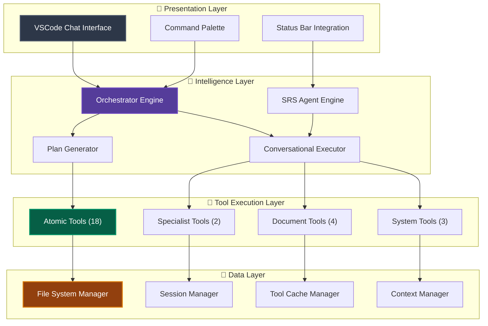

# SRS Writer - AI-Powered Requirements Engineering

<div align="center">


[](https://github.com/srs-writer-team/srs-writer-plugin)
[](https://opensource.org/licenses/Apache-2.0)
[](https://code.visualstudio.com/)
[](https://nodejs.org/)

**Production-Ready AI Assistant for Professional Software Requirements Engineering**

[Quick Start](#-quick-start) • [Architecture](#-architecture) • [Tool Ecosystem](#-tool-ecosystem) • [Documentation](#-documentation) • [Contributing](#-contributing)

</div>

---

## 🎯 Overview

SRS Writer is a production-ready VSCode extension featuring a sophisticated AI agent capable of autonomous software requirements engineering. Built with a four-layer tool architecture and conversational intelligence, it transforms natural language discussions into comprehensive, professional-grade SRS documentation.

**Current Capabilities:**
- **33 Specialized Tools** across 4 architectural layers
- **Autonomous Task Execution** with intelligent planning and recovery
- **Professional SRS Generation** following IEEE standards
- **Persistent Session Management** maintaining project context
- **Modular Architecture** with 17 specialized modules

## ✨ Core Features

### 🤖 Advanced AI Agent Engine

- **Conversational Intelligence**: Multi-turn dialogue with context awareness and memory
- **Autonomous Planning**: Self-organizing task execution with automatic error recovery
- **Tool Classification**: Smart risk assessment and confirmation workflows
- **Loop Detection**: Intelligent recovery from execution loops and edge cases
- **Progress Tracking**: Real-time task progress with transparent status reporting
- **Context Management**: Dynamic context window optimization and state persistence
- **User Interaction Handling**: Smart user input processing and response management

### 🏗️ Four-Layer Tool Architecture

**Production-grade tool ecosystem with 33 specialized tools:**

```
🟡 Atomic Layer (19 tools)    - VSCode API operations
🟠 Specialist Layer (4 tools) - Business logic operations  
🔴 Document Layer (6 tools)   - Complex document workflows
🟣 Internal Layer (4 tools)   - System control and management
```

### 📋 Professional Document Generation

- **IEEE-Compliant SRS**: Industry-standard requirements specifications
- **Structured YAML Files**: Machine-readable requirement definitions
- **Bi-directional Processing**: Import from existing documents or generate from scratch
- **Quality Assurance**: Built-in validation and consistency checking
- **Version Control Ready**: Text-based outputs optimized for Git workflows

### 🎨 Enterprise-Ready Architecture

- **Modular Design**: 15 specialized modules with clear separation of concerns
- **Async Operations**: Non-blocking operations with progress feedback
- **Error Recovery**: Comprehensive error handling with automatic rollback
- **Session Persistence**: Project state maintained across VSCode sessions
- **Plugin Architecture**: Extensible tool registry with hot-reload capabilities

## 🚀 Quick Start

### Prerequisites

- **Node.js 18+** 
- **VSCode 1.85.0+**
- **AI Provider** (GitHub Copilot, Claude, or OpenAI)

### Installation

```bash
# Clone and install
git clone https://github.com/srs-writer-team/srs-writer-plugin.git
cd srs-writer-plugin
yarn install
yarn build:prod

# Install in VSCode
# Press F5 to launch extension development host
```

### First Project in 2 Minutes

1. **Open VSCode Chat Panel** (Ctrl+Shift+I)
2. **Start with @srs-writer**:

   ```text
   @srs-writer Create a task management system for a team of 10 developers
   ```

3. **Watch autonomous execution**:
   - Project structure analysis
   - Requirements extraction and organization
   - Professional SRS document generation
   - Quality validation and reporting

## 🏗️ Architecture

### System Architecture Overview

SRS Writer employs a sophisticated multi-layer architecture designed for enterprise-scale requirements engineering:



### Core Engine Components

| Component | Purpose | Lines of Code | Key Features |
|-----------|---------|---------------|--------------|
| **Orchestrator** | AI planning and task routing | 402 | Multi-modal execution, intelligent triage |
| **SRS Agent Engine** | Autonomous task execution | 503 | Loop detection, error recovery, state management |
| **Specialist Executor** | Business logic coordination | 552 | Rule-based execution, specialist tool management |
| **Context Manager** | Memory and history management | - | Session persistence, context optimization |
| **Tool Executor** | Tool dispatch and coordination | 333 | Risk assessment, confirmation workflows |

### Modular Design Principles

- **Separation of Concerns**: Each module has a single, well-defined responsibility
- **Dependency Injection**: Clean interfaces enable easy testing and extension
- **Event-Driven Architecture**: Async operations with comprehensive error handling
- **Plugin Architecture**: Tool registry supports dynamic loading and hot-reload

## 🛠️ Tool Ecosystem

### Tool Distribution by Layer

```
Total Tools: 33
├── 🟡 Atomic Layer: 19 tools (57.6%)
│   ├── File Operations: readFile, writeFile, appendTextToFile, createDirectory, listFiles, deleteFile, renameFile
│   ├── Editor Integration: insertText, replaceText, getUserSelection, openAndShowFile, openAndSelectRange
│   ├── Knowledge Retrieval: readLocalKnowledge, internetSearch, enterpriseRAGCall
│   └── User Interaction: askQuestion, showProgressIndicator, suggestNextAction, showInformationMessage, showWarningMessage
│
├── 🟠 Specialist Layer: 4 tools (12.1%)
│   ├── SRS Management: createComprehensiveSRS, editSRSDocument
│   ├── Quality Assurance: classifyProjectComplexity, lintSRSDocument
│   └── [Expansion Ready: Plugin architecture supports dynamic tool loading]
│
├── 🔴 Document Layer: 6 tools (18.2%)
│   ├── Requirements Management: addNewRequirement, listRequirements
│   ├── Document Generation: generateFullSrsReport, generateSectionFromYaml
│   └── Document Import: importFromMarkdown, parseMarkdownTable
│
└── 🟣 Internal Layer: 4 tools (12.1%)
    ├── Task Control: finalAnswer, reportProgress
    ├── Knowledge Retrieval: ragRetrieval
    └── System Status: getSystemStatus
```

### Tool Intelligence Features

- **Risk Classification**: Automatic assessment (low/medium/high risk)
- **Interaction Modes**: Autonomous, confirmation-required, or interactive
- **Usage Analytics**: Real-time monitoring and performance tracking
- **Dynamic Registration**: Hot-reload capability for new tools
- **Access Control**: Distributed security model with caller-based permissions
- **Performance Monitoring**: Real-time tool execution analytics and optimization

### High-Value Tool Examples

```typescript
// Specialist Layer - Business Intelligence
await createComprehensiveSRS({
    projectName: "E-commerce Platform",
    description: "Full-featured online store with payment processing",
    includeTemplate: true
});

// Document Layer - Professional Output  
await generateFullSrsReport({
    projectPath: "my-project",
    outputFileName: "SRS_v1.0_Final.md",
    includeMetadata: true
});

// Atomic Layer - Smart Operations
await createDirectory({
    path: "new-project-folder",
    isProjectDirectory: true  // Automatically updates session context
});

// Document Layer - Requirements Management
await addNewRequirement({
    projectPath: "my-project",
    requirement: {
        name: "User Authentication",
        priority: "高",
        description: "Secure login with multi-factor authentication",
        acceptance_criteria: "Users can login with email/password + SMS verification"
    }
});
```

## 📊 Current Status & Metrics

### Development Metrics

<div align="center">


</div>

### Performance Characteristics

- **Response Time**: <2 seconds for common operations
- **Memory Usage**: <50MB typical working set
- **Tool Execution**: <500ms average per tool call
- **Session Loading**: <100ms for existing projects

### Reliability Features

- **Error Recovery**: Automatic rollback on failures
- **State Persistence**: Crash-resistant session management  
- **Loop Detection**: Intelligent handling of execution cycles
- **Graceful Degradation**: Fallback modes for edge cases

## 📁 Project Structure

```
srs-writer-plugin/
├── 📦 src/                          # Source code (TypeScript)
│   ├── 🎯 core/                     # Core intelligence modules
│   │   ├── orchestrator.ts          # Main AI orchestrator (402 lines)
│   │   ├── srsAgentEngine.ts        # Autonomous agent engine (503 lines)
│   │   ├── specialistExecutor.ts    # Specialist coordination (552 lines)
│   │   ├── engine/                  # Engine sub-modules (7 files)
│   │   └── orchestrator/            # Orchestrator sub-modules (8 files)
│   ├── 🔧 tools/                    # Four-layer tool architecture
│   │   ├── atomic/                  # VSCode API tools (19 tools)
│   │   ├── specialist/              # Business logic tools (4 tools)
│   │   ├── document/                # Document processing tools (6 tools)
│   │   └── internal/                # System control tools (4 tools)
│   ├── 💬 chat/                     # VSCode chat integration
│   ├── 🔍 parser/                   # Document processing (markdown, YAML)
│   ├── 🗂️ filesystem/               # File management
│   ├── ✅ quality/                  # Quality assurance and linting
│   ├── 🧪 test/                     # Test suites and fixtures
│   ├── 🔧 utils/                    # Utility functions (logger, error handler)
│   └── 🎨 types/                    # TypeScript definitions
├── 📋 rules/                        # AI behavior rules
│   ├── orchestrator.md              # Main orchestrator rules (310 lines)
│   └── specialists/                 # Task-specific rules (9 files)
├── ⚙️ config/                       # Configuration files
├── 📚 docs/                         # Architecture and implementation guides
│   ├── ai-response-format-standard.md
│   ├── model-configuration.md
│   ├── tool-access-control-matrix.md
│   └── specialist-tool-calling-implementation.md
├── 📄 templates/                    # SRS templates and samples
└── 🧪 src/test/                     # Comprehensive test suites
    ├── integration/                 # End-to-end testing
    ├── performance/                 # Performance benchmarks
    └── fixtures/                    # Test data and cases
```

## 💬 Usage Patterns

### Project Creation

```text
@srs-writer Create an e-commerce platform with the following features:
- User registration and authentication
- Product catalog with search and filtering  
- Shopping cart and checkout process
- Payment integration with Stripe
- Admin dashboard for inventory management
```

**Result**: Complete SRS document with structured requirements, YAML definitions, and quality validation.

### Requirement Management

```text
@srs-writer Add a new requirement for real-time notifications in my task management system

@srs-writer Update the payment processing requirements to include cryptocurrency support

@srs-writer Review the current requirements for completeness and consistency
```

### Document Operations

```text
@srs-writer Generate a final SRS report for client presentation

@srs-writer Import requirements from the existing project specification document

@srs-writer Validate the document structure and identify any missing sections
```

### Project Analysis

```text
@srs-writer /status

@srs-writer Analyze the current project structure and provide recommendations

@srs-writer Show me the current requirements coverage and any gaps
```

## 🧪 Quality Assurance

### Testing Strategy

- **Unit Tests**: Individual module functionality
- **Integration Tests**: Cross-module interactions  
- **Architecture Tests**: Design principle validation
- **Performance Tests**: Response time and memory usage
- **End-to-End Tests**: Complete user workflows

### Quality Gates

- **TypeScript**: Strict mode with comprehensive type checking
- **ESLint**: Enforced code style and best practices
- **Prettier**: Consistent code formatting
- **Jest**: Test coverage requirements (>85%)
- **Architecture Validation**: Automated design compliance

### Reliability Mechanisms

- **Graceful Error Handling**: Comprehensive try-catch with user-friendly messages
- **Automatic Rollback**: Database-style transactions for file operations
- **Session Recovery**: Automatic restoration of interrupted sessions
- **Resource Management**: Proper cleanup and memory management

## 🛠️ Development & Contributing

### Development Environment Setup

```bash
# Clone repository
git clone https://github.com/srs-writer-team/srs-writer-plugin.git
cd srs-writer-plugin

# Install dependencies
yarn install

# Development mode with hot reload
yarn dev

# Run test suite
yarn test

# Production build
yarn build:prod

# Architecture validation
yarn test:architecture
```

### Available Commands

| Command | Purpose | Usage |
|---------|---------|-------|
| `yarn dev` | Development with hot reload | Daily development |
| `yarn build` | Development build | Testing builds |
| `yarn build:prod` | Production build | Release preparation |
| `yarn test` | Run all tests | Quality assurance |
| `yarn test:spike` | Architecture validation | Design compliance |
| `yarn lint` | Code style check | Pre-commit validation |

### Contribution Guidelines

1. **Architecture Compliance**: Follow four-layer tool architecture
2. **Code Quality**: Maintain >85% test coverage
3. **Documentation**: Update README for user-facing changes
4. **Type Safety**: Use strict TypeScript throughout
5. **Performance**: Keep tool execution <500ms average

## 📚 Documentation & Resources

### User Documentation

- [Quick Start Guide](docs/quick-start.md) - Get running in minutes
- [Tool Architecture Report](工具架构报告.md) - Complete tool ecosystem overview
- [AI Response Format Standard](docs/ai-response-format-standard.md) - Response structure guidelines
- [Model Configuration](docs/model-configuration.md) - AI model setup and tuning
- [Tool Access Control Matrix](docs/tool-access-control-matrix.md) - Security and permissions

### Developer Resources

- [Orchestrator Rules](rules/orchestrator.md) - AI decision engine guidelines (310 lines)
- [Specialist Implementation](docs/specialist-tool-calling-implementation.md) - Business logic patterns
- [Tool Development](docs/tool-development.md) - Adding new tools
- [Architecture Testing](docs/spike-testing-guide.md) - Design validation methods

### API Reference

- [Tool Registry API](src/tools/index.ts) - Tool registration and management
- [Core Interfaces](src/types/index.ts) - TypeScript type definitions
- [Session Management](src/core/session-manager.ts) - State persistence APIs

## 🗺️ Roadmap & Vision

### Current Capabilities (v1.4.0)

- ✅ **Production-Ready Core**: Stable 4-layer architecture with 33 tools
- ✅ **Autonomous Agent**: Self-organizing task execution with error recovery
- ✅ **Professional Output**: IEEE-compliant SRS generation
- ✅ **Enterprise Features**: Session management, progress tracking, validation
- ✅ **Enhanced Tool Ecosystem**: Extended atomic layer with 19 tools
- ✅ **Specialist Intelligence**: 4 business logic tools for complex operations

### Next Phase: Tool Ecosystem Expansion

**Priority 1: Advanced Intelligence Features**
- Context-aware requirement suggestions
- Automatic consistency checking and gap detection
- Multi-language SRS generation support
- **Target**: Enhanced AI capabilities with domain expertise

**Priority 2: Integration & Automation**
- Git integration for version control
- CI/CD pipeline integration
- Third-party tool connectivity (JIRA, Azure DevOps)
- **Target**: Seamless development workflow integration

**Priority 3: Tool Ecosystem Expansion**
- Advanced requirements analysis and validation tools
- Project management and structure tools  
- Enhanced quality assurance and testing tools
- **Target**: Comprehensive professional toolset

### Long-term Vision

- **Cloud Platform**: Web-based collaboration with real-time sync
- **Enterprise Suite**: SSO, compliance reporting, advanced security
- **AI Evolution**: Continuous learning from user patterns and preferences
- **Ecosystem Growth**: Third-party plugin marketplace and API platform

## 📄 License & Attribution

This project is licensed under the Apache License 2.0 - see the [LICENSE](LICENSE) file for details.

**Key License Features:**
- ✅ Commercial use permitted
- ✅ Modification and distribution allowed  
- ✅ Private use encouraged
- ✅ Patent rights granted
- ⚠️ Trademark restrictions apply

---

<div align="center">

**🌟 Experience Production-Ready AI Requirements Engineering**

**Built for Professional Software Development Teams**

*Transforming natural language into professional documentation since 2024*

**Current Version: 1.4.0** | **Tools: 33** | **Modules: 17** | **Architecture: 4-Layer**

[⬆️ Back to top](#srs-writer---ai-powered-requirements-engineering)

</div>
