# SRS Writer - AI-Powered Requirements Engineering

<div align="center">


[](https://opensource.org/licenses/Apache-2.0)
[](https://code.visualstudio.com/)
[](https://nodejs.org/)

**Transform ideas into professional Software Requirements Specifications using natural language and AI**

[Getting Started](#-getting-started) • [Features](#-features) • [Documentation](#-documentation) • [Contributing](#-contributing) • [Roadmap](#-roadmap)

</div>

---

## 🎯 What is SRS Writer?

SRS Writer is a revolutionary VSCode extension that transforms the way you create Software Requirements Specifications. Simply describe your project in natural language, and watch as it generates comprehensive, professional-grade documentation including:

- **Complete SRS Documents** in industry-standard format
- **Structured YAML Files** for functional and non-functional requirements  
- **Glossary and Classification** for consistent terminology
- **Validation Reports** ensuring document quality

**No more wrestling with templates or complex formatting** - just focus on your ideas and let AI handle the rest.

## ✨ Features

### 🧠 Intelligent Natural Language Processing

- **Conversational Interface**: Describe your project like you're talking to a teammate
- **Context Awareness**: Remembers your project details across sessions
- **Intent Recognition**: Automatically understands whether you want to create, edit, or review

### 🏗️ Advanced Architecture

- **AST-Based Parsing**: Robust document processing that handles format variations
- **Hybrid Intelligence**: AI creativity combined with code reliability
- **Async Operations**: Non-blocking UI for smooth user experience
- **Session Management**: Maintains project state and history

### 📋 Professional Output

- **IEEE Standards Compliant**: Generate SRS documents following industry best practices
- **Multiple Formats**: Markdown, YAML, and structured text outputs
- **Comprehensive Coverage**: Functional requirements, non-functional requirements, glossaries
- **Quality Assurance**: Built-in validation and consistency checking

### 🎨 Flexible and Extensible

- **Template System**: Customizable document structures
- **Plugin Architecture**: Easy to extend with new features
- **Format Tolerance**: Robust parsing handles various input styles
- **Version Control Ready**: All outputs are text files perfect for Git

## 🚀 Getting Started

### Prerequisites

- **Node.js 18+** 
- **VSCode 1.85.0+**
- **AI Provider** (GitHub Copilot recommended, other providers supported)

### Installation

1. **Install from VSCode Marketplace** (coming soon)

   ```text
   Search for "SRS Writer" in VSCode Extensions
   ```

2. **Or install from source**

   ```bash
   git clone https://github.com/srs-writer-team/srs-writer-plugin.git
   cd srs-writer-plugin
   yarn install
   yarn build:prod
   ```

3. **Activate the extension**
   - Open VSCode
   - Press `F5` to launch extension development host
   - Open any project folder

### First Project in 60 Seconds

1. **Open VSCode Chat Panel** (Ctrl+Shift+I)
2. **Start with @srs-writer**
3. **Describe your project**:

   ```text
   @srs-writer I want to build a task management app for small teams
   ```

4. **Watch the magic happen** ✨

## 💬 Usage Examples

### Creating New Projects

```text
@srs-writer Create an e-commerce platform with user authentication and payment processing

@srs-writer Build a mobile app for expense tracking with receipt scanning

@srs-writer Design a library management system with book lending and return features
```

### Editing Existing Projects

```text
@srs-writer Add real-time notifications to my task management system

@srs-writer Update the payment requirements to include cryptocurrency

@srs-writer Remove the admin dashboard and simplify user roles
```

### Quality Assurance

```text
@srs-writer Check the quality of my current requirements

@srs-writer Validate the document structure and completeness

@srs-writer Show me what's missing from my SRS
```

## 🏗️ Architecture Highlights

### Hybrid Intelligence Design

SRS Writer combines the best of AI creativity and code reliability:

```mermaid
flowchart LR
    A["🗣️ Natural<br/>Language<br/>Input"] --> B["🤖 AI<br/>Processing<br/>& Generation"]
    B --> C["📄 Structured<br/>Documents<br/>Output"]
    B --> D["⚙️ Code-Driven<br/>Validation &<br/>File Generation"]
    
    style A fill:#2d3748,stroke:#4a5568,stroke-width:2px,color:#ffffff
    style B fill:#553c9a,stroke:#6b46c1,stroke-width:2px,color:#ffffff
    style C fill:#065f46,stroke:#059669,stroke-width:2px,color:#ffffff
    style D fill:#92400e,stroke:#d97706,stroke-width:2px,color:#ffffff
```



### Core Components

| Component | Purpose | Technology |
|-----------|---------|------------|
| **Orchestrator** | Intent understanding and routing | AI + Natural Language Processing |
| **AST Parser** | Document structure analysis | marked.js + Custom parsing |
| **Strategy Engine** | Task execution and coordination | TypeScript + Async patterns |
| **Session Manager** | State persistence and context | File-based storage + Caching |
| **File System** | Document generation and management | VSCode APIs + Async I/O |

### Why This Architecture Matters

- **🚀 Performance**: Async operations keep VSCode responsive
- **🛡️ Reliability**: Graceful fallbacks ensure consistent operation
- **🔧 Maintainability**: Clean separation of concerns and dependency injection
- **📈 Scalability**: Modular design supports growing feature sets
- **🎯 Accuracy**: AST-based parsing handles format variations robustly

## 📁 Project Structure

```mermaid
flowchart TD
    Root["🚀 SRS Writer Plugin"] --> Src["🎯 src/"]
    Root --> Rules["🤖 rules/"]
    Root --> Templates["📝 templates/"]
    Root --> Config["🔧 config/"]
    Root --> Docs["📚 docs/"]
    
    Src --> Extension["extension.ts<br/><small>Extension entry point</small>"]
    Src --> Chat["chat/<br/><small>Chat interface</small>"]
    Src --> Core["core/<br/><small>Core intelligence</small>"]
    Src --> Strategies["strategies/<br/><small>Task execution</small>"]
    Src --> Parser["parser/<br/><small>Document processing</small>"]
    Src --> Filesystem["filesystem/<br/><small>File operations</small>"]
    Src --> Types["types/<br/><small>TypeScript definitions</small>"]
    
    Core --> Orchestrator["orchestrator.ts"]
    Core --> AICommunicator["ai-communicator.ts"]
    Core --> SessionManager["session-manager.ts"]
    Core --> ReverseParser["reverse-parser.ts"]
    
    Rules --> OrchestratorMD["orchestrator.md"]
    Rules --> Specialists["specialists/<br/><small>Task-specific rules</small>"]
    
    style Root fill:#1a202c,stroke:#2d3748,stroke-width:3px,color:#ffffff
    style Src fill:#2d3748,stroke:#4a5568,stroke-width:2px,color:#ffffff
    style Core fill:#553c9a,stroke:#6b46c1,stroke-width:2px,color:#ffffff
    style Rules fill:#c53030,stroke:#e53e3e,stroke-width:2px,color:#ffffff
```



## 🛠️ Development & Contributing

We welcome contributions from the community! Here's how to get involved:

### Setting Up Development Environment

```bash
# Clone the repository
git clone https://github.com/srs-writer-team/srs-writer-plugin.git
cd srs-writer-plugin

# Install dependencies
yarn install

# Start development mode
yarn dev

# Run tests
yarn test

# Validate architecture
yarn validate:architecture
```

### Contributing Guidelines

1. **🐛 Bug Reports**: Use GitHub Issues with detailed reproduction steps
2. **💡 Feature Requests**: Share your ideas in GitHub Discussions
3. **📝 Documentation**: Help improve our docs and examples
4. **🔧 Code Contributions**: 
   - Fork the repository
   - Create a feature branch
   - Add tests for new functionality
   - Submit a pull request

### Development Commands

| Command | Description |
|---------|-------------|
| `yarn dev` | Start development with hot reload |
| `yarn build` | Build for development |
| `yarn build:prod` | Build for production |
| `yarn test` | Run test suite |
| `yarn test:spike` | Run architecture validation |
| `yarn lint` | Check code style |
| `yarn lint:fix` | Auto-fix code style issues |

### Code Quality Standards

- **TypeScript**: Strict type checking enabled
- **ESLint**: Consistent code style enforcement
- **Jest**: Comprehensive test coverage
- **Architecture Testing**: Automated validation of system design
- **Performance**: <2 second response time targets

## 📚 Documentation

### User Guides

- [Quick Start Tutorial](docs/quick-start.md)
- [Advanced Usage Patterns](docs/advanced-usage.md)
- [Document Templates](docs/templates.md)
- [Troubleshooting Guide](docs/troubleshooting.md)

### Developer Resources

- [Architecture Deep Dive](docs/architecture.md)
- [AI Rule System](docs/ai-rules.md)
- [Adding New Features](docs/feature-development.md)
- [Testing Strategy](docs/testing.md)
- [Mother Document Format Requirements](docs/mother-document-format-requirement.md)

### API Reference

- [TypeScript Types](docs/api/types.md)
- [Core Interfaces](docs/api/interfaces.md)
- [Extension Commands](docs/api/commands.md)

## 🗺️ Roadmap

### 🎯 Current Focus (Next 3 Months)

- **📱 VSCode Marketplace Release**: Make installation one-click easy
- **🌐 Multi-language Support**: Generate SRS in multiple languages
- **🎨 Advanced Templates**: Industry-specific SRS templates (web, mobile, enterprise)
- **⚡ Performance Optimization**: Sub-second response times for common operations

### 🚀 Near Term (3-6 Months)

- **🔄 Real-time Collaboration**: Multiple users editing the same SRS
- **📊 Analytics Dashboard**: Project metrics and requirement tracking
- **🔌 Integration APIs**: Connect with JIRA, Azure DevOps, GitHub Issues
- **📖 Enhanced Documentation**: Interactive tutorials and video guides

### 🌟 Medium Term (6-12 Months)

- **🤖 Advanced AI Features**: 
  - Context-aware requirement suggestions
  - Automatic consistency checking
  - Smart requirement gap detection
- **👥 Team Features**:
  - Role-based access control
  - Review and approval workflows
  - Change tracking and history
- **🏢 Enterprise Integration**:
  - SSO authentication
  - Compliance reporting
  - Advanced security features

### 🔮 Long Term Vision (12+ Months)

- **🧠 Adaptive AI**: Learn from user preferences and improve over time
- **🌍 Cloud Platform**: Web-based SRS editor with synchronization
- **📈 Business Intelligence**: Requirement analytics and trend analysis
- **🔗 End-to-End Workflow**: From requirements to code generation

### Community-Driven Features

We prioritize features based on community feedback. Vote on and suggest features in our [GitHub Discussions](https://github.com/srs-writer-team/srs-writer-plugin/discussions).

## 👥 Community & Support

### 💬 Get Help

- **📖 Documentation**: Check our comprehensive docs first
- **🐛 Bug Reports**: [GitHub Issues](https://github.com/srs-writer-team/srs-writer-plugin/issues)
- **💡 Feature Requests**: [GitHub Discussions](https://github.com/srs-writer-team/srs-writer-plugin/discussions)
- **❓ Questions**: Stack Overflow with tag `srs-writer`

### 🤝 Connect with the Community

- **GitHub**: Star, watch, and contribute to the repository
- **Discord**: Join our developer community (link coming soon)
- **Twitter**: Follow [@SRSWriter](https://twitter.com/srswriter) for updates
- **Blog**: Read about new features and best practices

### 🏆 Recognition

Special thanks to our contributors and the amazing open source community that makes this project possible:

- **🎨 Architecture**: Innovative hybrid intelligence design
- **🔧 Engineering**: Robust, scalable, and maintainable codebase  
- **📝 Documentation**: Comprehensive guides and examples
- **🧪 Testing**: Ensuring reliability and quality
- **🌍 Community**: Feedback, suggestions, and contributions

## 📊 Project Stats

<div align="center">


</div>

## 📄 License

This project is licensed under the Apache License 2.0 - see the [LICENSE](LICENSE) file for details.

```
Apache License 2.0

Copyright (c) 2024 SRS Writer Team

Licensed under the Apache License, Version 2.0 (the "License");
you may not use this file except in compliance with the License.
You may obtain a copy of the License at

    http://www.apache.org/licenses/LICENSE-2.0

Unless required by applicable law or agreed to in writing, software
distributed under the License is distributed on an "AS IS" BASIS,
WITHOUT WARRANTIES OR CONDITIONS OF ANY KIND, either express or implied.
See the License for the specific language governing permissions and
limitations under the License.
```

---

<div align="center">

**🌟 Star this repository if you find it useful!**

**Built with ❤️ for the global developer community**

*Experience the future of requirements engineering - where natural language meets professional documentation*

[⬆️ Back to top](#srs-writer---ai-powered-requirements-engineering)

</div>
