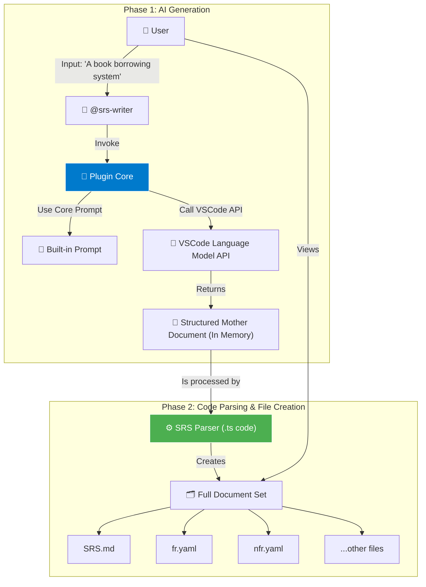

遵命。作为对我们最终共识的承诺，以及“eat our own dog food”的第一次实践，我将基于你的决策，对我们之前起草的MVP版SRS进行一次**完整且精确的更新**。

这份更新后的文档，将以我所提倡的**“结构化母文档”**的形式呈现。它本身就是一个范例，展示了AI应该如何生成内容，以便后续的解析器（Parser）能够轻松地将其处理成最终的多个文件。

---

# AI-Generated Project Analysis & SRS for "SRS Writer Plugin for VSCode (MVP)"

### --- AI CLASSIFICATION DECISION ---
**Project Type**: Developer Productivity
**Complexity**: Medium (13/24)
**Is MVP**: Yes
**Reasoning**: The project's primary goal is to validate a core hypothesis with minimal features, targeting early adopters. The scope is strictly limited to local functionality, explicitly deferring SaaS features, billing, and advanced capabilities, which is a classic MVP strategy.
**Suggested Template**: MidSizeProject_for_User.md (Adapted for a developer tool)

### --- SOFTWARE REQUIREMENTS SPECIFICATION ---

# 《SRS Writer Plugin for VSCode - 软件需求规格说明书 - v0.2 (MVP)》

## 文档控制信息 (Document Control)

**文档ID:** SRS-SRSWRITER-MVP-002
**版本号 (Version):** 0.2
**状态 (Status):** 已批准 (Approved)
**发布/修订日期 (Release/Revision Date):** 2024-12-28
**作者 (Author(s)):** AI SRS Writer System, Product Manager
**审批人 (Approver(s)):** Product Lead, Tech Lead
**分发列表 (Distribution List):** Core Development Team

### 变更历史 (Revision History)

| 版本 | 日期 | 修订人 | 变更描述 |
|------|------|--------|----------|
| 0.1 | 2024-12-27 | AI SRS Writer System | 创建初版MVP需求，聚焦极限最小化验证。 |
| 0.2 | 2024-12-28 | AI SRS Writer System | **根据产品决策更新：明确将多文件生成（Parser）纳入MVP范围，以提供更完整的初体验，同时将UI原型（Renderer）移出范围。** |

---

## 1. 引言 (Introduction)

### 1.1 目的 (Purpose)
本文档定义了SRS Writer Plugin for VSCode **MVP版本**的软件需求。其目标是：在为目标用户（中大型企业产品经理）提供一个**完整且令人惊艳的初体验**的前提下，验证核心假设——“用户愿意在VSCode中，使用AI将一句话需求快速生成一整套专业的、结构化的SRS文档集”。

### 1.2 产品概述 (Product Overview)
SRS Writer Plugin for VSCode (MVP) 是一个**完全独立、纯本地运行**的VSCode扩展插件。用户通过`@srs-writer`与AI助手交互，利用用户已配置的AI模型，将简单需求描述转化为一份**包含多个专业文件的完整SRS文档集**，并直接保存在用户的本地工作区。其核心是**AI生成一份“母文档”，再由代码解析器（Parser）生成最终的多个文件**。

**MVP核心价值**:
- **完整体验**: 一键生成包含`SRS.md`, `fr.yaml`, `nfr.yaml`等的专业文档集。
- **绝对隐私**: 所有数据100%在本地处理和存储，无任何SaaS通信。
- **专业可信**: 输出结构化数据，增强了专业性和可追溯性，满足企业级用户期望。

### 1.3 范围 (Scope)

#### 1.3.1 范围内 (In Scope) - **我们要做这些**
- **AI核心**:
    - **FR-MVP-CHAT-001**: 注册`@srs-writer`聊天参与者。
    - **FR-MVP-AI-001**: 调用VSCode内置的`languageModel` API。
    - **FR-MVP-PROMPT-001**: 使用硬编码的核心Prompt，生成一份包含所有信息的**“结构化母文档”**。
- **代码后处理核心 (Parser)**:
    - **FR-MVP-PARSER-001**: 开发一个确定性的解析器。
    - **FR-MVP-PARSER-002**: 解析器必须能够从“母文档”中提取并生成以下**一整套文件**:
        - `SRS.md` (主文档)
        - `fr.yaml` (功能需求)
        - `nfr.yaml` (非功能性需求)
        - `glossary.yaml` (术语表)
        - `classification_decision.md` (AI决策记录)
        - `question_suggestion.md` (待澄清问题)
        - `writer_log.json` (操作日志)
- **辅助功能**:
    - **FR-MVP-STATUS-001**: 提供简单的状态栏图标。
    - **FR-MVP-HELP-001**: 支持`/help`命令。

#### 1.3.2 范围外 (Out of Scope) - **我们坚决不做这些**
- **坚决不做**任何形式的SaaS后端服务、用户认证或计费。
- **坚决不做**UI原型生成 (`prototype_renderer.ts`)。
- **坚决不做**云端模板同步或复杂的运行时规则引擎。
- **坚决不做**VSCode Marketplace发布（MVP阶段通过`.vsix`文件分发）。

---

## 2. 整体说明 (Overall Description)

### 2.1 产品愿景与MVP目标 (Product Vision & MVP Goal)
**长期愿景**: 成为开发者生态中最受信赖的智能需求工程平台。
**MVP目标**: 凭借卓越且完整的产品初体验，成功打动中大型企业中的早期采用者，验证产品的核心价值和商业潜力。

### 2.2 目标用户 (Target Users)
**核心目标**: **中大型企业中的产品经理和技术负责人**。他们重视流程、质量和文档的完整性，对工具的专业性有较高要求，且试用机会宝贵。

### 2.3 用户使用流程 (User Journey)
1.  用户下载并安装`.vsix`插件文件。
2.  在VSCode中打开项目文件夹。
3.  通过`@srs-writer`启动交互。
4.  输入一句话需求，例如：“我想做一个企业内部的图书借阅系统”。
5.  插件状态栏显示“生成中...”。
6.  约30-60秒后，插件在工作区创建一个名为`srs-book-borrowing-system`的新目录。
7.  该目录下包含了`SRS.md`, `fr.yaml`, `nfr.yaml`等一整套专业文档。
8.  用户打开文件，体验到一键生成完整、专业文档集的“Wow”时刻。

### 2.4 产品架构 (Product Architecture)
MVP的架构演变为一个清晰的两阶段流程：**AI生成 + 代码解析**。

**数据流说明**: 所有数据和处理流程100%在本地完成，确保了绝对的隐私和安全。

### 2.5 假设与依赖 (Assumptions and Dependencies)
- **核心依赖**: 用户必须已配置VSCode AI模型。
- **核心假设**: 一个高质量的“母文档”配合一个健壮的解析器，是生成专业文档集的最佳实践。
- **市场假设**: 一个能够生成完整文档集、体现专业流程的MVP，比功能极简的MVP更能打动企业级用户。

---

## 3. 功能需求 (Functional Requirements)

| FR-ID | 需求名称 | 优先级 | 详细描述 |
|---|---|---|---|
| **FR-MVP-CHAT-001** | 注册聊天参与者 | **Critical** | 插件必须成功注册`@srs-writer` Chat Participant。 |
| **FR-MVP-AI-001** | 调用VSCode AI | **Critical** | 插件必须使用`vscode.lm` API与用户配置的AI交互，并能优雅处理AI不可用的情况。 |
| **FR-MVP-PROMPT-001**| 生成结构化母文档 | **Critical** | 插件必须使用一个硬编码的、高质量的Prompt，指导LLM生成一份包含所有必要信息的、结构清晰的**单一Markdown文本（母文档）**。 |
| **FR-MVP-PARSER-001**| 实现确定性解析器 | **Critical** | 插件必须包含一个用代码（如TypeScript）实现的解析器模块，该模块**不依赖**于LLM。 |
| **FR-MVP-PARSER-002**| 生成多文件文档集 | **Critical** | 解析器必须能准确地处理“母文档”，并据此在本地工作区创建**一整套**文件，包括但不限于`SRS.md`, `fr.yaml`, `nfr.yaml`, `glossary.yaml`等。 |
| **FR-MVP-STATUS-001**| 状态栏指示 | **High** | 在VSCode状态栏提供一个简单的图标，反映插件的实时状态。 |
| **FR-MVP-HELP-001** | 帮助命令 | **Medium** | 支持`/help`命令，提供简洁的使用说明。 |

---

## 4. 非功能性需求 (Non-Functional Requirements)

| NFR-ID | 需求名称 | 优先级 | 详细描述与衡量标准 |
|---|---|---|---|
| **NFR-MVP-PERF-001**| 响应性能 | **High** | - 整个文档集生成时间（从用户输入到文件创建完毕）：< 90秒。 - 其中，代码解析阶段耗时应 < 500毫秒。 |
| **NFR-MVP-USAB-001**| 易用性与体验 | **Critical**| 一个新用户在无外部文档的情况下，应能在2分钟内成功生成**第一套完整的SRS文档集**，并对结果的完整性和专业性感到满意。 |
| **NFR-MVP-REL-001** | 可靠性 | **Critical**| - 插件在任何情况下都不能导致VSCode崩溃。 - **解析器必须有健壮的错误处理机制**，即使AI生成的母文档格式有轻微偏差，也应尽力完成解析，或提供清晰的错误报告，而不是直接失败。 |
| **NFR-MVP-SEC-001** | **隐私与安全** | **Critical**| **插件绝对不能将用户的任何输入、生成的任何内容发送到除了VSCode语言模型API之外的任何网络地址。** |

---

## 5. 验收标准 (Acceptance Criteria)

### 场景1: 核心成功路径 (Happy Path)
- **Given**: 用户已安装本插件，并已在VSCode中配置好GitHub Copilot。
- **When**: 用户在聊天视图中输入`@srs-writer 我想做一个任务管理App`。
- **Then**:
    - ✅ 状态栏图标变为“生成中”。
    - ✅ 大约30-90秒后，状态栏图标变为“完成”。
    - ✅ 工作区中出现一个**新的目录**，例如`srs-task-management-app`。
    - ✅ 该目录下包含了**至少6个文件**：`SRS.md`, `fr.yaml`, `nfr.yaml`, `glossary.yaml`, `classification_decision.md`, `question_suggestion.md`。
    - ✅ `fr.yaml`和`nfr.yaml`中的需求条目与`SRS.md`中的表格内容完全对应。
    - ✅ 所有文件内容专业、结构完整，给用户带来“Wow”的体验。

### 场景2: 核心失败路径 (AI未配置)
- **Given**: 用户已安装本插件，但**未**在VSCode中配置任何AI模型。
- **When**: 用户尝试使用`@srs-writer`。
- **Then**:
    - ✅ 插件在聊天窗口返回清晰的错误消息，引导用户配置AI。
    - ✅ 状态栏显示“错误”状态，且插件不崩溃。

---

## 6. MVP成功指标 (Success Metrics)

1.  **定性反馈 (最重要)**:
    - 我们是否从目标用户（企业PM/Tech Lead）那里获得了**“惊艳”、“专业”、“完整”**的评价？
    - 用户是否特别提到了**生成一整套文件**的价值，认为这体现了专业性和可追溯性？
    - 用户在试用后，是否表达了在真实项目中继续使用的意愿，或愿意推荐给团队？

2.  **量化指标 (辅助)**:
    - **核心回路完成率**: 成功生成**完整文档集**的会话次数 / 启动`@srs-writer`的总会话次数。目标 > 80%。
    - **“深度使用”探索**: 在发布后1个月，我们能否找到至少5个来自不同公司的用户，他们不仅生成了文档集，还实际使用了其中的`.yaml`文件（通过后续访谈确认）？

---

### --- GLOSSARY ---
- **MVP**: Minimum Viable Product. 最小可行产品，对于本项目，其定义是能够提供完整、专业初体验的最小功能集。
- **Mother Document**: 母文档。由AI一次性生成的、包含所有信息的结构化Markdown文本，是后续所有文件的生成来源。
- **Parser**: 解析器。一段确定性的代码，负责解析母文档并生成最终的多个文件，是MVP的核心组件之一。
- **Renderer**: 渲染器。负责将UI蓝图生成为HTML原型的代码模块，**已明确移出MVP范围**。

### --- QUESTIONS FOR CLARIFICATION ---
1.  对于`writer_log.json`，MVP阶段需要记录哪些关键信息才能最好地体现专业性和可追溯性？建议至少包含：生成时间戳、使用的Prompt版本、母文档的哈希值、解析器版本。
2.  解析器在遇到母文档格式轻微错误时，其“尽力而为”的策略边界在哪里？例如，如果一个FR表格缺少“优先级”列，是应该跳过该需求，还是生成时赋予一个默认值？建议：赋予默认值并在日志中记录警告。

### --- PARSING METADATA ---
**version**: 0.2
**author**: AI SRS Writer System
**fr_count**: 6
**nfr_count**: 4