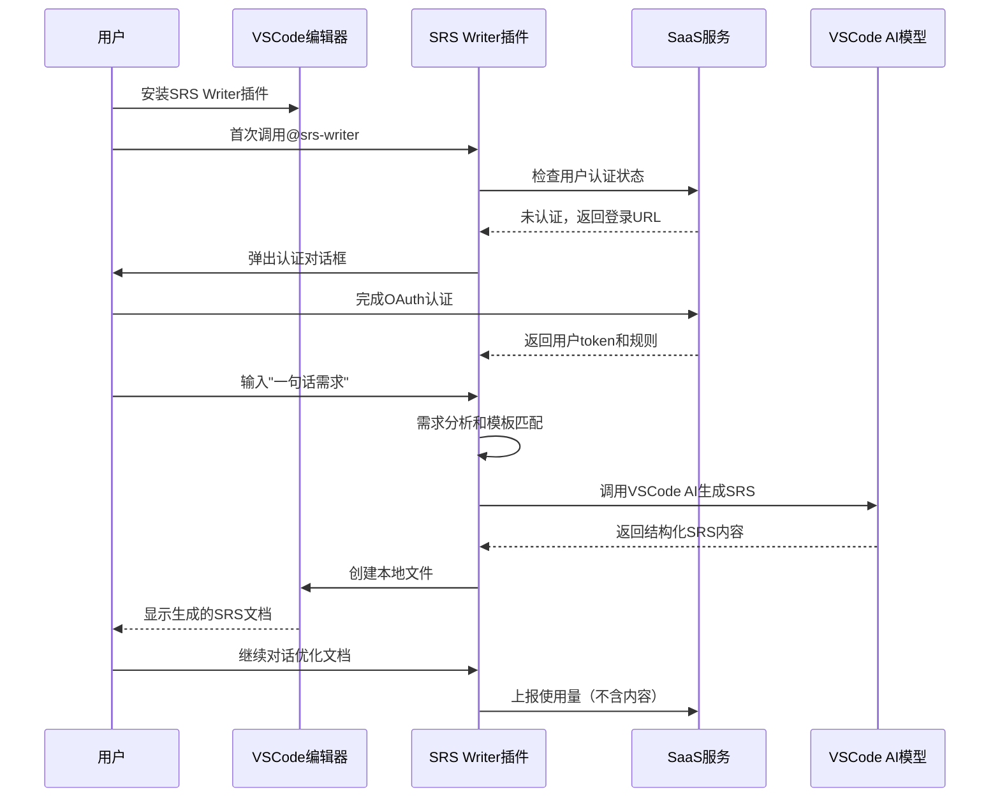
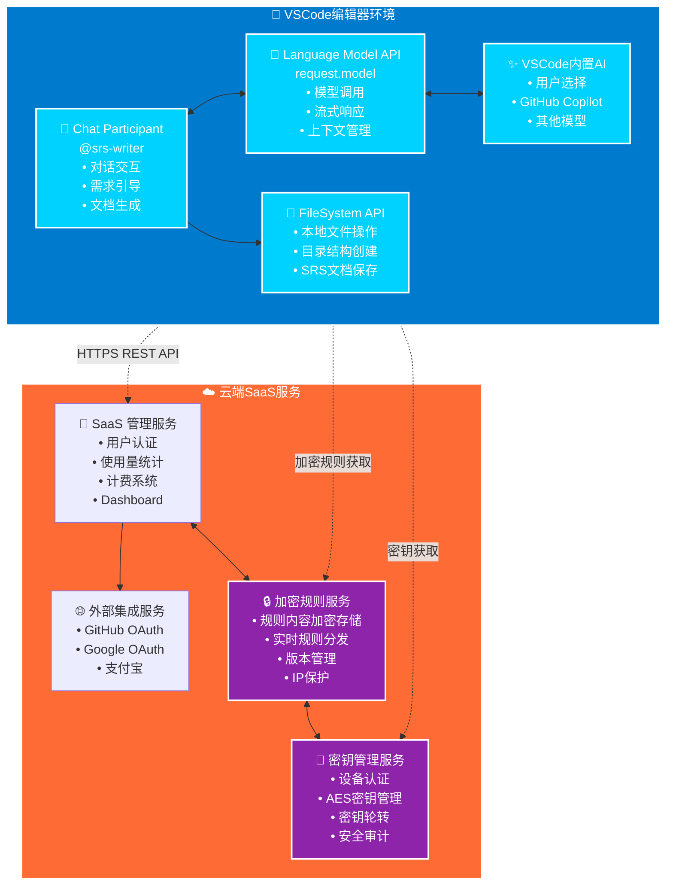
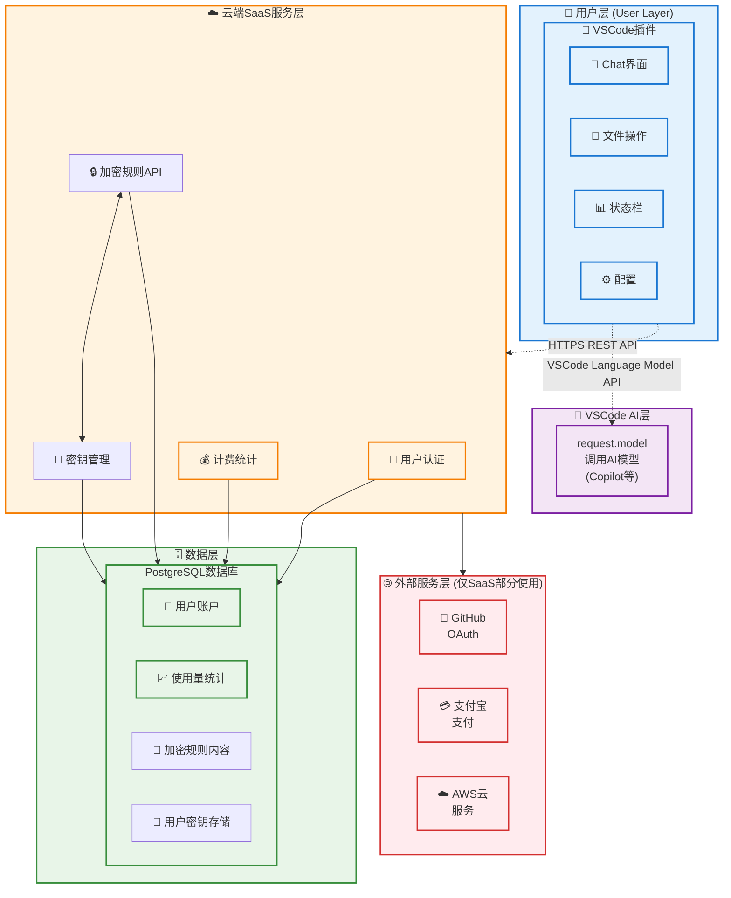
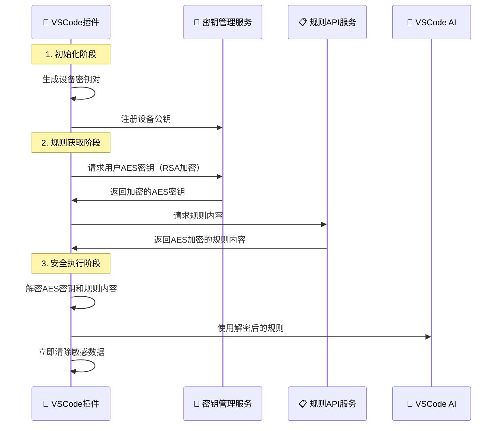

# 《SRS Writer Plugin for VSCode - 软件需求规格说明书 - v1.0》

## 文档控制信息 (Document Control)

**文档ID:** SRS-SRSWRITER-001  
**版本号 (Version):** 1.0  
**状态 (Status):** 草稿 (Draft)  
**发布/修订日期 (Release/Revision Date):** 2024-12-26  
**作者 (Author(s)):** AI SRS Writer System  
**贡献者 (Contributor(s)):** 产品经理  
**审批人 (Approver(s)):** 架构师, 技术负责人  
**分发列表 (Distribution List):** 开发团队, 测试团队, 产品团队  

### 变更历史 (Revision History)

| 版本 | 日期 | 修订人 | 审批人 | 变更描述 | 模版类型 |
|------|------|--------|--------|----------|----------|
| 0.1 | 2024-12-26 | AI SRS Writer System | | 初稿创建 | 面向开发工具项目-复杂模版 |
| 1.0 | 待定 | 产品经理 | 架构师 | 根据评审意见修订并首次发布 | |

---

## 目录 (Table of Contents)

1. [引言 (Introduction)](#1-引言-introduction)
2. [整体说明 (Overall Description)](#2-整体说明-overall-description)
3. [核心功能需求 (Core Functional Requirements)](#3-核心功能需求-core-functional-requirements)
4. [数据需求 (Data Requirements)](#4-数据需求-data-requirements)
5. [外部接口需求 (External Interface Requirements)](#5-外部接口需求-external-interface-requirements)
6. [非功能性需求 (Non-Functional Requirements)](#6-非功能性需求-non-functional-requirements)
7. [运维与监控需求 (Operations and Monitoring Requirements)](#7-运维与监控需求-operations-and-monitoring-requirements)
8. [其他需求 (Other Requirements)](#8-其他需求-other-requirements)
9. [验收标准 (Acceptance Criteria)](#9-验收标准-acceptance-criteria)
10. [产品演进规划 (Product Evolution Planning)](#10-产品演进规划-product-evolution-planning)

附录 (Appendices)

---

## 1. 引言 (Introduction)

### 1.1 目的 (Purpose)
本文档的目的是定义SRS Writer Plugin for VSCode的软件需求规格说明。该产品是一个结合VSCode插件和SaaS云端服务的AI驱动的需求文档生成工具。

预期读者包括：产品经理、架构师、开发团队、测试团队、运维团队以及相关的技术决策者。

### 1.2 产品概述 (Product Overview)
SRS Writer Plugin for VSCode是一个创新的开发工具，采用**VSCode Chat Participant + SaaS服务**的混合架构。用户通过`@srs-writer`在VSCode聊天视图中与AI Agent交互，直接使用VSCode内置的Language Model（用户在VSCode中配置的AI模型），将需求idea自动转换为完整的SRS文档集并保存在本地工作区。

**核心价值**：
- **开发者原生体验**：集成在VSCode中，无需切换工具
- **隐私保护**：SRS内容完全本地生成和存储
- **AI驱动**：智能化需求分析和文档生成
- **模板生态**：丰富的行业模板和自定义能力

该产品在开发工具生态中的定位是**开发者工作流中的智能文档助手**，为产品经理、技术负责人和开发团队提供标准化、专业化的需求文档生成能力。

### 1.3 范围 (Scope)

#### 1.3.1 产品范围 (Product Scope)
本需求文档覆盖SRS Writer Plugin for VSCode的完整功能体系，包括**VSCode Chat Participant插件**（核心）、**SaaS管理服务**（辅助）、**模板库和同步**、**用户认证和计费系统**。

其主要目标是在VSCode原生环境中提供智能化的需求文档生成能力，核心价值是提升软件开发团队的文档编写效率和质量。

#### 1.3.2 范围内 (In Scope)
MVP第一版明确包含的功能特性：

**VSCode Chat Participant（核心功能）:**
- `@srs-writer` Chat Participant注册和交互
- 基于VSCode内置AI模型的文档生成
- 本地工作区文件创建和管理
- 插件状态栏和配置管理

**SaaS管理服务（支撑功能）:**
- 用户认证系统（GitHub、Google OAuth + 邮箱注册）
- 使用量统计和Freemium计费（每月2个免费SRS项目）
- 模板库管理和同步
- 用户Dashboard和账单管理

**模板和规则系统:**
- 预制行业模板库
- 用户自定义模板上传和管理
- SRS生成规则引擎

#### 1.3.3 范围外 (Out of Scope)
第一版暂缓功能（后续版本考虑）：
- **VSCode Marketplace发布**（MVP阶段使用.vsix离线安装）
- **VSCode AI服务**（用户已配置AI模式）
- **文档协作功能**（本地文件为主）
- **复杂的项目管理**
- **企业级权限管理**
- **高级对话回退功能**（依赖VSCode Chat原生功能）
- **实时客服系统**
- **多语言本地化**

#### 1.3.4 成功度量标准 (Success Metrics)
*（详细的度量标准和KPI定义请参见第6章非功能性需求）*

**用户增长指标:**
- 第1-6个月用户数增长路径: 10→50→200→600→1200→2000
- 付费用户转化率: 20%

**使用效率指标:**
- 用户平均每月生成SRS文档集: 2.7份
- SRS生成成功率: >95%

**技术指标:**
- 插件响应时间、API性能、系统可用性等（具体量化标准见NFR章节）

### 1.4 关键术语与定义 (Definitions, Acronyms, and Abbreviations)

| 术语 | 定义 |
|------|------|
| SRS | Software Requirements Specification，软件需求规格说明书 |
| AI Agent | 智能代理，基于大语言模型的自动化需求文档生成引擎 |
| HLD | High Level Design，高层设计文档 |
| MVP | Minimum Viable Product，最小可行产品 |
| Freemium | 免费增值商业模式，基础功能免费，高级功能付费 |
| VSCode Extension | Visual Studio Code扩展插件 |
| SaaS | Software as a Service，软件即服务 |
| OAuth | 开放授权标准 |
| JWT | JSON Web Token，用于身份验证的令牌标准 |
| API | Application Programming Interface，应用程序编程接口 |
| CLI | Command Line Interface，命令行界面 |

### 1.5 参考资料 (References)
- VSCode Extension API文档: <https://code.visualstudio.com/api>
- GitHub OAuth文档: <https://docs.github.com/en/developers/apps/building-oauth-apps>
- Google OAuth文档: <https://developers.google.com/identity/protocols/oauth2>
- OpenAI API文档: <https://platform.openai.com/docs>
- Claude API文档: <https://docs.anthropic.com/claude/reference>
- AWS EKS文档: <https://docs.aws.amazon.com/eks/>
- React官方文档: <https://reactjs.org/docs>
- Node.js官方文档: <https://nodejs.org/en/docs/>

### 1.6 文档约定 (Document Conventions)
- **优先级定义:** Critical(关键) > High(高) > Medium(中) > Low(低)
- **需求ID命名规则:** FR-[MODULE]-XXX（功能需求），NFR-[MODULE]-XXX（非功能需求）
- **模块缩写:** CHAT(聊天)、FILE(文件)、STATUS(状态)、CONFIG(配置)、AUTH(认证)、AI(人工智能)、TEMPLATE(模板)、BILLING(计费)、DASHBOARD(仪表板)、API(接口)、SECURITY(安全)
- **文档状态:** 草稿 → 评审中 → 已批准 → 已发布 → 已废弃

---

## 2. 整体说明 (Overall Description)

### 2.1 产品愿景与目标 (Product Vision and Goals)

**长期愿景:** 成为开发者生态中最受信赖的智能需求文档生成工具，让"一句话需求"自动转化为专业的SRS文档集。

**短期目标:**
- MVP阶段：建立基础的AI驱动需求文档生成能力
- 6个月内：达到2000活跃用户，验证产品市场适应性
- 1年内：成为VSCode Marketplace中需求文档类插件的标杆产品

**技术发展目标:**
- 构建可扩展的AI Agent架构，支持多种文档类型生成
- 建立完善的模板生态系统，支持不同行业和项目类型
- 实现智能化的需求质量检测和改进建议

### 2.2 目标用户与使用场景 (Target Users and Use Cases)

**主要用户群体:**

1. **产品经理** (Primary)
   - 特征：中大型公司软件团队、业务部门的产品经理
   - 痛点：对技术细节不太了解，经常写出"一句话需求"等不规范需求文档
   - 使用场景：需要快速将产品idea转化为标准化的技术需求文档

2. **技术负责人** (Primary)  
   - 特征：架构师或全栈技术专家
   - 痛点：需要花费大量时间完善和标准化需求文档
   - 使用场景：审核和完善产品经理提供的需求，生成技术团队可执行的规格说明

3. **开发团队成员** (Secondary)
   - 特征：经验水平参差不齐的开发人员
   - 痛点：理解模糊需求困难，缺乏标准化的需求参考
   - 使用场景：查阅和理解项目需求，确保开发符合规格要求

### 2.2.1 完整用户使用流程 (Complete User Journey)

为了帮助用户理解如何使用此产品，以下是详细的端到端使用流程：

#### 第一步：产品下载与安装
1. **下载VSCode编辑器**
   - 访问 [VSCode官网](https://code.visualstudio.com/)
   - 下载并安装适合操作系统的版本

2. **获取SRS Writer插件**
   - 从官方渠道下载SRS Writer Plugin for VSCode的.vsix文件
   - MVP阶段通过.vsix文件分发，不在VSCode Marketplace发布

3. **离线安装插件**
   - 打开VSCode，按Ctrl+Shift+P打开命令面板
   - 输入"Extensions: Install from VSIX..."命令
   - 选择下载的.vsix文件进行安装
   - 安装完成后重启VSCode

4. **初始配置检查**
   - 安装完成后，插件会检查VSCode中是否已配置AI模型
   - 如未配置，会提示用户配置GitHub Copilot或其他Language Model

#### 第二步：用户注册与认证
1. **首次使用触发注册**
   - 首次调用`@srs-writer`时，插件会检查用户认证状态
   - 如果未登录，会弹出认证对话框

2. **SaaS端注册流程**
   - 点击"Sign up/Sign in"按钮，自动打开浏览器
   - 访问SaaS注册页面：`https://aiagent.testany.com.cn/auth`
   - 选择认证方式：GitHub OAuth、Google OAuth 或邮箱注册
   - 完成认证后，浏览器显示"认证成功，请返回VSCode"

3. **插件同步用户信息**
   - 认证完成后，插件自动同步用户信息和会话状态
   - 用户session自动保存并支持自动续期（30天有效期）
   - 从SaaS端拉取用户的SRS生成规则和模板配置，加密存储在插件内存中

#### 第三步：VSCode AI模型配置（用户已有）
**重要说明**：此产品基于VSCode内置Language Model API，使用用户在VSCode中已配置的AI模型，**无需额外配置API Key**。

1. **支持的AI模型**
   - GitHub Copilot（最常见）
   - 其他VSCode支持的Language Model（如通过插件扩展的模型）
   - 用户模型信息完全本地存储，不同步到SaaS端

2. **安全性保障**
   - **插件不接触用户API Key**：所有AI调用通过VSCode内置API进行
   - **零Token成本**：用户使用已付费的AI服务，插件本身不产生AI调用费用
   - **隐私保护**：SRS内容生成完全本地进行，不上传到云端

#### 第四步：开始创建SRS文档
1. **启动Chat交互**
   - 在VSCode中打开Chat面板（Ctrl+Alt+I或通过命令面板）
   - 输入`@srs-writer`，插件会显示欢迎信息和可用命令

2. **项目需求输入**
   - 用户描述"一句话需求"，如："我想做一个在线图书管理系统"
   - 插件通过多轮对话收集详细需求：
     - 项目类型（用户交付/平台/内部工具等）
     - 核心功能描述
     - 用户角色和使用场景
     - 技术约束和非功能需求

3. **智能模板推荐**
   - 基于用户输入，插件自动分析项目特征
   - 从6种预制模板中推荐最合适的一种（用户交付×3 + 平台×3）
   - 用户可确认推荐或手动选择其他模板

#### 第五步：文档生成与本地保存
1. **AI生成SRS文档**
   - 插件调用VSCode内置AI模型，使用专业SRS提示词
   - 生成完整的SRS.md主文档和结构化的YAML文件
   - 整个过程耗时约30-60秒，取决于项目复杂度

2. **本地文件创建**
   - 在当前VSCode工作区创建项目目录结构
   - 生成文件：SRS.md、fr.yaml、nfr.yaml、glossary.yaml
   - 所有文件完全本地存储，**不上传到云端**

#### 第六步：文档编辑与迭代
1. **实时编辑支持**
   - 用户可直接在VSCode中编辑生成的SRS文档
   - 插件监控文件变更，提供格式检查和一致性验证
   - 支持通过`@srs-writer`继续对话进行文档优化

2. **版本控制集成**
   - 支持Git操作，可将SRS文档提交到版本控制系统
   - 提供PR模板和评审流程支持

#### 第七步：使用量管理
1. **Freemium模式**
   - 免费用户每月可创建2个SRS项目
   - 超量使用按¥49/项目计费
   - 计费基于新建SRS.md文档的次数

2. **账单管理**
   - 用户可在SaaS端Dashboard查看使用情况
   - 支持支付宝在线支付，自动续费

### 使用流程时序图



### 2.3 产品架构概览 (Product Architecture Overview)

**高层架构:**




**数据流向:**
1. **用户交互**：`@srs-writer` → Chat Participant → 规则路由决策
2. **规则获取**：规则请求 → 加密规则服务 → 密钥解密 → 内存中规则内容
3. **AI调用**：解密规则 + 用户输入 → VSCode内置AI → 生成响应
4. **文档生成**：AI响应 → 本地文件系统 → 保存SRS文档
5. **使用统计**：生成完成 → SaaS服务 → 计费统计
6. **安全清理**：规则使用完成 → 内存数据清除 → 垃圾回收

**主要技术栈:**
- **VSCode插件**：VSCode Extension API + TypeScript + Chat API + 加密库(crypto)
- **前端Dashboard**：React + TailwindCSS 
- **后端服务**：Node.js + Express + PostgreSQL（轻量化）
- **安全加密**：AES-256-GCM + RSA-2048 + 设备指纹 + 密钥管理
- **部署**：AWS EKS（简化架构）
- **AI集成**：VSCode Language Model API（用户已配置的AI模型）

### 2.4 运行环境 (Operating Environment)

**VSCode插件环境:**
- VSCode版本：1.100.0或更高（支持Chat API）
- 操作系统：Windows 10+, macOS 10.15+, Linux (Ubuntu 18.04+)
- 网络要求：互联网连接（用户认证和模板同步）
- 存储空间：本地文档存储，无特殊要求

**SaaS服务环境:**
- 云平台：AWS（简化架构）
- 容器环境：Docker容器化部署
- 数据库：PostgreSQL（用户和模板数据）
- CDN：静态资源加速

**用户端要求:**
- **必需**：VSCode中已配置AI模型（如GitHub Copilot或其他）
- **可选**：GitHub或Google账户（用于SaaS服务认证）

### 2.5 设计与实现约束 (Design and Implementation Constraints)

**VSCode Chat API约束:**
- 必须使用标准Chat Participant API
- 遵循VSCode Chat界面设计规范
- 支持对话历史和上下文管理
- 兼容VSCode Chat响应流格式

**数据隐私约束:**
- **SRS内容不得上云**：所有文档内容仅本地存储
- **最小化数据收集**：仅收集必要的使用统计数据
- **用户隐私保护**：SRS内容完全本地存储，零上云

**性能约束:**
- 插件启动时间 < 3秒
- Chat交互响应时间 < 2秒（依赖用户API响应）
- 文档生成时间 < 30秒（依赖LLM性能）

**成本约束:**
- **无AI调用成本**：使用VSCode内置AI模型（用户已付费）
- SaaS服务成本最小化
- 主要成本为用户管理和模板服务

### 2.6 假设与依赖 (Assumptions and Dependencies)

**VSCode平台依赖:**
- VSCode Chat API稳定性和兼容性
- VSCode Extension Marketplace发布流程
- VSCode FileSystem API可靠性

**用户依赖:**
- 用户具备基本VSCode使用经验
- 用户已在VSCode中配置AI模型（如GitHub Copilot）
- 用户理解Chat Participant交互模式

**外部服务依赖:**
- GitHub/Google OAuth服务稳定性
- VSCode Language Model API稳定性
- 支付宝支付接口（计费功能）

**技术假设:**
- VSCode Chat API功能满足产品需求
- VSCode Language Model API满足LLM调用需求
- 用户愿意在VSCode中配置和使用AI模型

### 2.7 容量规划与扩展性 (Capacity Planning and Scalability)

**当前容量需求（MVP阶段）:**
- 支持并发用户：100人
- 日API调用量：1,000次
- 数据存储：10GB用户数据 + 模板数据

**未来增长预期:**
- 6个月后：2,000用户，日API调用20,000次
- 1年后：10,000用户，日API调用100,000次
- 3年后：100,000用户，支持企业级部署

**扩展策略:**
- 水平扩展：Kubernetes自动伸缩
- 垂直扩展：根据负载调整实例规格
- 数据扩展：数据库分片和读写分离

**弹性要求:**
- 自动扩缩容：基于CPU和内存使用率
- 负载均衡：支持多实例负载分发
- 故障恢复：30秒内自动故障转移

---

## 3. 核心功能需求 (Core Functional Requirements)

### 3.1 VSCode插件端核心能力

#### 3.1.1 Chat Participant核心功能 (CHAT)

| FR-ID | 需求名称/标题 | 优先级 | 详细描述 | 依赖组件 | 验收标准 (Acceptance Criteria) | 备注/澄清点 |
|-------|---------------|--------|----------|----------|-------------------------------|-------------|
| FR-CHAT-001 | Chat Participant注册 | Critical | 注册@srs-writer Chat Participant，使用户能通过@符号在VSCode聊天视图中调用插件。 | VSCode Chat API | 1. 成功注册Chat Participant ID<br/>2. @srs-writer触发正确响应<br/>3. 显示插件图标和描述<br/>4. 支持命令自动补全<br/>5. 与VSCode Chat UI完全集成 | 遵循VSCode Chat Participant规范 |
| FR-CHAT-002 | 对话式需求收集 | Critical | 通过Chat界面收集用户项目需求，支持多轮对话和上下文理解。依赖VSCode Chat原生的对话历史功能。 | VSCode Language Model API, VSCode Chat Context | 1. 支持多轮对话历史（VSCode Chat原生功能）<br/>2. 智能需求信息提取<br/>3. 自动识别信息缺失<br/>4. 主动澄清问题<br/>5. 生成结构化需求<br/>6. 上下文理解和延续 | **MVP阶段**：依赖VSCode Chat Participant原生的对话历史功能，不开发额外的对话回退机制 |
| FR-CHAT-003 | Slash命令支持 | High | 支持完整的slash命令系统，提升用户操作效率。命令直接路由到对应的规则文件，跳过关键词检测的不确定性。 | VSCode Chat Commands, 规则路由系统 | 1. **工作流命令**：<br/>  - `/new [project-type]`：新建SRS项目 → 100_create_srs.mdc<br/>  - `/edit [section]`：编辑SRS文档 → 200_edit_srs.mdc<br/>  - `/prototype [feature]`：创建UI原型 → 300_prototype.mdc<br/>  - `/git [operation]`：Git操作 → 500_git_ops.mdc<br/>2. **系统管理命令**：<br/>  - `/sync`：状态同步 → 999_state_sync.mdc<br/>  - `/status`：显示项目状态和session信息<br/>  - `/help`：显示可用命令和帮助<br/>  - `/templates`：列出可用的6种模板<br/>  - `/reset`：重置当前session状态<br/>3. 命令参数解析和验证<br/>4. 错误处理和用户友好提示 | **设计原则**：命令作为快捷入口，最终路由到相同的规则文件；保持现有状态验证和同步检查逻辑；自然语言输入作为备选方案；**绝不暴露核心IP或生成规则** |

#### 3.1.2 文件操作能力 (FILE)

| FR-ID | 需求名称/标题 | 优先级 | 详细描述 | 依赖组件 | 验收标准 (Acceptance Criteria) | 备注/澄清点 |
|-------|---------------|--------|----------|----------|-------------------------------|-------------|
| FR-FILE-001 | 项目文件创建 | Critical | 插件应能在VSCode工作区中创建完整的SRS项目目录结构和文件。 | VSCode FileSystem API | 1. 自动创建项目目录结构<br/>2. 生成SRS.md主文档<br/>3. 创建fr.yaml/nfr.yaml结构化文件<br/>4. 生成glossary.yaml术语表<br/>5. 创建proto/原型目录（可选） | 目录结构遵循标准规范 |
| FR-FILE-002 | 文件内容生成 | Critical | 根据Chat收集的信息，自动生成完整的SRS文档内容并写入相应文件。 | AI Agent, 模板引擎 | 1. SRS文档内容完整性100%<br/>2. 功能需求ID格式统一<br/>3. 验收标准符合S.M.A.R.T原则<br/>4. 文档格式符合Markdown规范<br/>5. 结构化文件格式正确 | 支持多种SRS模板 |
| FR-FILE-003 | 文件编辑检测 | Medium | 检测用户在VSCode中对生成文件的编辑，提供智能建议。 | VSCode File Watcher | 1. 检测文件变更<br/>2. 提供编辑建议<br/>3. 格式一致性检查<br/>4. 结构完整性验证<br/>5. 本地备份管理 | 不上传用户内容到云端 |

#### 3.1.3 状态栏集成 (STATUS)

| FR-ID | 需求名称/标题 | 优先级 | 详细描述 | 依赖组件 | 验收标准 (Acceptance Criteria) | 备注/澄清点 |
|-------|---------------|--------|----------|----------|-------------------------------|-------------|
| FR-STATUS-001 | 插件状态显示 | High | 在VSCode状态栏显示插件当前状态，包括连接状态、生成进度、用户信息等。 | VSCode StatusBar API | 1. 显示云端连接状态<br/>2. 显示当前用户信息<br/>3. 显示文档生成进度<br/>4. 支持点击快速操作<br/>5. 状态图标清晰易懂 | 图标设计简洁明了 |
| FR-STATUS-002 | 快速操作入口 | Medium | 状态栏提供快速操作入口，如新建项目、切换账户、查看帮助等。 | 插件命令系统 | 1. 右键菜单功能完整<br/>2. 快捷键支持<br/>3. 操作响应及时<br/>4. 帮助文档访问<br/>5. 设置界面入口 | 操作入口不宜过多 |

#### 3.1.4 配置管理 (CONFIG)

| FR-ID | 需求名称/标题 | 优先级 | 详细描述 | 依赖组件 | 验收标准 (Acceptance Criteria) | 备注/澄清点 |
|-------|---------------|--------|----------|----------|-------------------------------|-------------|
| FR-CONFIG-001 | 用户设置管理 | High | 提供插件配置界面，支持偏好设置、模板选择、SaaS账户等配置。 | VSCode Configuration API | 1. 配置界面易于使用<br/>2. 账户设置集成<br/>3. 设置实时生效<br/>4. 配置导入导出<br/>5. 重置默认设置功能 | 无需管理LLM Token |
| FR-CONFIG-002 | 云端设置同步 | Medium | 支持用户设置在不同设备间同步，保持一致的使用体验。 | 云端用户API | 1. 设置自动同步<br/>2. 冲突处理策略<br/>3. 同步状态提示<br/>4. 手动同步触发<br/>5. 隐私设置保护 | 考虑网络环境影响 |

### 3.2 Language Model集成能力

#### 3.2.1 多模型支持 (LM)

| FR-ID | 需求名称/标题 | 优先级 | 详细描述 | 依赖组件 | 验收标准 (Acceptance Criteria) | 备注/澄清点 |
|-------|---------------|--------|----------|----------|-------------------------------|-------------|
| FR-LM-001 | VSCode AI模型集成 | Critical | 集成VSCode内置的Language Model API，使用用户在VSCode中配置的AI模型。**重要澄清**：API Key由用户在VSCode设置中配置（如GitHub Copilot），插件通过VSCode标准API调用，**插件不直接接触或存储用户API Key**，确保安全性。 | VSCode Language Model API | 1. 使用request.model调用AI<br/>2. 支持VSCode支持的所有模型<br/>3. 自动模型选择（用户配置）<br/>4. **安全保障**：插件不接触用户API Key，通过VSCode代理调用<br/>5. API调用错误处理<br/>6. 响应流式处理 | **安全机制**：用户API Key存储在VSCode设置中，插件通过VSCode Language Model API调用，插件无权访问原始API Key，消除用户对Token被盗用的担忧 |
| FR-LM-002 | 智能提示词引擎 | Critical | 使用专业的SRS生成提示词和规则，确保生成文档的质量和标准化。**工作机制澄清**：插件启动时从SaaS端加载加密的SRS生成规则到内存中，调用VSCode内置AI时将规则与用户输入组合发送给AI模型，规则使用完成后自动从内存清除。 | 云端模板服务, 加密传输 | 1. 专业SRS提示词库<br/>2. **规则加载机制**：SaaS端加密存储规则，插件按需加载到内存<br/>3. 项目类型适配<br/>4. 动态提示词组装<br/>5. 输出格式控制<br/>6. 质量一致性保证<br/>7. **内存清理**：规则使用完成后自动清除 | **规则保护**：核心SRS生成规则加密存储在云端，插件临时加载使用，使用完成后自动清理，保护知识产权 |
| FR-LM-003 | 文档结构化生成 | High | 将LLM生成的内容解析为标准化的SRS文档结构，并保存为多个文件。 | 文档解析器, File API | 1. 内容结构化解析<br/>2. 多文件自动分割<br/>3. 格式规范化<br/>4. 文件命名规范<br/>5. 错误恢复机制 | 支持增量生成和修改 |
| FR-LM-004 | 项目分类与模板智能推荐 | High | 基于RequirementComplexClassification.md规则，自动分析项目特征并推荐合适的固定模板。**推荐机制澄清**：系统通过调用SaaS端模板管理API获取6种预制模板信息（用户交付×3 + 平台×3），基于项目复杂度和类型进行智能匹配，返回最适合的模板选择建议。 | 项目分类算法, 固定模板文件, VSCode Language Model API, SaaS模板管理API | 1. 支持4种项目类型识别（用户交付/平台/团队效率/安全）<br/>2. 支持3种复杂度评估（简单/中等/大型）<br/>3. **智能推荐机制**：调用SaaS端API获取6种固定模板，基于分类结果推荐最佳匹配<br/>4. 提供分类依据说明<br/>5. 支持用户确认或调整推荐<br/>6. **模板预览**：显示推荐模板的结构和特点 | **模板来源**：6种固定模板存储在SaaS端，通过API同步到插件；推荐算法基于项目复杂度矩阵进行匹配；暂不支持用户自定义模板上传 |

### 3.3 SaaS前端核心能力

#### 3.3.1 用户认证系统 (AUTH)

| FR-ID | 需求名称/标题 | 优先级 | 详细描述 | 依赖组件 | 验收标准 (Acceptance Criteria) | 备注/澄清点 |
|-------|---------------|--------|----------|----------|-------------------------------|-------------|
| FR-AUTH-001 | 多方式登录 | Critical | 支持GitHub OAuth、Google OAuth和邮箱注册三种登录方式。 | OAuth2.0服务, 邮件服务 | 1. GitHub登录成功率 > 99%<br/>2. Google登录成功率 > 99%<br/>3. 邮箱注册验证流程完整<br/>4. 登录状态持久化<br/>5. 账户绑定和解绑功能 | 优先实现GitHub和Google登录 |
| FR-AUTH-002 | 用户会话管理 | High | 提供安全的用户会话管理，包括登录状态维护、自动续期、安全登出等。 | JWT, Redis缓存 | 1. 会话超时可配置<br/>2. 自动续期机制<br/>3. 多设备登录管理<br/>4. 异常登录检测<br/>5. 安全登出清理 | 会话安全性要求高 |

*[其他功能模块的详细需求表格继续...]*

### 3.4 模板管理系统 (TEMPLATE)

| FR-ID | 需求名称/标题 | 优先级 | 详细描述 | 依赖组件 | 验收标准 (Acceptance Criteria) | 备注/澄清点 |
|-------|---------------|--------|----------|----------|-------------------------------|-------------|
| FR-TEMPLATE-001 | 固定模板路径管理 | High | 基于固定路径的SRS模板选择和管理，支持6种预制模板（用户交付×3 + 平台×3）。 | 固定模板文件, 项目分类算法 | 1. 支持6种固定路径SRS模板<br/>2. 智能模板推荐（基于项目分类）<br/>3. 模板预览和说明功能<br/>4. 模板版本同步机制<br/>5. 不支持用户自定义模板上传 | 模板路径固定，LLM agent依赖特定路径结构 |
| FR-TEMPLATE-002 | 固定模板同步 | High | 同步6个固定路径SRS模板的最新版本，确保LLM agent使用最新模板内容。 | API接口, 本地缓存, 固定模板文件 | 1. 同步6个固定路径模板文件<br/>2. 模板版本检查机制<br/>3. 离线缓存支持<br/>4. 同步状态提示<br/>5. 模板内容完整性验证 | 只同步固定路径模板，不支持用户自定义模板 |

### 3.5 计费系统 (BILLING)

| FR-ID | 需求名称/标题 | 优先级 | 详细描述 | 依赖组件 | 验收标准 (Acceptance Criteria) | 备注/澄清点 |
|-------|---------------|--------|----------|----------|-------------------------------|-------------|
| FR-BILLING-001 | Freemium模式 | Critical | 实现免费版每月2个SRS项目，超量按¥49/项目计费的商业模式。 | 计费引擎, 支付系统 | 1. 使用量准确统计<br/>2. 免费额度控制<br/>3. 超量自动计费<br/>4. 支付流程顺畅<br/>5. 账单明细清晰 | 以新建SRS.md为计费点 |
| FR-BILLING-002 | 支付集成 | High | 集成支付宝支付，支持在线付款和自动续费。 | 支付宝API | 1. 支付成功率 > 99%<br/>2. 支付安全性保障<br/>3. 退款流程完整<br/>4. 支付状态同步<br/>5. 发票开具支持 | 支付安全合规要求 | 

---

## 4. 数据需求 (Data Requirements)

### 4.1 数据架构概述 (Data Architecture Overview)
SRS Writer Plugin for VSCode采用**隐私优先**的数据架构，核心原则是用户业务数据（SRS内容）完全本地存储，云端仅存储必要的管理数据。数据分为三层：用户管理层、模板配置层、使用统计层。

**隐私保护策略**：
- SRS文档内容：100%本地存储，不上云
- 用户输入需求：不记录，不存储
- 只统计使用次数：用于计费，不涉及内容
- 模板和规则：云端托管，但不包含用户数据

### 4.2 核心数据实体定义 (Core Data Entity Definitions)

| 实体名称 | 描述 | 主要属性 | 数据类型 | 约束条件 | 来源系统 | 更新频率 |
|----------|------|----------|----------|----------|----------|----------|
| 用户账户 | 用户基本信息和认证数据 | user_id, email, auth_provider, created_at, subscription_status | JSON | 非空, 唯一性 | OAuth服务/用户注册 | 按需 |
| 使用量统计 | 用户SRS生成次数统计（不含内容） | user_id, usage_count, billing_cycle, generation_timestamp | JSON | 非空, 索引 | VSCode插件上报 | 实时更新 |
| 固定模板 | 系统预置的6种固定路径SRS模板 | template_id, template_path, content, version, type | JSON/Text | 版本控制, 路径固定 | 模板同步系统 | 按需 |
| 用户偏好 | 用户配置和偏好设置 | user_id, preferred_template_type, project_classification_bias, sync_settings | JSON | 外键约束 | VSCode插件/Dashboard | 按需 |
| 系统配置 | 提示词模板和SRS规则 | config_key, config_value, version, template_type | JSON | 版本控制, 环境隔离 | 管理后台 | 按需 |
| 支付记录 | 用户付费和账单数据 | payment_id, user_id, amount, status, invoice_url | JSON | 加密存储 | 支付系统 | 交易时 |

### 4.3 数据质量与治理 (Data Quality and Governance)

**数据质量标准:**
- 完整性：核心字段非空率 > 99%
- 准确性：数据验证规则覆盖率 100%
- 一致性：跨系统数据一致性检查
- 及时性：关键数据更新延迟 < 5秒

**数据安全与合规:**
- 敏感数据识别：用户邮箱、会话信息等
- 数据脱敏：日志中自动脱敏个人信息
- 访问控制：基于角色的数据访问权限
- 数据加密：传输和存储均采用加密保护

**数据生命周期:**
- 用户账户：账户注销后30天删除
- 使用量统计：保留2年用于分析
- 模板数据：用户删除时立即清理
- 支付记录：法律要求保留7年

### 4.4 数据存储与处理 (Data Storage and Processing)

**轻量化存储策略:**
- 所有数据：PostgreSQL单库部署（数据量小）
- 模板文件：数据库+CDN缓存
- 配置数据：内存缓存+数据库持久化

**简化备份策略:**
- 数据库：每日全量备份
- RTO：< 4小时，RPO：< 1小时
- 模板同步：多地区CDN复制

**最小化批处理:**
- 使用量统计：实时累加，无需批处理
- 账单生成：月度自动生成
- 数据清理：季度清理过期数据

---

## 5. 外部接口需求 (External Interface Requirements)

### 5.1 用户界面 (User Interfaces)

**VSCode插件界面:**
- Chat交互面板：类似GitHub Copilot的对话界面
- 侧边栏集成：项目管理和状态显示
- 状态栏组件：连接状态和快速操作
- 设置页面：配置管理和偏好设置

**SaaS Web界面:**
- 响应式设计：支持桌面和移动端访问
- 现代化UI：基于React和TailwindCSS
- 用户体验：直观易用的交互设计
- 可访问性：符合WCAG 2.1 AA标准

### 5.2 程序接口 (Programmatic Interfaces)

#### 5.2.1 REST API接口

| 接口名称 | 接口用途 | HTTP方法 | 数据格式 | 认证方式 | 限流要求 |
|----------|----------|----------|----------|----------|----------|
| 用户认证API | 处理用户登录和认证 | POST | JSON | OAuth2/JWT | 100/min |
| 项目管理API | 项目CRUD操作 | GET/POST/PUT/DELETE | JSON | JWT | 1000/hour |
| 文档生成API | 基于VSCode AI的SRS文档生成 | POST | JSON | JWT | 100/hour |
| 固定模板API | 固定模板同步和版本管理 | GET/POST | JSON | JWT | 500/hour |
| 计费API | 使用量统计和计费 | GET/POST | JSON | JWT | 200/hour |

**API版本策略:**
- 版本命名：v1, v2, v3...
- URL格式：`/api/v1/resource`
- 向下兼容：至少支持2个主版本
- 废弃通知：提前6个月通知API变更

#### 5.2.2 VSCode扩展API集成

**Command API:**
- 注册插件命令：`srswriter.generateSRS`、`srswriter.openChat`
- 快捷键绑定：支持自定义键盘快捷键
- 菜单集成：右键菜单和命令面板集成

**FileSystem API:**
- 文件操作：创建、读取、写入、删除文件
- 目录管理：创建项目目录结构
- 文件监听：检测文件变更并同步

**WebView API:**
- Chat界面：基于WebView的交互界面
- 设置页面：配置管理界面
- 预览功能：文档预览和编辑

### 5.3 外部系统集成 (External System Integration)

#### 5.3.1 身份认证集成

**GitHub OAuth:**
- 授权范围：用户基本信息访问
- 回调处理：安全的授权码处理
- Token管理：访问令牌的安全存储

**Google OAuth:**
- 授权范围：邮箱和基本资料
- 安全性：PKCE流程支持
- 用户体验：一键登录流程

#### 5.3.2 VSCode AI模型集成

**VSCode Language Model API集成:**
- 直接使用request.model调用VSCode配置的AI模型
- 支持VSCode支持的所有模型（如GitHub Copilot）
- 自动适配用户在VSCode中选择的模型
- 无需管理多供应商API或Token配置

**集成要求:**
- VSCode接口：基于VSCode Language Model API规范
- 模型透明：使用用户在VSCode中配置的任何AI模型
- 错误处理：VSCode AI不可用时的降级策略
- 零成本模式：用户已通过VSCode（如GitHub Copilot）付费

#### 5.3.3 支付系统集成

**支付宝集成:**
- 支付方式：网页支付和移动支付
- 安全性：支付签名验证
- 异步通知：支付状态同步
- 退款支持：自动和手动退款

### 5.4 数据交换接口 (Data Exchange Interfaces)

**插件-云端通信:**
- 协议：HTTPS REST API
- 数据格式：JSON
- 压缩：gzip压缩减少传输量
- 缓存：智能缓存策略减少请求

**VSCode AI通信:**
- 协议：VSCode Language Model API
- 数据格式：request.model参数调用
- 流式响应：支持VSCode原生流式处理
- 错误处理：遵循VSCode错误处理规范

**规则内容获取:**
- 协议：HTTPS REST API
- 数据格式：加密的规则内容
- 获取方式：实时拉取，不本地存储
- 安全要求：端到端加密保护核心IP

---

## 6. 非功能性需求 (Non-Functional Requirements)

### 6.1 性能需求 (Performance Requirements)

| NFR-ID | 需求名称/标题 | 需求描述 | 优先级 | 衡量指标/验收标准 | 备注/澄清点 |
|--------|--------|----------|--------|------------------|-------------|
| NFR-PERF-001 | 插件启动性能 | VSCode插件启动时间应控制在合理范围内，不影响编辑器整体性能。 | High | 插件激活时间 < 3秒，内存占用 < 50MB | 延迟加载非核心功能 |
| NFR-PERF-002 | Chat响应性能 | Chat交互响应速度应满足实时对话体验要求。 | Critical | 用户输入响应 < 2秒，界面渲染流畅 | 不包括AI模型调用时间 |
| NFR-PERF-003 | API响应时间 | 云端API服务响应时间应满足用户体验要求。 | High | P95响应时间 < 500ms，P99 < 1秒 | 排除外部AI API调用时间 |
| NFR-PERF-004 | 文档生成性能 | SRS文档生成速度应在用户可接受范围内。 | Critical | 完整SRS生成时间 < 30秒，进度可视化 | 包含AI调用和文档渲染 |
| NFR-PERF-005 | 系统吞吐量 | 系统应支持预期的并发用户访问量。 | High | 支持100并发用户，日处理1000个SRS生成请求 | MVP阶段目标 |

### 6.2 可靠性需求 (Reliability Requirements)

| NFR-ID | 需求名称/标题 | 需求描述 | 优先级 | 衡量指标/验收标准 | 备注/澄清点 |
|--------|--------|----------|--------|------------------|-------------|
| NFR-REL-001 | 系统可用性 | 云端服务应保持高可用性，减少用户使用中断。 | Critical | 系统可用性 > 99.5%，计划维护时间除外 | 月度统计，7×24小时监控 |
| NFR-REL-002 | 数据持久性 | 用户数据应得到可靠保护，防止丢失和损坏。 | Critical | 数据持久性 > 99.99%，自动备份和恢复 | 包括项目数据和用户配置 |
| NFR-REL-003 | 故障恢复 | 系统应具备快速故障恢复能力。 | High | 故障检测 < 1分钟，服务恢复 < 5分钟 | 自动故障转移和告警 |
| NFR-REL-004 | 优雅降级 | 在外部依赖不可用时，系统应提供降级服务。 | High | AI服务不可用时提供基础模板功能 | 保证核心功能可用性 |

### 6.3 安全需求 (Security Requirements)

| NFR-ID | 需求名称/标题 | 需求描述 | 优先级 | 衡量指标/验收标准 | 备注/澄清点 |
|--------|--------|----------|--------|------------------|-------------|
| NFR-SEC-001 | 身份认证安全 | 用户身份认证应符合行业标准，保护账户安全。 | Critical | 支持OAuth2.0/JWT，会话管理安全 | 多因子认证在后续版本考虑 |
| NFR-SEC-002 | 数据传输安全 | 所有数据传输应采用加密保护。 | Critical | 强制HTTPS，TLS 1.2+加密 | API和Web界面全部加密 |
| NFR-SEC-003 | 数据存储安全 | 敏感数据存储应采用加密保护。 | Critical | 数据库加密，账户信息安全存储 | 用户密码和会话令牌加密 |
| NFR-SEC-004 | 访问控制 | 实现基于角色的访问控制机制。 | High | 用户权限隔离，资源访问控制 | 支持用户/管理员角色 |
| NFR-SEC-005 | 安全审计 | 记录重要的安全事件和用户操作。 | High | 登录/数据访问日志，异常行为监控 | 保留审计日志90天 |

### 6.4 可用性需求 (Usability Requirements)

| NFR-ID | 需求名称/标题 | 需求描述 | 优先级 | 衡量指标/验收标准 | 备注/澄清点 |
|--------|--------|----------|--------|------------------|-------------|
| NFR-USAB-001 | 学习曲线 | 产品应易于学习和使用，降低用户上手门槛。 | High | 新用户5分钟内完成首次SRS生成 | 提供引导教程和示例 |
| NFR-USAB-002 | 界面友好性 | 用户界面应直观易用，符合用户习惯。 | High | 用户满意度评分 > 4.0/5.0 | 基于用户反馈评估 |
| NFR-USAB-003 | 错误处理 | 系统应提供清晰的错误提示和恢复建议。 | High | 错误信息用户理解率 > 90% | 避免技术术语，提供解决方案 |
| NFR-USAB-004 | 帮助支持 | 提供完整的帮助文档和问题解答。 | Medium | 常见问题覆盖率 > 80% | 包括FAQ和使用指南 |

### 6.5 兼容性需求 (Compatibility Requirements)

| NFR-ID | 需求名称/标题 | 需求描述 | 优先级 | 衡量指标/验收标准 | 备注/澄清点 |
|--------|--------|----------|--------|------------------|-------------|
| NFR-COMP-001 | VSCode版本兼容 | 插件应支持主流VSCode版本。 | Critical | 支持VSCode 1.100+版本，向后兼容 | 定期测试新版本兼容性 |
| NFR-COMP-002 | 操作系统兼容 | 支持主流操作系统平台。 | High | Windows 10+, macOS 10.15+, Linux Ubuntu 18.04+ | 跨平台测试验证 |
| NFR-COMP-003 | 浏览器兼容 | SaaS界面支持主流浏览器。 | High | Chrome 90+, Firefox 88+, Safari 14+, Edge 90+ | 响应式设计适配 |
| NFR-COMP-004 | API向下兼容 | API版本更新保持向下兼容。 | High | 至少支持2个主版本，6个月废弃通知期 | 版本管理策略 |

### 6.6 可扩展性需求 (Scalability Requirements)

| NFR-ID | 需求名称/标题 | 需求描述 | 优先级 | 衡量指标/验收标准 | 备注/澄清点 |
|--------|--------|----------|--------|------------------|-------------|
| NFR-SCAL-001 | 用户规模扩展 | 系统应支持用户数量的增长。 | High | 支持从100用户扩展到10000用户 | 基于容器化和微服务架构 |
| NFR-SCAL-002 | 固定模板扩展 | 架构应支持固定模板的版本更新和优化。 | Medium | 固定模板版本更新、模板内容优化 | 基于固定路径的模板架构 |
| NFR-SCAL-003 | 地域扩展 | 支持多地域部署和访问优化。 | Low | 后续支持多可用区部署 | MVP阶段暂不考虑 |

### 6.7 可维护性需求 (Maintainability Requirements)

| NFR-ID | 需求名称/标题 | 需求描述 | 优先级 | 衡量指标/验收标准 | 备注/澄清点 |
|--------|--------|----------|--------|------------------|-------------|
| NFR-MAIN-001 | 代码质量 | 代码应具备良好的可读性和可维护性。 | High | 代码覆盖率 > 80%，代码规范遵循率 100% | 使用ESLint和Prettier |
| NFR-MAIN-002 | 日志记录 | 系统应提供完整的日志记录和监控能力。 | High | 关键操作日志覆盖率 100% | 结构化日志格式 |
| NFR-MAIN-003 | 部署自动化 | 支持自动化部署和版本管理。 | Medium | CI/CD流水线自动化率 > 90% | 基于Git工作流 |
| NFR-MAIN-004 | 配置管理 | 支持灵活的配置管理和环境切换。 | Medium | 配置热更新，环境隔离 | 配置中心集成 |

### 6.8 成本效率需求 (Cost Efficiency Requirements)

| NFR-ID | 需求名称/标题 | 需求描述 | 优先级 | 衡量指标/验收标准 | 备注/澄清点 |
|--------|--------|----------|--------|------------------|-------------|
| NFR-COST-001 | 基础设施成本 | 控制云服务基础设施成本在合理范围内。 | High | 月度运营成本控制在预算范围内 | 基于实际用户量和使用情况 |
| NFR-COST-002 | AI调用成本 | 完全消除AI模型调用成本，实现零AI成本模式。 | High | VSCode AI模式，用户已通过VSCode付费 | 比用户自带Token模式更优雅 |
| NFR-COST-003 | 开发维护成本 | 降低系统开发和维护的人力成本。 | Medium | 自动化测试和部署，减少人工干预 | 提高开发效率 |

---

## 7. 运维与监控需求 (Operations and Monitoring Requirements)

### 7.1 监控指标 (Monitoring Metrics)

| 指标名称 | 指标用途 | 数据来源 | 计算方法 | 阈值 | 告警策略 |
|----------|----------|----------|----------|------|----------|
| 插件启动时间 | 评估插件性能 | 系统日志 | 插件启动时间 | < 3秒 | 告警 |
| Chat响应时间 | 评估交互性能 | 系统日志 | 用户输入响应时间 | < 2秒 | 告警 |
| API响应时间 | 评估服务性能 | 系统日志 | P95响应时间 | < 500ms, P99 < 1秒 | 告警 |
| 文档生成时间 | 评估生成性能 | 系统日志 | 完整SRS生成时间 | < 30秒 | 告警 |
| 系统可用性 | 评估服务稳定性 | 系统日志 | 可用性 > 99.5% | 可用性 < 99.5% | 告警 |
| 数据持久性 | 评估数据保护 | 数据库备份 | 备份成功率 | > 99.99% | 告警 |
| 使用量统计 | 评估资源利用 | 数据库 | 使用量统计 | 无 | 无 |
| 错误日志 | 评估系统健康 | 系统日志 | 错误日志覆盖率 | 100% | 告警 |

### 7.2 告警与通知 (Alerting and Notification)

| 告警类型 | 告警条件 | 通知方式 | 通知对象 | 告警级别 |
|----------|----------|----------|----------|----------|
| 系统告警 | 系统可用性 < 99.5% | 邮件 | 技术团队 | Critical |
| 资源告警 | 资源利用率 > 80% | 邮件 | 运维团队 | High |
| 错误告警 | 错误日志覆盖率 < 100% | 邮件 | 技术团队 | High |
| 使用告警 | 使用量统计异常 | 邮件 | 运维团队 | Medium |

### 7.3 日志与审计 (Logging and Auditing)

| 日志类型 | 日志用途 | 日志存储 | 日志保留 | 日志分析 |
|----------|----------|----------|----------|----------|
| 系统日志 | 系统运行监控 | 本地磁盘 | 90天 | 日志分析 |
| 访问日志 | 用户访问监控 | 云端存储 | 90天 | 访问分析 |
| 错误日志 | 系统错误监控 | 本地磁盘 | 90天 | 错误分析 |
| 操作日志 | 系统操作监控 | 本地磁盘 | 90天 | 操作分析 |

### 7.4 备份与恢复 (Backup and Recovery)

| 备份类型 | 备份用途 | 备份频率 | 备份策略 | 恢复策略 |
|----------|----------|----------|----------|----------|
| 全量备份 | 数据完整性保护 | 每日 | 本地磁盘备份 | 本地恢复 |
| 增量备份 | 数据一致性保护 | 每日 | 本地磁盘备份 | 本地恢复 |
| 异地备份 | 数据完整性保护 | 每日 | 云端存储备份 | 异地恢复 |
| 备份验证 | 备份有效性验证 | 每日 | 备份验证脚本 | 备份恢复测试 |

---

## 8. 其他需求 (Other Requirements)

### 8.1 法律合规需求 (Legal and Compliance Requirements)

#### 8.1.1 数据保护法规合规 (Data Protection Compliance)

**GDPR (欧盟通用数据保护条例):**
- 用户数据最小化收集原则：仅收集必要的使用统计数据
- 用户数据控制权：提供数据导出、删除功能
- 数据处理透明度：明确的隐私政策和数据使用说明
- 数据泄露通知：72小时内通知相关监管机构

**CCPA (加州消费者隐私法案):**
- 用户隐私权告知：清晰的隐私权利说明
- 数据销售禁止：不得销售用户个人信息
- 用户请求响应：30天内响应用户数据请求

**中国网络安全法:**
- 数据本地化：用户数据在中国境内存储
- 网络安全等级保护：三级等保认证要求
- 个人信息保护：严格的个人信息处理规范

#### 8.1.2 知识产权保护 (Intellectual Property Protection)

**开源许可证合规:**
- VSCode Extension API：遵循MIT许可证
- 依赖库许可证：审查所有第三方库许可证
- 代码贡献协议：明确贡献者许可协议

**商标和版权:**
- VSCode商标使用：遵循Microsoft商标使用指南
- 第三方资源：确保所有图标、字体等资源有合法使用权
- 用户生成内容：明确用户对SRS文档的版权归属

#### 8.1.3 出口管制和国际贸易 (Export Control and International Trade)

**技术出口管制:**
- 加密技术：确保加密算法符合各国出口管制要求
- 软件分发：遵循软件出口许可证要求

### 8.2 行业标准遵循 (Industry Standards Compliance)

#### 8.2.1 软件工程标准 (Software Engineering Standards)

**ISO/IEC 25010 软件质量模型:**
- 功能适用性：满足明确和隐含需求
- 性能效率：时间行为和资源利用
- 兼容性：共存性和互操作性
- 可用性：易用性和易学性
- 可靠性：成熟性和容错性
- 安全性：保密性、完整性、可追溯性
- 可维护性：模块化、可重用性、可分析性
- 可移植性：适应性和可安装性

**IEEE 830 SRS标准:**
- 文档结构：遵循标准SRS文档结构
- 需求描述：清晰、完整、一致、可验证
- 需求追溯：建立需求之间的追溯关系

#### 8.2.2 Web无障碍标准 (Web Accessibility Standards)

**WCAG 2.1 AA级标准:**
- 可感知性：为所有用户提供信息和UI组件
- 可操作性：界面组件和导航必须可操作
- 可理解性：信息和UI操作必须可理解
- 健壮性：内容足够健壮，可被各种用户代理解释

### 8.3 环境和部署约束 (Environmental and Deployment Constraints)

#### 8.3.1 技术环境约束 (Technical Environment Constraints)

**VSCode平台限制:**
- 扩展大小限制：插件包大小不超过50MB
- 内存使用限制：运行时内存占用不超过100MB
- CPU使用限制：不得长时间占用高CPU资源
- 网络访问限制：仅允许HTTPS外部请求

**云服务提供商约束:**
- AWS服务区域：主要部署在中国境内区域
- 数据驻留要求：用户数据不得跨境传输
- 服务等级协议：99.9%可用性要求

#### 8.3.2 运营环境约束 (Operational Environment Constraints)

**监管审查:**
- 定期安全审计：每季度进行安全评估
- 合规性检查：年度法律合规性审查
- 数据保护影响评估：新功能发布前的隐私评估

**商业约束:**
- 成本控制：单用户月度运营成本不超过¥2
- 支付处理：支持主流支付方式，手续费不超过3%
- 客服支持：7×12小时客服响应，24小时内解决问题

### 8.4 文档和培训需求 (Documentation and Training Requirements)

#### 8.4.1 用户文档需求 (User Documentation Requirements)

**必需文档:**
- 用户使用指南：详细的插件使用教程
- API文档：完整的API接口文档
- 故障排除指南：常见问题和解决方案
- 隐私政策：数据收集和使用说明
- 服务条款：用户权利义务条款

**文档质量标准:**
- 多语言支持：中文、英文双语文档
- 可访问性：符合无障碍阅读标准
- 版本管理：文档版本与产品版本同步
- 搜索功能：支持全文搜索和快速导航

#### 8.4.2 开发者文档需求 (Developer Documentation Requirements)

**技术文档:**
- 架构设计文档：系统架构和设计决策说明
- API规范文档：完整的API接口规范
- 部署运维文档：系统部署和运维指南
- 安全设计文档：安全架构和实现方案

**代码文档:**
- 代码注释覆盖率：关键代码注释覆盖率>80%
- 函数文档：所有公共API函数的完整文档
- 架构决策记录：重要技术决策的记录和原因

---

## 9. 验收标准 (Acceptance Criteria)

### 9.1 用户验收测试 (User Acceptance Testing)

#### 9.1.1 核心用户场景测试 (Core User Scenario Testing)

**场景1：新用户首次使用**

```markdown
前置条件：
- 用户已安装VSCode 1.100+
- 用户已配置GitHub Copilot或其他AI模型
- 用户未安装SRS Writer插件

测试步骤：
1. 安装SRS Writer插件
2. 重启VSCode
3. 打开新的工作区
4. 在Chat视图中输入"@srs-writer"
5. 按照引导完成首次SRS生成

验收标准：
✅ 插件安装和激活时间 < 5秒
✅ 用户能在3分钟内理解如何使用Chat功能
✅ 能在10分钟内生成第一个SRS文档
✅ 生成的文档结构完整，包含SRS.md、fr.yaml、nfr.yaml
✅ 用户满意度 ≥ 4.0/5.0（基于新手引导体验）
```

**场景2：产品经理日常使用**

```markdown
前置条件：
- 用户已熟悉插件基本操作
- 用户已注册SaaS账户

测试步骤：
1. 开启新项目：电商平台用户管理系统
2. 通过Chat交互描述项目需求
3. 选择合适的模板类型
4. 生成完整SRS文档集
5. 检查并优化需求内容

验收标准：
✅ 需求收集对话轮次 ≤ 5轮完成基本信息收集
✅ 项目分类推荐准确率 ≥ 85%
✅ 生成文档符合所选模板结构
✅ 功能需求数量符合项目规模（简单：5-10个，中等：10-20个，大型：20+个）
✅ 验收标准描述清晰，符合S.M.A.R.T原则
```

**场景3：技术负责人协作使用**

```markdown
前置条件：
- 产品经理已生成初版SRS
- 技术负责人需要完善技术细节

测试步骤：
1. 打开已有SRS项目
2. 通过Chat询问技术架构建议
3. 添加NFR需求
4. 优化验收标准
5. 导出最终文档

验收标准：
✅ 能识别现有项目上下文
✅ 提供合理的技术架构建议
✅ NFR需求覆盖性能、安全、可靠性等关键维度
✅ 文档版本管理清晰
✅ 支持增量编辑和内容同步
```

#### 9.1.2 边界条件测试 (Boundary Condition Testing)

**边界1：网络异常处理**

```markdown
测试条件：模拟网络断开、API响应超时、服务器错误

验收标准：
✅ 网络断开时提供离线降级功能
✅ API超时时有明确错误提示和重试机制
✅ 服务器错误时能使用基础模板继续工作
✅ 网络恢复后能自动重新连接
✅ 不会因网络问题导致VSCode崩溃或数据丢失
```

**边界2：大量数据处理**

```markdown
测试条件：复杂项目需求（50+个FR，30+个NFR）

验收标准：
✅ 大型项目SRS生成时间 ≤ 60秒
✅ 内存占用不超过200MB
✅ VSCode界面保持响应性
✅ 文档结构保持清晰和可读性
✅ 支持分章节渐进式生成
```

**边界3：并发用户场景**

```markdown
测试条件：同一SaaS账户在多设备同时使用

验收标准：
✅ 使用量统计准确，无重复计费
✅ 账户状态在所有设备上保持同步
✅ 不会出现账户锁定或冲突
✅ 每设备的配置独立管理
✅ 安全退出时清理本地认证信息
```

### 9.2 系统集成测试 (System Integration Testing)

#### 9.2.1 VSCode平台集成验证 (VSCode Platform Integration)

**Chat Participant集成测试：**

```markdown
测试项目：
1. @srs-writer 触发响应测试
2. 多轮对话上下文保持测试
3. Slash命令功能测试
4. Chat界面UI一致性测试
5. 与其他Chat Participant共存测试

验收标准：
✅ @srs-writer 100%成功触发响应
✅ 对话上下文保持5轮以上不丢失
✅ 所有Slash命令响应时间 < 1秒
✅ UI设计与VSCode原生Chat风格一致
✅ 与GitHub Copilot Chat无冲突
```

**Language Model API集成测试：**

```markdown
测试项目：
1. 不同AI模型兼容性测试（Copilot, Claude等）
2. 流式响应处理测试
3. 错误处理和降级测试
4. 并发请求处理测试
5. Token限制处理测试

验收标准：
✅ 支持VSCode所有可用AI模型
✅ 流式响应实时显示，无卡顿
✅ AI不可用时降级为基础模板
✅ 并发请求不会相互干扰
✅ Token超限时有明确提示和处理
```

#### 9.2.2 云端服务集成验证 (Cloud Service Integration)

**认证系统集成测试：**

```markdown
测试项目：
1. GitHub OAuth流程测试
2. Google OAuth流程测试
3. 会话管理测试
4. 多设备登录测试
5. 安全退出测试

验收标准：
✅ OAuth登录成功率 ≥ 99.5%
✅ 会话有效期管理正确（7天自动续期）
✅ 支持最多5台设备同时登录
✅ 退出后本地认证信息完全清理
✅ 异常登录能及时检测和提醒
```

**计费系统集成测试：**

```markdown
测试项目：
1. 使用量实时统计测试
2. 免费额度控制测试
3. 超量计费流程测试
4. 支付宝支付集成测试
5. 账单生成和查询测试

验收标准：
✅ 使用量统计准确率 100%
✅ 免费额度到达后准确阻止继续使用
✅ 超量付费流程顺畅，成功率 ≥ 98%
✅ 支付成功后立即恢复服务
✅ 账单明细清晰，支持导出PDF
```

### 9.3 性能基准测试 (Performance Benchmark Testing)

#### 9.3.1 响应时间基准 (Response Time Benchmarks)

| 操作类型 | 目标时间 | 测试方法 | 验收标准 |
|----------|----------|----------|----------|
| 插件启动 | < 3秒 | VSCode插件激活时间测量 | ✅ 95%的启动 < 3秒 |
| Chat首次响应 | < 2秒 | 用户输入到界面显示响应 | ✅ P95 < 2秒，P99 < 5秒 |
| SRS文档生成 | < 30秒 | 从开始生成到文件创建完成 | ✅ 中等项目 < 30秒，大型项目 < 60秒 |
| API调用响应 | < 500ms | 云端API接口响应时间 | ✅ P95 < 500ms，P99 < 1秒 |
| 登录认证 | < 5秒 | OAuth完整流程时间 | ✅ 95%的认证 < 5秒 |

#### 9.3.2 资源使用基准 (Resource Usage Benchmarks)

| 资源类型 | 限制 | 测试方法 | 验收标准 |
|----------|------|----------|----------|
| 内存占用 | < 100MB | 运行时内存监控 | ✅ 正常使用 < 50MB，峰值 < 100MB |
| CPU使用 | < 10% | 平均CPU占用率 | ✅ 待机状态 < 1%，工作状态 < 10% |
| 磁盘空间 | < 50MB | 插件包大小+缓存 | ✅ 安装包 < 20MB，缓存 < 30MB |
| 网络带宽 | < 1MB/次 | 单次SRS生成网络传输 | ✅ 规则获取 < 500KB，统计上报 < 10KB |

### 9.4 安全渗透测试 (Security Penetration Testing)

#### 9.4.1 认证安全测试 (Authentication Security Testing)

**测试项目：**
- Session劫持攻击防护测试
- CSRF攻击防护测试
- OAuth流程安全性测试
- 密码暴力破解防护测试
- 多设备登录安全测试

**验收标准：**
✅ 所有认证相关安全测试无高危漏洞
✅ Session固化攻击防护有效
✅ CSRF Token验证机制正常工作
✅ OAuth流程符合安全最佳实践
✅ 支持账户异常登录检测和通知

#### 9.4.2 数据传输安全测试 (Data Transmission Security Testing)

**测试项目：**
- HTTPS强制执行测试
- TLS配置安全性测试
- API接口安全性测试
- 敏感数据传输加密测试
- 中间人攻击防护测试

**验收标准：**
✅ 所有HTTP请求强制重定向到HTTPS
✅ TLS配置评级达到A级（SSL Labs）
✅ API接口无敏感信息泄露
✅ 用户输入内容不在网络传输中出现
✅ 证书校验机制正常工作

### 9.5 用户体验验收 (User Experience Acceptance)

#### 9.5.1 可用性测试 (Usability Testing)

**新用户上手测试：**

```markdown
测试对象：10位从未使用过的产品经理
测试任务：独立完成首次SRS生成

成功标准：
✅ 80%的用户能在10分钟内完成首次SRS生成
✅ 90%的用户能理解Chat交互模式
✅ 用户操作错误率 < 5%
✅ 用户满意度评分 ≥ 4.0/5.0
✅ 95%的用户愿意推荐给同事使用
```

**专业用户效率测试：**

```markdown
测试对象：5位有经验的技术负责人
测试任务：完成中等复杂度项目SRS编写

成功标准：
✅ SRS编写效率比传统方式提升 ≥ 50%
✅ 生成文档质量评分 ≥ 4.2/5.0
✅ 用户认为比手工编写更准确和完整
✅ 90%的功能需求描述清晰具体
✅ 验收标准符合可测试性要求
```

#### 9.5.2 可访问性测试 (Accessibility Testing)

**辅助功能支持测试：**

```markdown
测试工具：屏幕阅读器、键盘导航、高对比度模式

验收标准：
✅ 支持完整的键盘导航操作
✅ 屏幕阅读器能正确读取所有界面元素
✅ 高对比度模式下界面仍然清晰可用
✅ 字体大小调整时界面布局正常
✅ 符合WCAG 2.1 AA级无障碍标准
```

### 9.6 发布就绪检查 (Release Readiness Checklist)

#### 9.6.1 技术就绪度检查 (Technical Readiness)

- [ ] 所有核心功能测试通过率 ≥ 95%
- [ ] 性能测试达到基准要求
- [ ] 安全渗透测试无高危漏洞
- [ ] 兼容性测试覆盖目标平台 100%
- [ ] 代码覆盖率 ≥ 80%
- [ ] 文档完整性检查通过
- [ ] 监控和告警系统部署完成
- [ ] 数据库备份和恢复流程验证
- [ ] 灾难恢复预案测试通过
- [ ] 负载测试达到目标容量

#### 9.6.2 业务就绪度检查 (Business Readiness)

- [ ] 用户验收测试完成，满意度 ≥ 4.0
- [ ] 客服支持文档和流程准备完成
- [ ] 定价策略确认，计费系统测试通过
- [ ] 法律合规审查完成
- [ ] 隐私政策和服务条款发布
- [ ] 营销材料和用户指南准备完成
- [ ] 客户支持团队培训完成
- [ ] 发布计划和回滚预案确认
- [ ] 用户数据迁移方案（如适用）验证
- [ ] 竞品分析和差异化优势确认

---

## 10. 产品演进规划 (Product Evolution Planning)

### 10.1 产品路线图 (Product Roadmap)

#### 10.1.1 近期规划 (Q1-Q2 2025)

**v1.0 MVP版本 (2025年Q1)**

```markdown
目标：验证产品市场适应性，建立基础用户群

核心功能：
✅ VSCode Chat Participant基础功能
✅ 6种固定模板支持
✅ SaaS用户认证和计费系统  
✅ 基础的SRS文档生成能力
✅ GitHub/Google OAuth登录

成功指标：
- 用户注册数：500+
- 月活用户：200+
- SRS生成成功率：≥90%
- 用户留存率（7天）：≥60%
- 付费转化率：≥15%

主要风险：VSCode AI生态变化、用户接受度不确定
```

**v1.1 稳定优化版本 (2025年Q2)**

```markdown
目标：基于用户反馈优化产品体验，提升用户满意度

优化重点：
🔧 用户体验优化：简化新用户上手流程
🔧 性能优化：减少文档生成时间至15秒内
🔧 模板质量提升：优化现有6个模板的准确性
🔧 错误处理增强：更友好的错误提示和恢复
🔧 文档质量检查：自动检查生成文档的完整性

成功指标：
- 用户满意度：4.2/5.0+
- 新用户上手时间：<5分钟
- 客服工单量：减少40%
- 文档质量评分：4.0/5.0+
```

#### 10.1.2 中期规划 (Q3-Q4 2025)

**v2.0 功能扩展版本 (2025年Q3)**

```markdown
目标：扩展产品功能边界，支持更多使用场景

新增功能：
🆕 团队协作：多人协作编辑SRS文档
🆕 文档版本管理：Git风格的版本控制
🆕 项目模板定制：企业用户自定义模板
🆕 智能需求分析：需求冲突检测和建议
🆕 导出功能增强：支持Word、PDF格式导出

技术升级：
⚡ 引入微服务架构提升可扩展性
⚡ 实现实时协作的WebSocket连接
⚡ 增加Redis缓存提升响应速度

目标用户：中大型团队，企业用户
市场定位：从个人工具向团队平台转变
```

**v2.1 企业级增强 (2025年Q4)**

```markdown
目标：满足企业级用户需求，建立B2B商业模式

企业功能：
🏢 单点登录集成（SAML/LDAP）
🏢 企业级权限管理和审批流程
🏢 API开放平台，支持第三方集成
🏢 企业级安全和合规认证
🏢 私有化部署选项

成功指标：
- 企业客户数：20+
- B2B收入占比：40%+
- 单企业用户数：50+人规模
- 企业客户续费率：≥80%
```

#### 10.1.3 长期愿景 (2026年+)

**v3.0 智能化平台 (2026年)**

```markdown
愿景：成为AI驱动的需求工程智能平台

核心能力：
🧠 需求智能分析：自动识别需求缺陷和优化建议
🧠 项目风险预测：基于历史数据预测项目风险
🧠 需求追溯：自动建立需求到代码的追溯关系
🧠 测试用例生成：从需求自动生成测试用例
🧠 多语言支持：英文、日文等国际化支持

技术革新：
- AI模型微调：基于SRS领域知识训练专用模型
- 知识图谱：构建需求工程领域知识图谱
- 自然语言处理：更精准的需求理解和生成
```

### 10.2 市场和用户发展规划 (Market and User Growth Planning)

#### 10.2.1 用户增长策略 (User Growth Strategy)

**阶段1：种子用户培育 (2025年Q1-Q2)**
- **目标用户**：开源项目维护者、独立开发者、小型团队
- **获客渠道**：GitHub、VSCode Marketplace、技术社区、KOL推广
- **增长目标**：1000注册用户，200月活用户
- **留存策略**：优质用户体验、社区运营、用户反馈快速响应

**阶段2：主流用户扩展 (2025年Q3-Q4)**  
- **目标用户**：中大型公司的产品经理、技术负责人
- **获客渠道**：企业销售、行业会议、内容营销、客户转介绍
- **增长目标**：5000注册用户，1500月活用户，100付费企业
- **留存策略**：企业级功能、专业服务支持、成功案例分享

**阶段3：行业标准建立 (2026年+)**
- **目标用户**：各行业的软件开发团队
- **获客渠道**：品牌影响力、行业合作伙伴、生态集成
- **增长目标**：20000+注册用户，10000+月活用户，500+付费企业
- **留存策略**：平台生态、行业标准制定、技术创新引领

#### 10.2.2 商业模式演进 (Business Model Evolution)

**当前模式：Freemium (2025年)**
- 免费版：每月2个SRS项目
- 付费版：¥49/项目 或 ¥299/月无限制
- 目标：验证付费意愿，积累用户基础

**发展模式：SaaS订阅 (2025年下半年)**
- 个人版：¥99/月，适合个人开发者
- 团队版：¥299/月/10用户，适合小团队
- 企业版：¥999/月/50用户，包含企业功能
- 目标：建立稳定的订阅收入

**成熟模式：平台生态 (2026年+)**
- SaaS服务：基础订阅收入
- API服务：按调用量计费
- 模板市场：收取交易分成
- 专业服务：培训、咨询、定制开发
- 目标：多元化收入，提升LTV

### 10.3 技术架构演进规划 (Technical Architecture Evolution)

#### 10.3.1 架构升级路径 (Architecture Upgrade Path)

**当前架构：单体式轻量架构 (v1.0)**

```markdown
特点：简单部署，快速迭代
组件：VSCode插件 + Node.js后端 + PostgreSQL
优势：开发效率高，运维简单
限制：扩展性有限，功能耦合度高
```

**过渡架构：混合式架构 (v2.0)**

```markdown
特点：核心服务微服务化，非核心保持单体
组件：
- 用户服务：独立微服务，支持扩展
- AI服务：独立微服务，支持模型切换
- 文档服务：独立微服务，支持协作
- 基础服务：保持单体，稳定可靠

技术栈：
- 容器化：Docker + Kubernetes
- 服务网格：Istio（可选）
- 消息队列：Redis + RabbitMQ
- 监控：Prometheus + Grafana
```

**目标架构：云原生微服务架构 (v3.0)**

```markdown
特点：完全微服务化，云原生设计
组件：
- API网关：统一入口，路由分发
- 用户服务：认证、授权、用户管理
- 项目服务：SRS项目生命周期管理
- AI服务：多模型支持，智能分析
- 协作服务：实时协作，版本控制
- 文档服务：文档生成、格式转换
- 通知服务：消息推送、邮件通知
- 计费服务：订阅管理、计费统计

技术选型：
- 服务框架：gRPC + REST
- 数据库：PostgreSQL + MongoDB + Redis
- 消息队列：Apache Kafka
- 搜索引擎：Elasticsearch
- AI/ML：TensorFlow + PyTorch
- 监控：全链路追踪，实时告警
```

#### 10.3.2 技术债务管理 (Technical Debt Management)

**当前技术债务识别：**
- 代码质量：部分模块耦合度较高，需要重构
- 测试覆盖：自动化测试覆盖率需要提升至80%+
- 文档完整性：API文档和架构文档需要完善
- 安全审计：定期进行安全评估和漏洞修复

**技术债务偿还计划：**

```markdown
Q1 2025：
- 核心模块重构：用户认证、SRS生成引擎
- 测试体系建设：单元测试、集成测试、端到端测试
- 代码规范：ESLint配置、代码审查流程

Q2 2025：
- 性能优化：数据库查询优化、缓存策略
- 安全加固：依赖更新、漏洞修复、渗透测试
- 监控完善：APM监控、业务指标追踪

Q3 2025：
- 架构重构：为微服务化做准备
- CI/CD优化：部署自动化、环境标准化
- 文档体系：技术文档、API文档、运维手册
```

### 10.4 风险管理和应对策略 (Risk Management and Mitigation)

#### 10.4.1 技术风险 (Technical Risks)

**风险1：VSCode API依赖**

```markdown
风险级别：高
影响：VSCode API变更可能导致插件失效
应对策略：
- 跟踪VSCode发布计划和API变更
- 建立API兼容性测试自动化
- 开发API适配层，降低直接依赖
- 准备替代方案（如Cursor等编辑器）
```

**风险2：AI模型依赖**  

```markdown
风险级别：中
影响：VSCode AI服务不稳定影响用户体验
应对策略：
- 多AI模型支持，降低单一依赖
- 本地基础模板降级方案
- 与AI服务商建立直接合作关系
- 开发自有AI模型能力（长期）
```

**风险3：技术栈过时**

```markdown
风险级别：中
影响：技术栈落后影响产品竞争力
应对策略：
- 定期技术栈评估和升级
- 关注行业技术发展趋势
- 渐进式技术升级，避免大爆炸式重写
- 技术团队持续学习和培训
```

#### 10.4.2 市场风险 (Market Risks)

**风险1：竞品压力**

```markdown
风险级别：高
影响：强势竞品进入可能影响市场份额
应对策略：
- 建立技术护城河：模板质量、AI能力
- 强化VSCode生态绑定，提升切换成本
- 快速功能迭代，保持领先优势
- 建立用户社区，增强用户黏性
```

**风险2：市场需求变化**

```markdown
风险级别：中
影响：SRS文档需求可能被其他形式替代
应对策略：
- 扩展到更广义的需求工程工具
- 支持多种文档格式和标准
- 关注敏捷开发、DevOps等趋势
- 与项目管理工具集成
```

#### 10.4.3 业务风险 (Business Risks)

**风险1：现金流压力**

```markdown
风险级别：中
影响：用户增长不及预期导致现金流紧张
应对策略：
- 严格控制运营成本
- 多元化收入来源
- 寻求外部融资支持
- 建立应急资金储备
```

**风险2：团队扩张风险**

```markdown
风险级别：中  
影响：团队快速扩张可能影响产品质量
应对策略：
- 建立完善的招聘和培训体系
- 保持核心团队稳定
- 建立清晰的工作流程和质量标准
- 定期团队建设和文化建设
```

### 10.5 成功指标和里程碑 (Success Metrics and Milestones)

#### 10.5.1 关键成功指标 (Key Success Metrics)

**用户指标**
- 注册用户数：2025年底达到5000+
- 月活跃用户：2025年底达到1500+
- 用户留存率：7天留存≥60%，30天留存≥40%
- 净推荐值(NPS)：≥50

**业务指标**
- 月度经常性收入(MRR)：2025年底达到¥50万+
- 付费转化率：≥20%
- 客户生命周期价值(LTV)：≥¥2000
- 客户获取成本(CAC)：≤¥500

**产品指标**
- SRS生成成功率：≥95%
- 平均生成时间：≤20秒
- 用户满意度：≥4.2/5.0
- 文档质量评分：≥4.0/5.0

**技术指标**
- 系统可用性：≥99.9%
- API响应时间：P95 ≤ 300ms
- 代码测试覆盖率：≥80%
- 安全漏洞数：0个高危漏洞

#### 10.5.2 重要里程碑 (Major Milestones)

**2025年Q1：产品发布**
- [ ] v1.0正式发布
- [ ] VSCode Marketplace上架
- [ ] 获得首批1000名注册用户
- [ ] 实现首个付费用户转化

**2025年Q2：市场验证**
- [ ] 用户满意度达到4.0+
- [ ] 月活用户突破500人
- [ ] 付费转化率达到15%
- [ ] 获得第一个企业客户

**2025年Q3：功能扩展**
- [ ] v2.0功能版本发布
- [ ] 团队协作功能上线
- [ ] 月度收入突破¥10万
- [ ] 用户数突破3000人

**2025年Q4：规模化增长**
- [ ] 企业版功能完善
- [ ] B2B收入占比达到30%+
- [ ] 完成A轮融资（如需要）
- [ ] 团队扩展至20人

**2026年目标：行业领先**
- [ ] 成为VSCode插件分类Top 3
- [ ] 年收入突破¥1000万
- [ ] 服务企业客户500+
- [ ] 建立技术行业标准影响力

---

## 附录 (Appendices)

### A. 竞品分析摘要 (Competitive Analysis Summary)

**直接竞品:**
- Sommo's SRS AI Generator - Web端SRS生成工具
- PaceAI SRS Generator - 免费在线SRS生成器
- Taskade AI SRS Generator - AI驱动的SRS文档生成平台
- WriteMyPRD - GPT-3驱动的PRD文档生成工具

**间接竞品:**
- DocFy AI (VSCode插件) - GPT驱动的代码文档生成
- StackSpot AI (VSCode插件) - AI代码生成+交互式Chat

**竞争优势:**
1. 唯一专门做VSCode插件+SaaS的SRS生成工具
2. 开发者原生环境，直接集成到开发工作流
3. 可插拔规则+用户自定义模板更灵活

### B. 功能模块映射表 (Functional Module Mapping)

| 模块简称 | 完整名称 | 主要功能 | 优先级 |
|----------|----------|----------|--------|
| CHAT | Chat交互界面 | 对话式需求收集、智能引导 | Critical |
| FILE | 文件操作能力 | 项目文件创建、内容生成、编辑同步 | Critical |
| STATUS | 状态栏集成 | 插件状态显示、快速操作入口 | High |
| CONFIG | 配置管理 | 用户设置管理、云端设置同步 | High |
| AUTH | 用户认证系统 | 多方式登录、用户会话管理 | Critical |
| AI | 智能需求分析 | 需求信息提取、SRS文档生成、质量检查 | Critical |
| TEMPLATE | 固定模板管理系统 | 固定模板路径管理、固定模板同步 | High |
| BILLING | 计费系统 | Freemium模式、支付集成 | Critical |
| DASHBOARD | SaaS前端 | 用户概览、项目管理、账单管理 | High |
| API | 云端API服务 | REST API接口、数据交换 | Critical |
| SECURITY | 安全合规 | 数据保护、访问控制、审计日志 | High |

### C. 成功指标详细定义 (Success Metrics Details)

**用户增长指标:**
- 第1个月: 10用户（内测阶段）
- 第2个月: 50用户（公测阶段）
- 第3个月: 200用户（正式发布）
- 第4个月: 600用户（市场推广）
- 第5个月: 1200用户（口碑传播）
- 第6个月: 2000用户（付费用户占比20% = 400付费用户）

**使用效率指标:**
- 平均每人每月生成SRS文档集: 2.7份
- SRS生成成功率: >95%
- 用户满意度评分: >4.0/5.0
- 新用户上手时间: <5分钟

### D. 技术架构示意图 (Technical Architecture Diagram)




**架构说明：**
- **用户层**: VSCode插件各功能模块，直接面向用户
- **AI层**: 通过VSCode Language Model API调用用户配置的AI模型
- **SaaS层**: 云端服务，负责认证、加密规则分发、密钥管理、计费统计
- **数据层**: PostgreSQL数据库，存储用户数据、加密规则、密钥信息
- **外部服务层**: 第三方集成服务，支持OAuth和支付

> **注意**: 
> - AI模型通过VSCode管理，无需外部AI服务商，实现零AI成本
> - 规则内容端到端加密，实时获取不本地存储，保护核心IP

### E. API接口清单 (API Interface List)

**核心API列表:**
1. `POST /api/v1/auth/login` - 用户登录认证
2. `GET /api/v1/auth/profile` - 获取用户信息
3. `POST /api/v1/usage/report` - 上报SRS生成使用量（仅计数）
4. `GET /api/v1/usage/summary` - 获取用户使用量统计
5. `GET /api/v1/billing/usage` - 获取计费使用量统计
6. `POST /api/v1/billing/payment` - 处理支付请求

**规则安全API列表:**
7. `GET /api/v1/rules/{ruleName}` - 获取加密的规则内容
8. `GET /api/v1/keys/user` - 获取用户专属AES密钥（RSA加密）
9. `POST /api/v1/devices/register` - 注册设备公钥
10. `POST /api/v1/keys/rotate` - 触发密钥轮转
11. `GET /api/v1/rules/version/{ruleName}` - 获取规则版本信息

**注意：** 
- SRS文档生成完全在本地通过VSCode AI完成
- 规则内容端到端加密传输，不在本地存储

### F. 风险评估与缓解策略 (Risk Assessment and Mitigation)

**技术风险:**
- VSCode AI不可用 → 基础模板降级方案
- VSCode API变更 → 定期兼容性测试
- 性能瓶颈 → 渐进式优化和监控

**业务风险:**
- 用户接受度低 → MVP快速验证和迭代
- 竞品压力 → 差异化定位和优势建立
- 成本控制 → VSCode AI模式，零AI成本

**合规风险:**
- 数据隐私保护 → GDPR/CCPA合规设计
- 知识产权保护 → 核心IP云端保护
- 支付安全 → 标准化支付流程

### G. 规则安全架构设计方案 (Rule Security Architecture Design)

> **注意**: 本附录为架构师提供详细的技术实现建议，不属于SRS需求范围。

#### G.1 核心安全挑战

**问题背景:**
1. **IP保护需求**: 规则文件是产品核心知识产权，不能被用户获取
2. **更新频率**: 规则需要频繁优化，不能依赖插件版本更新
3. **用户体验**: 需要实时获取最新规则，保持响应速度

**技术约束:**
- VSCode插件可以发送HTTPS请求
- 用户可以通过调试工具抓包分析网络流量
- 规则内容在客户端内存中短暂存在

#### G.2 端到端加密架构方案

##### G.2.1 整体架构




##### G.2.2 混合加密实现

**密钥管理策略:**


```typescript
interface DeviceKeyPair {
  publicKey: string;   // RSA-2048公钥，注册到云端
  privateKey: string;  // RSA-2048私钥，本地存储
  deviceId: string;    // 基于硬件特征生成的设备ID
}

interface UserAESKey {
  keyData: string;     // AES-256密钥
  userId: string;      // 用户标识
  expiry: number;      // 密钥过期时间
  version: number;     // 密钥版本（支持轮转）
}
```


**加密传输流程:**
1. **设备注册**: 插件首次启动时生成RSA密钥对，公钥注册到云端
2. **密钥获取**: 服务端用设备公钥加密用户的AES密钥后传输
3. **规则加密**: 规则内容使用用户专属AES密钥加密存储和传输
4. **客户端解密**: 先解密AES密钥，再解密规则内容，仅在内存中存在

##### G.2.3 安全增强措施

**A. 时效性控制**


```typescript
interface EncryptedRuleResponse {
  encryptedContent: string;  // AES加密的规则内容
  iv: string;               // 初始化向量
  authTag: string;          // GCM认证标签
  timestamp: number;        // 加密时间戳
  expiry: number;          // 过期时间（建议5分钟）
  contentHash: string;     // 原文哈希值，验证完整性
}
```


**B. 设备指纹绑定**


```typescript
function generateDeviceFingerprint(): string {
  const deviceInfo = {
    vscodeVersion: vscode.version,
    machineId: vscode.env.machineId,
    platform: os.platform(),
    arch: os.arch(),
    hostname: os.hostname()
  };
  
  return crypto.createHash('sha256')
    .update(JSON.stringify(deviceInfo))
    .digest('hex');
}
```


**C. 反调试保护**


```typescript
class SecurityValidator {
  private detectTamperingAttempts(): boolean {
    // 检测调试器存在
    const start = performance.now();
    debugger;
    const end = performance.now();
    
    return (end - start) > 100; // 时间异常表明有调试器
  }
  
  private verifyCodeIntegrity(): boolean {
    // 验证关键函数未被篡改
    const functionHash = crypto.createHash('sha256')
      .update(this.executeRule.toString())
      .digest('hex');
    
    return functionHash === EXPECTED_FUNCTION_HASH;
  }
}
```


#### G.3 具体实现建议

##### G.3.1 客户端实现


```typescript
class SecureRuleOrchestrator {
  private deviceKeyPair: DeviceKeyPair;
  private userAESKey: UserAESKey | null = null;
  
  async executeRule(ruleName: string, userInput: string): Promise<string> {
    try {
      // 1. 获取或刷新用户密钥
      if (!this.userAESKey || this.isKeyExpired()) {
        await this.refreshUserKey();
      }
      
      // 2. 获取加密的规则内容
      const encryptedRule = await this.fetchEncryptedRule(ruleName);
      
      // 3. 解密并验证
      const decryptedRule = await this.decryptAndValidate(encryptedRule);
      
      // 4. 执行规则
      const result = await this.executeWithVSCodeAI(decryptedRule, userInput);
      
      // 5. 安全清理
      await this.secureCleanup(decryptedRule);
      
      return result;
      
    } catch (error) {
      console.warn('规则执行失败，使用降级方案:', error.message);
      return this.executeFallbackTemplate(userInput);
    }
  }
  
  private async decryptAndValidate(encrypted: EncryptedRuleResponse): Promise<string> {
    // 时效性检查
    if (Date.now() > encrypted.expiry) {
      throw new Error('规则内容已过期');
    }
    
    // AES-GCM解密
    const decipher = crypto.createDecipherGCM('aes-256-gcm', this.userAESKey!.keyData);
    decipher.setInitVector(Buffer.from(encrypted.iv, 'hex'));
    decipher.setAuthTag(Buffer.from(encrypted.authTag, 'hex'));
    
    const decrypted = decipher.update(encrypted.encryptedContent, 'hex', 'utf8') + 
                     decipher.final('utf8');
    
    // 完整性验证
    const actualHash = crypto.createHash('sha256').update(decrypted).digest('hex');
    if (actualHash !== encrypted.contentHash) {
      throw new Error('规则内容完整性验证失败');
    }
    
    return decrypted;
  }
  
  private async secureCleanup(...sensitiveData: string[]): Promise<void> {
    // 多次覆写内存
    sensitiveData.forEach(data => {
      for (let i = 0; i < 3; i++) {
        data = crypto.randomBytes(data.length).toString('hex');
      }
    });
    
    // 强制垃圾回收（如果可能）
    if (global.gc) {
      global.gc();
    }
  }
}
```


##### G.3.2 服务端实现


```typescript
class RuleEncryptionService {
  async getEncryptedRule(
    ruleName: string, 
    userId: string, 
    deviceId: string
  ): Promise<EncryptedRuleResponse> {
    
    // 验证设备权限
    await this.validateDeviceAccess(userId, deviceId);
    
    // 获取规则原文
    const ruleContent = await this.getRuleContent(ruleName);
    
    // 获取用户AES密钥
    const userKey = await this.getUserAESKey(userId);
    
    // AES-GCM加密
    const iv = crypto.randomBytes(16);
    const cipher = crypto.createCipherGCM('aes-256-gcm', userKey);
    cipher.setInitVector(iv);
    
    const encrypted = cipher.update(ruleContent, 'utf8', 'hex') + 
                     cipher.final('hex');
    const authTag = cipher.getAuthTag();
    
    // 计算原文哈希
    const contentHash = crypto.createHash('sha256')
      .update(ruleContent)
      .digest('hex');
    
    return {
      encryptedContent: encrypted,
      iv: iv.toString('hex'),
      authTag: authTag.toString('hex'),
      timestamp: Date.now(),
      expiry: Date.now() + (5 * 60 * 1000), // 5分钟过期
      contentHash
    };
  }
  
  async getUserEncryptedAESKey(userId: string, deviceId: string): Promise<string> {
    const userAESKey = await this.getUserAESKey(userId);
    const devicePublicKey = await this.getDevicePublicKey(deviceId);
    
    // RSA加密AES密钥
    return crypto.publicEncrypt(
      {
        key: devicePublicKey,
        padding: crypto.constants.RSA_PKCS1_OAEP_PADDING,
        oaepHash: 'sha256'
      },
      Buffer.from(userAESKey)
    ).toString('base64');
  }
}
```


#### G.4 部署和运维考虑

##### G.4.1 密钥轮转策略
- **用户密钥**: 每30天自动轮转
- **设备密钥**: 每90天轮转或设备异常时立即轮转
- **规则内容**: 每次更新时重新加密

##### G.4.2 监控和告警
- **异常访问检测**: 同一用户短时间内大量请求不同规则
- **设备指纹变化**: 同一账户设备指纹突变
- **解密失败率**: 解密失败率异常升高

##### G.4.3 应急响应
- **密钥泄露**: 立即轮转所有相关密钥
- **规则泄露**: 更新规则版本，使旧版本失效
- **大规模攻击**: 暂时降级为基础模板服务

#### G.5 安全评估结论

**保护强度:**
- ✅ **防网络抓包**: 端到端加密，抓包只能看到密文
- ✅ **防本地存储**: 规则内容不落地，仅内存短暂存在
- ✅ **防重放攻击**: 时间戳和随机IV防止重放
- ✅ **防篡改攻击**: GCM认证标签确保完整性

**剩余风险:**
- ⚠️ **内存转储**: 高级攻击者可能dump进程内存
- ⚠️ **调试器分析**: 专业逆向工程师可能绕过保护
- ⚠️ **内部泄露**: 开发团队内部泄露源码

**建议的风险缓解:**
1. **分层保护**: 不同等级的规则使用不同的保护强度
2. **动态混淆**: 对规则内容进行动态混淆处理
3. **蜜罐检测**: 植入虚假规则检测逆向行为
4. **法律保护**: 通过用户协议明确禁止逆向工程

---

**文档结束**

> **注意:** 本文档基于面向开发工具项目的复杂模板定制而成，重点关注VSCode插件特性、AI Agent能力、云端服务架构等开发工具产品的核心需求。相比传统平台项目，更加强调开发者体验、智能化能力和商业化模式的平衡。 