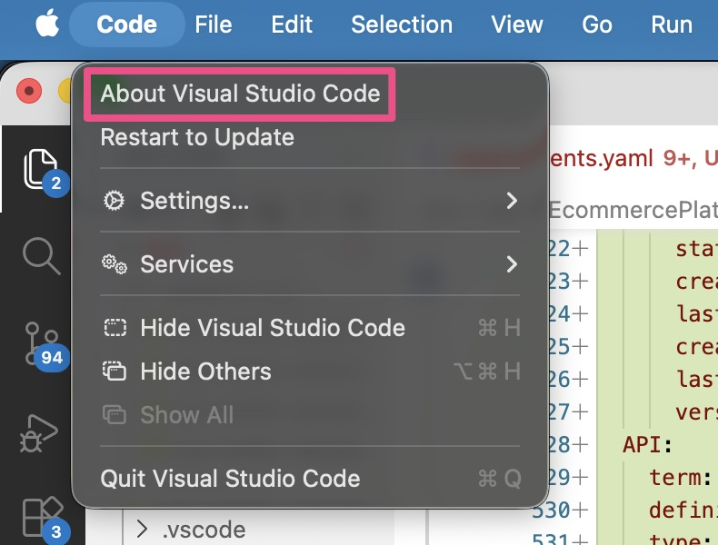
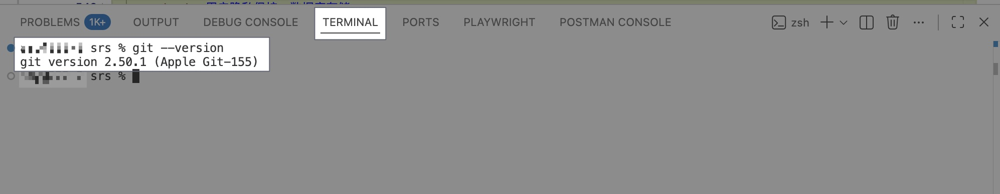
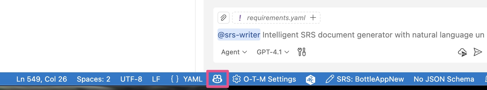
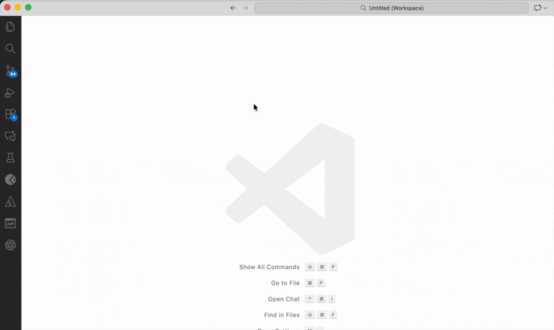

# Installation & Initialization Guide

> **Time required**: ~10 minutes

---

## Prerequisites

Make sure the following are ready:

- ✅ **VS Code 1.102.0 or above+**  
  Check via `Help` → `About` (macOS: `Code` → `About Visual Studio Code`).

- ✅ **Git installed**  
  Run `git --version` in a terminal.

- ✅ **GitHub Copilot subscription**  
  SRS Writer uses VS Code LM APIs provided by Copilot. Ensure the Copilot icon in the bottom-right is logged in and healthy.


> SRS Writer is free; Copilot provides the AI.

---

## Step 1: Install SRS Writer Via VS Code Marketplace

1. Open VS Code
2. Extensions view (`Cmd+Shift+X` / `Ctrl+Shift+X`)
3. Search **`SRS Writer`**
4. Install "SRS Writer" by Testany



---

## Step 2: Initialize a Workspace (recommended)

> Copies templates, sets defaults, initializes Git (`main` + `wip`), and creates `.session-log/` for session files.

1. Command Palette `Cmd+Shift+P` / `Ctrl+Shift+P`
2. Run **SRS Writer: Control Panel**
3. Pick **Create Workspace & Initialize**
4. Choose a parent folder → enter workspace name (letters/numbers/`-`/`_`)
5. VS Code will open the new workspace when finished


You’ll get:
- `.templates/` (chapter and prototype templates)
- `.vscode/settings.json` packaged with the extension
- Git repo with `main` and working `wip` branch
- `.session-log/` session files for multi-project switching

---

## Step 3: Verify & select a model

1. Status bar shows **SRS: ...** when the extension is active
2. Open Chat panel (`Cmd+Shift+I` / `Ctrl+Shift+I`) and type `@srs-writer` → icon should appear
3. Choose an AI model from the chat header (Copilot-provided; premium model recommended for quality)


---

## Troubleshooting

### ❌ "No AI model available"
1. Ensure Copilot is logged in (bottom-right icon)
2. Run `Developer: Reload Window`
3. Confirm subscription at [github.com/settings/copilot](https://github.com/settings/copilot) and sign in again

### ❌ `@srs-writer` not found in chat
1. `Developer: Reload Window`
2. Check the extension is installed/enabled
3. If still missing, uninstall then reinstall the extension

### ❌ Extension won’t install
1. Verify VS Code ≥ 1.102.0
2. Use VSIX offline install if Marketplace is blocked
3. Remove old cache then reinstall:
   ```bash
   rm -rf ~/.vscode/extensions/testany.srs-writer-plugin-*
   ```

---

## Next steps

- 👉 Try your first run: [Create Your First Document]([approved]getting-started-first-document.md)
- 👉 See the structure SRS Writer generates: [Document Structure]([approved]getting-started-document-structure.md)
- 👉 Stuck? Check [Troubleshooting]([approved]faq-error-messages.md)
