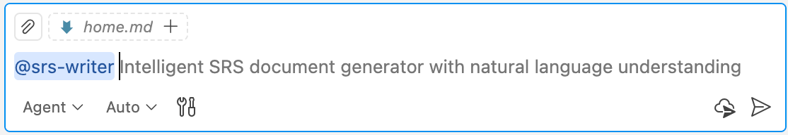

# Quality Improvement

> **Scenario**: Refine the SRS before sign-off  
> **Time**: 10–20 minutes per iteration

---

## Quality toolkit

- **`srs_reviewer`**: Multi-dimensional review (completeness, consistency, clarity, testability, traceability, compliance, etc.), reports issues by severity and can auto-fix.  
- **`syntaxChecker`**: Markdown/YAML validation; modes: basic / standard / strict.  
- **Traceability & IDs**: `requirements.yaml` uses entity IDs (FR/NFR/IFR/DAR/UC, etc.) to keep links consistent.

---

## Run a quality review

In chat:
Press `Ctrl+Shift+I` (Windows/Linux) or `Cmd+Shift+I` (macOS)

```
@srs-writer Run a quality check and list issues by severity
```

Typical response:
- Issues with section/requirement IDs + severity
- Fix suggestions or an option to auto-apply
- Traceability or testability gaps

Auto-apply fixes:
```
@srs-writer Apply the fixes above and summarize the changes
```

> Results appear in chat; no separate file is produced.

---

## Syntax & structure checks

`syntaxChecker` is on by default; configure via `srs-writer.syntaxChecker.*`:
- Markdown: `standard` linting (avoid formatting errors)
- YAML: `standard` / `strict` (structure + requirement schema validation)

Re-run checks when needed:
```
@srs-writer Re-run Markdown/YAML syntax checks
```

---

## Handling common issues

### Vague or untestable
```
@srs-writer FR-005 is too vague; add measurable criteria and acceptance tests.
```

### Traceability gaps
```
@srs-writer Identify and fill missing links between use cases, requirements, and tests; keep IDs stable.
```

### Missing or thin sections
```
@srs-writer Check for missing interface/data/risk sections and fill them per template.
```

### Weak NFRs
```
@srs-writer Add concrete NFRs for performance/security/reliability with targets and validation methods.
```

---

## Pre-commit review checklist

- No high-severity findings outstanding from the quality review  
- IDs and content aligned between `SRS.md` and `requirements.yaml`  
- Key sections present: summary, overall description, journeys/use cases, FR, NFR, interface/data, constraints/risks, prototype overview  
- Markdown/YAML checks pass  
- On `wip` branch, `git diff` reviewed before committing

---

[⬅️ Back: Multi-Project Management](scenario-multi-project.md) | [Next: FAQ ➡️]([approved]faq-common-questions.md)
