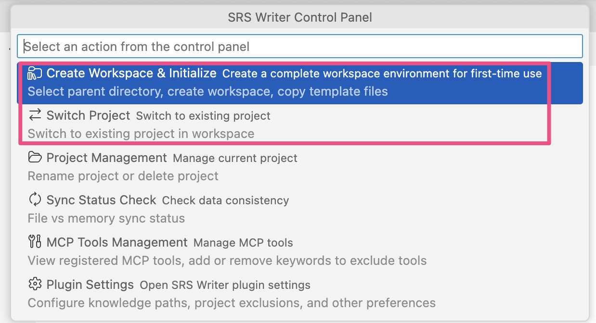

# 错误信息与解决方案

> 常见报错的含义与快速修复

---

## Copilot / 模型相关

### “No AI model available” / “GitHub Copilot is not active”
- 确认已登录 Copilot（右下角图标正常）。  
- 在命令面板运行 `GitHub Copilot: Sign In`，完成登录后重载窗口。  
- 确认已订阅 Copilot 并使用 VS Code 1.102.0+。  
- 重试后仍异常：重启 VS Code 或重新安装 Copilot 扩展。

### “LanguageModelError” / “Failed to connect to Language Model API”
- 检查网络、代理/VPN；确保 https://api.github.com 可访问。  
- 如果公司代理阻断，按需配置 VS Code `http.proxy`。  
- 这是服务端或网络瞬时问题时，等待几分钟后重试。

---

## 项目/会话相关

### “No project found in current workspace”
- 说明当前工作区未初始化或没有会话。  
- 运行 **SRS Writer: Control Panel → 创建工作区并初始化**，或在聊天中创建新项目。  
- 确保正在打开的目录就是初始化后的工作区根。

### “BaseDir validation failed” / “Project directory missing”
- 项目目录被移动/重命名。  
- 使用控制面板 **项目管理 → 重命名项目** 修复路径，或将目录移回工作区根。  

- 手动改名后记得运行 **同步状态检查** 或 **Force Sync Context**。

### 同步不一致 / 进度异常
- 使用控制面板 **同步状态检查** 查看问题。  
- 选择 **Force Sync Context**（命令面板）重新加载会话和文件。  
- 若仍异常，切换到其他项目再切回。

---

## 文件与路径

### “File not found” / “Cannot read file”
- 路径需相对项目根，文件必须在当前工作区内。  
- 不支持直接读取 `.docx`/`.pdf` 等二进制文件；先转换为 `.md` 或 `.txt`。  
- 确认在聊天中提供的路径与实际文件名一致，区分大小写。

---

## 仍未解决？
- 运行 **开发者工具**（`Cmd+Opt+I` / `Ctrl+Shift+I`）查看控制台错误。  
- 截图/复制完整错误信息，在 [GitHub Issues](https://github.com/Testany-io/srs-writer-plugin/issues) 提交。  
- 说明 VS Code 版本、SRS Writer 版本（0.8.2）、触发步骤和日志片段。

