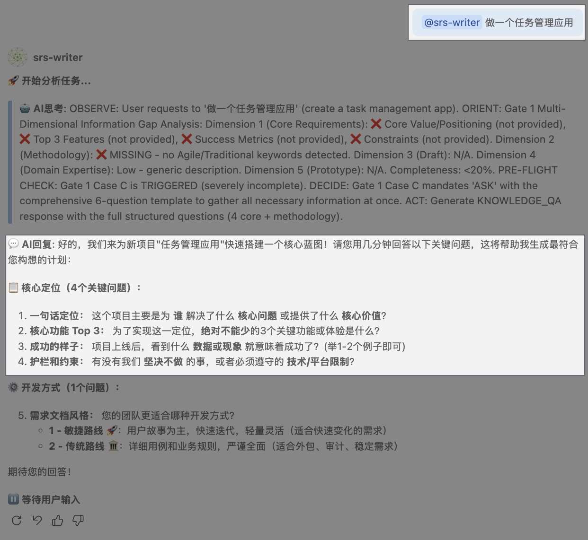
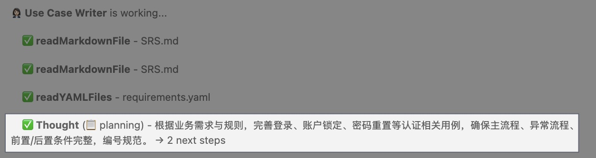
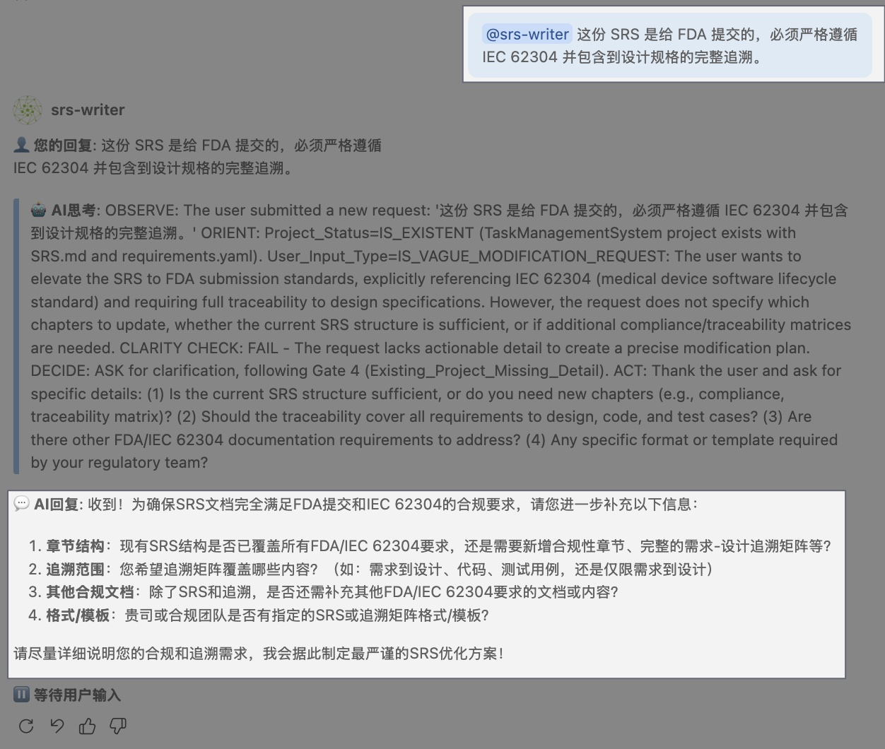

# 如何与 SRS Writer 对话

> **学习目标**：掌握获得更好需求的对话技巧

---

## 概述

SRS Writer 理解自然语言，但**如何**与它交流会极大影响输出质量。本指南分享来自真实用户的实用技巧。

---

## ✅ 有效的对话模式

### 模式 1：提供上下文

**为什么有效**：上下文帮助 SRS Writer 理解你的业务领域、规模和约束。

**模板**：

```text
@srs-writer 我需要一个 [系统类型]，给 [谁使用]。
[他们需要做什么]。[约束或特殊要求]。
```

**示例**：

**好** ✅：

```text
@srs-writer 我需要一个任务管理系统，给 20 人的软件团队使用。
他们需要创建任务、分配给团队成员、设置优先级和截止日期、
跟踪进度、接收通知。我们现在用 JIRA 但太复杂了。
```


**为什么有效**：

- 指明了用户（软件团队，20 人）
- 列出了核心需求（创建、分配、跟踪、通知）
- 提到了背景（从 JIRA 迁移）
- 暗示简洁性很重要

---

**好** ✅：

```text
@srs-writer 我需要一个报销系统，给 200 人的公司使用。
员工提交报销单和发票。财务团队审核批准。
CFO 需要月度报表。我们每月处理约 500 笔报销。
```

**为什么有效**：

- 用户角色清晰（员工、财务、CFO）
- 工作流程已定义（提交 → 审核 → 报表）
- 规模已说明（200 人，500 笔/月）

---

**太模糊** ❌：

```text
@srs-writer 做一个任务管理应用
```



**问题**：没有用户、规模或需求的上下文。SRS Writer 只能猜测。

---

### 模式 2：描述用户旅程

**为什么有效**：故事帮助 SRS Writer 推断隐含需求。

**模板**：

```text
@srs-writer 这是用户使用系统的方式：

1. [用户] 通过 [方式] 做 [动作]
2. [系统] 然后 [响应]
3. [用户] 还可以 [可选动作]
```

**示例**：

```text
@srs-writer 这是登录流程的工作方式：

1. 用户在登录页面输入邮箱和密码
2. 系统验证凭据并检查账户是否激活
3. 如果正确，用户跳转到仪表盘
4. 如果密码错误 3 次，账户锁定 15 分钟
5. 用户可以点击"忘记密码"收到重置邮件
```




**SRS Writer 推断出**：

- 安全需求：失败后账户锁定
- 用户体验：需要密码重置流程
- 系统行为：激活/未激活账户状态
- 错误处理：多种失败场景

---

### 模式 3：使用具体示例

**为什么有效**：具体示例澄清抽象需求。

**模板**：

```text
@srs-writer 例如，[包含实际值的具体场景]
```

**示例**：

```text
@srs-writer 系统需要处理批量导入。

例如：
- 财务团队每周五上传包含 500 笔交易的 CSV
- 每行包含：日期、供应商、金额、类别、发票 URL
- 系统先验证所有行，然后在没有错误时导入
- 如果任何行无效，高亮显示错误并拒绝整个批次
```


**这澄清了**：

- 导入格式（CSV）
- 数据结构（具体字段）
- 验证方式（全部或无）
- 错误处理（高亮错误，不部分导入）

---

### 模式 4：说明目标受众

**为什么有效**：SRS Writer 会调整语气和详细程度。

**给客户的提案**：

```text
@srs-writer 这份 SRS 是给客户的提案，需要非常专业，
包含安全和合规章节，用商业语言解释技术决策。
```


**给内部开发团队**：

```text
@srs-writer 这是给开发团队的内部文档。
专注于技术细节、API 规格和数据库设计。
保持实用，跳过商业论证。
```


**给监管提交**：

```text
@srs-writer 这份 SRS 是给 FDA 提交的，必须严格遵循
IEC 62304 并包含到设计规格的完整追溯。
```



---

### 模式 5：分步迭代

**为什么有效**：将复杂需求拆分成小对话能产生更好的结果。

**多轮对话**：

**第 1 轮**：

```text
@srs-writer 我需要一个销售手工艺品的电商平台。
先从用户注册和认证开始。
```

**第 2 轮**（审查输出后）：

```text
@srs-writer 很好！现在添加产品目录功能：
- 卖家可以上传产品，包含照片、描述、价格
- 买家可以浏览、搜索、按类别筛选
- 购物车和结账
```

**第 3 轮**：

```text
@srs-writer 添加 Stripe 支付集成
和订单确认的邮件通知。
```

**为什么比一个巨大的提示词更好**：

- 你可以在每步后审查和调整
- SRS Writer 逐步建立上下文
- 更容易早期发现和修正错误

---

## ❌ 要避免的模式

### 反模式 1：太技术化

**不好** ❌：

```text
@srs-writer 用 React SPA 做前端，Node.js 后端、Express、PostgreSQL，
Redis 做缓存，Docker 容器，部署在 AWS ECS 用 CloudFront CDN。
认证用 JWT，密码用 bcrypt，用 Redis 实现限流。
```

**问题**：这些是**实现细节**，不是需求。

**更好** ✅：

```text
@srs-writer 构建一个 Web 应用，需要：
- 支持 1,000 个并发用户
- 200ms 内响应用户操作
- 安全存储用户数据
- 任何有网络的地方都能访问
- 每小时处理 10,000 个 API 请求
```

> 💡 **规则**：描述系统**做什么**（需求），而不是**怎么做**（实现）。

---

### 反模式 2：太简短

**不好** ❌：

```text
@srs-writer 做一个 CRM 系统
```

**问题**：CRM 可以有很多含义。没有提供上下文。

**更好** ✅：

```text
@srs-writer 做一个 CRM 系统给小型销售团队（5 人）使用。
他们需要跟踪线索、安排跟进、记录通话和邮件、
查看显示交易阶段和金额的销售管道仪表盘。
```

---

### 反模式 3：太冗长

**不好** ❌：

```text
@srs-writer [粘贴 10 页会议记录、PRD 和头脑风暴文档]
生成完整需求
```

**问题**：信息过多会混淆优先级。

**更好** ✅：

```text
@srs-writer 我有启动会的会议记录。让我分享关键点：

目标：
- [3-4 个主要目标]

核心功能：
- [5-7 个必备功能]

约束：
- [2-3 个主要约束]

能基于此生成 SRS 吗？我会在后续提供更多细节。
```

然后在后续消息中提供更多上下文。

---

### 反模式 4：混合需求和实现

**不好** ❌：

```text
@srs-writer 用户需要登录。用 Google 和 Facebook 的 OAuth。
会话存 Redis 24 小时过期。用 JWT token。
```

**更好** ✅：

```text
@srs-writer 用户需要用 Google 或 Facebook 账号登录。
会话在最后活动后保持 24 小时有效。
```

**让 SRS Writer 处理实现细节**放在"系统设计"章节，而你专注于需求。

---

## 🎯 对话流程

典型对话的演进过程：

```text
┌─────────────────────────────────────────────────────┐
│ 你：初始项目描述                                      │
│                                                     │
│ "我需要 [系统] 给 [用户] 来 [目标]"                   │
└──────────────────┬──────────────────────────────────┘
                   ↓
┌─────────────────────────────────────────────────────┐
│ SRS Writer：生成初始 SRS                             │
│                                                     │
│ - 项目概述                                          │
│ - 核心功能需求                                       │
│ - 基本非功能需求                                     │
└──────────────────┬──────────────────────────────────┘
                   ↓
┌─────────────────────────────────────────────────────┐
│ 你：审查并提供反馈                                    │
│                                                     │
│ "添加功能 X"                                         │
│ "澄清需求 Y"                                         │
│ "删除功能 Z"                                         │
└──────────────────┬──────────────────────────────────┘
                   ↓
┌─────────────────────────────────────────────────────┐
│ SRS Writer：更新 SRS                                 │
│                                                     │
│ 同时更新 SRS.md 和 requirements.yaml                 │
└──────────────────┬──────────────────────────────────┘
                   ↓
┌─────────────────────────────────────────────────────┐
│ 你：请求质量审查                                      │
│                                                     │
│ "@srs-writer 做一轮质量检查并列出需要改进的章节"       │
└──────────────────┬──────────────────────────────────┘
                   ↓
┌─────────────────────────────────────────────────────┐
│ SRS Writer：解释质量问题                              │
│                                                     │
│ 按严重度/章节给出改进建议并可自动修正                  │
└──────────────────┬──────────────────────────────────┘
                   ↓
┌─────────────────────────────────────────────────────┐
│ 你：处理质量问题                                      │
│                                                     │
│ "让需求 FR-005 更具体"                               │
└──────────────────┬──────────────────────────────────┘
                   ↓
              [重复直到满意]
```

---

## 🔧 特殊命令和关键词

SRS Writer 理解自然语言，这些短语会触发特定行为：

### 添加内容

```text
@srs-writer 添加一个功能 [描述]
@srs-writer 添加一条关于 [方面] 的非功能需求
@srs-writer 增加一个关于 [主题] 的章节
```

---

### 修改内容

```text
@srs-writer 把 [旧描述] 改成 [新描述]
@srs-writer 更新需求 FR-XXX 包含 [修改]
@srs-writer 让 [需求] 更详细/更具体
```

---

### 删除内容

```text
@srs-writer 删除 [功能/需求]
@srs-writer 删除所有与 [主题] 相关的内容
```

---

### 澄清需求

```text
@srs-writer 详细解释需求 FR-XXX
@srs-writer 把 [功能] 拆分成更小的需求
@srs-writer [章节] 缺少什么？
```

---

### 质量检查

```text
@srs-writer 做一轮质量检查，按严重度列出需要修改的章节
@srs-writer 直接修复质量问题并说明修改点
@srs-writer 哪些需求不可测试或不够具体？
@srs-writer 需求 FR-XXX 是否满足可测试性？给出改进建议
```

---

### 处理现有内容

```text
@srs-writer 基于这个 [粘贴文档]，生成需求
@srs-writer 读取文件 [路径] 并整合进来
@srs-writer 把这个与现有需求合并：[内容]
```

---

## 💡 专业技巧

### 技巧 1：明确优先级

```text
@srs-writer 以下功能是 v1.0 的必备项：
- 用户认证
- 产品列表
- 购物车

这些是 v2.0 的可选项：
- 社交分享
- 心愿单
- 产品评价
```

SRS Writer 会在 requirements.yaml 中相应标记优先级。

---

### 技巧 2：尽早提及约束

```text
@srs-writer 重要约束：
- 预算：5 万美元
- 时间：3 个月
- 团队：3 个开发、1 个设计
- 用户：主要是移动端（70% 移动，30% 桌面）
```

这帮助 SRS Writer 提出切实可行的建议。

---

### 技巧 3：提供反面示例

```text
@srs-writer 对于管理后台：
- 要包含：用户管理、报表、系统设置
- 不要包含：复杂的分析仪表盘（我们用 Tableau）
```

说清**不要**什么可以防止范围蔓延。

---

### 技巧 4：要求解释

如果有不理解的地方：

```text
@srs-writer 为什么包含 [需求]？
@srs-writer 能解释一下 [决策] 背后的原因吗？
```

SRS Writer 会解释它的思路。

---

### 技巧 5：引用外部文档

如果有 URL 或文件路径：

```text
@srs-writer 查看我们的 API 文档 [URL] 并确保
需求与现有 API 结构一致
```

*注意：这需要配置 MCP 才能访问外部内容*

---

## 🎓 示例学习

来看一个产出高质量需求的完整对话：

### 示例：构建客户支持工单系统

**用户**：

```text
@srs-writer 我需要一个客户支持工单系统，给我们的 SaaS 公司用。

背景：
- 支持团队：10 个客服
- 客户：500 家 B2B 公司
- 当前痛点：用邮件，难以跟踪和排优先级
- 必须集成我们现有的认证系统

核心工作流：
1. 客户通过网页表单或邮件提交工单
2. 系统根据类别自动分配给可用客服
3. 客服回复，工单状态更新
4. 客户可以回复，添加到工单线程
5. 经理看到仪表盘展示指标（响应时间、解决时间、积压）
```

**SRS Writer**：[生成包含功能需求的初始 SRS]

---

**用户**（审查后）：

```text
@srs-writer 开始不错！添加这些需求：

优先级和 SLA：
- 工单有优先级：低、中、高、紧急
- SLA 计时：紧急=1小时，高=4小时，中=24小时，低=3天
- SLA 风险时（已过 80% 时间）显示视觉告警

分类：
- 类别：技术、账单、功能请求、Bug 报告
- 每个类别路由到专门客服
- 客户提交后不能更改类别（防止作弊）
```

**SRS Writer**：[更新 SRS，添加优先级/SLA 和分类需求]

---

**用户**：

```text
@srs-writer 现在检查 SRS 的质量
```

**SRS Writer**（示例响应）：

```text
质量审查摘要：
- 完整性：覆盖核心流程，但缺少异常处理
- 清晰度/可测试性：FR-005、NFR-003 需要补充量化标准

改进建议：
1) FR-005 "自动分配给可用客服" 需定义“可用”与无客服时的处理
2) NFR-003 "响应时间" 需明确目标值、适用范围
可自动应用修复，是否继续？
```

---

**用户**：

```text
@srs-writer 发现得好！修复这些问题：

关于自动分配：
- "可用"意味着客服状态是"在线"且未处理工单少于 10 个
- 如果没有客服可用，工单进入队列，所有客服可见
- 客服可以从队列手动认领

关于响应时间：
- API 响应：95 分位 < 200ms
- 网页加载：< 2 秒
- 数据库查询：读操作 < 100ms
```

**SRS Writer**：[更新需求，添加具体、可测试的标准]

---

**最终结果**：高质量 SRS 包含：

- 清晰的上下文和约束
- 详细的工作流程
- 具体、可测试的需求
- 质量审查通过，剩余问题可追踪

---

## 🚀 下一步

**练习这些模式**：

1. 开始一个新项目
2. 使用本指南中的"好"模式
3. 根据 SRS Writer 的输出迭代
4. 检查质量并改进

**继续学习**：
👉 [理解文档结构](getting-started-document-structure.md)
👉 [常见场景](scenario-import-existing.md)

---

**有问题？** [查看常见问题](faq-common-questions.md) 或 [社区讨论](https://github.com/Testany-io/srs-writer-plugin/discussions)

---

[⬅️ 上一篇：文档结构与示例](getting-started-document-structure.md) | [下一篇：控制面板与状态检查 ➡️](scenario-control-panel.md)
