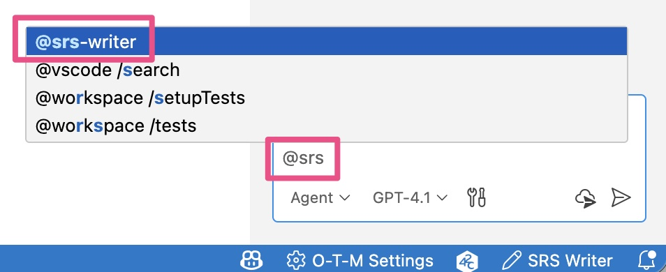

# 安装与初始化指南

> **所需时间**：约 10 分钟

---

## 环境要求

安装前请确认：

- ✅ **VSCode 1.102.0及以上+**
  - 打开 VSCode → `帮助` → `关于`（macOS：`Code` → `关于 Visual Studio Code`）查看版本

- ✅ **Git 已安装**
  - 在终端运行 `git --version` 验证；用于初始化仓库与分支

- ✅ **GitHub Copilot 订阅**
  - SRS Writer 依赖 VS Code LM API，需有效的 Copilot 账号
  - 右下角 Copilot 图标需处于登录状态，异常时点击登录


> SRS Writer 免费，但 AI 能力由 Copilot 提供。

---

## 第 1 步：通过 VSCode 应用商店安装 SRS Writer 扩展

1. 打开 VSCode
2. 点击左侧边栏的**扩展**图标
   - 或按 `Cmd+Shift+X`（Mac）/ `Ctrl+Shift+X`（Windows/Linux）
3. 在搜索框中输入：**`SRS Writer`**
4. 找到 Testany 发布的 "SRS Writer"
5. 点击**安装**按钮


---

## 第 2 步：初始化工作区（推荐）

> 目的：复制模板、生成默认设置、初始化 Git（`main` + `wip`）并创建 `.session-log/`，确保后续文档编辑和会话管理一致。

1. 打开命令面板 `Cmd+Shift+P` / `Ctrl+Shift+P`
2. 运行 **SRS Writer: Control Panel**
3. 选择 **Create Workspace & Initialize**
4. 选择父目录 → 输入工作区名称（仅限字母/数字/`-`/`_`）
5. 等待完成，VS Code 会自动打开新工作区


完成后，工作区包含：
- `.templates/`（SRS 章节与原型模板）
- `.vscode/settings.json`（随扩展打包的默认设置）
- Git 仓库：`main` 分支 + 日常工作的 `wip` 分支
- `.session-log/`（会话文件，支持多项目切换）

---

## 第 3 步：验证安装

### 检查扩展是否已激活
1. 状态栏右下角显示 **SRS: ...** 图标
2. 扩展视图中 "SRS Writer" 状态为“已安装”

### 打开聊天面板
1. 按 `Cmd+Shift+I`（Mac）/ `Ctrl+Shift+I`（Windows/Linux）
2. 输入 `@srs-writer`，应能看到图标和提示



### 选择 AI 模型
1. 聊天面板顶部选择可用模型（来自 Copilot）
2. 常用模型：标准/高级模型（质量优先建议高级）

---

## 故障排除

### ❌ "No AI model available"

1. 确认 Copilot 已登录（右下角图标正常）
2. `Developer: Reload Window` 刷新 VS Code
3. 在 [github.com/settings/copilot](https://github.com/settings/copilot) 确认订阅有效并重新登录

---

### ❌ 聊天中看不到 `@srs-writer`

1. `Developer: Reload Window` 刷新 VS Code
2. 扩展视图确认未被禁用
3. 仍异常时卸载后重新安装

---

### ❌ 扩展无法安装

1. 确认 VS Code 版本 ≥ 1.102.0
2. 市场不可达时使用 VSIX 离线安装
3. 关闭 VS Code 后删除旧版本缓存再安装：
   ```bash
   rm -rf ~/.vscode/extensions/testany.srs-writer-plugin-*
   ```

---

## 下一步

✅ 安装与初始化完成

- 👉 首次体验：[创建第一个文档](getting-started-first-document.md)
- 👉 了解结构与示例：[文档结构](getting-started-document-structure.md)
- 👉 常见问题：[故障与错误处理](faq-error-messages.md)

---

**相关主题**：
- [环境要求](#环境要求)
- [GitHub Copilot 设置](https://github.com/features/copilot/getting-started)
- [VSCode 聊天面板指南](https://code.visualstudio.com/docs/copilot/copilot-chat)

---

**有问题？** [查看常见问题](faq-common-questions.md) 或 [社区讨论](https://github.com/Testany-io/srs-writer-plugin/discussions)

---

[⬅️ 返回首页](home.md) | [下一篇：创建第一个文档 ➡️](getting-started-first-document.md)
