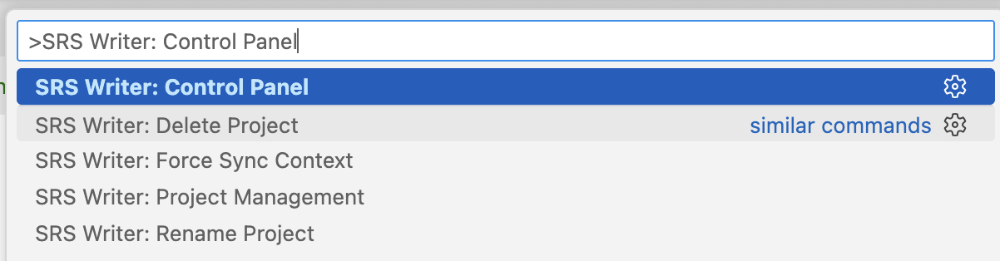
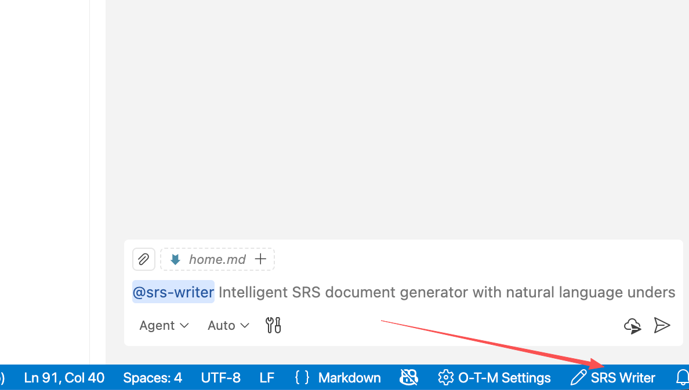

# SRS Writer - AI 驱动的需求工程助手

> **将对话转化为可交付的需求包，从数周缩短到数小时**

---

## 🎬 功能演示

*(演示视频即将上线)*

---

## 什么是 SRS Writer？

SRS Writer 是一款 **VSCode 插件**，通过 AI 对话驱动 16+ 专家模型协同，生成完整的需求工件包（`SRS.md`、`requirements.yaml`、`prototype/`、会话日志）。

**传统方式的痛点**：
- 需求整理、格式规范、质量评审都要手工完成
- 会议记录、草稿文件分散，容易遗漏
- 多项目切换缺乏一致的模板和追踪

**使用 SRS Writer 后**：
- ✅ 几小时内得到可交付的需求工件包
- ✅ 基于内置模板自动对齐 IEEE 830 结构
- ✅ 质量审查、语法检查和追踪矩阵自动完成
- ✅ 通过语义编辑支持安全迭代更新

---

## 💬 工作原理

**1. 在聊天面板召唤 `@srs-writer`**

```
@srs-writer 需要一个任务管理系统，能创建任务、分配成员、跟踪进度
```

**2. 编排器生成执行计划**
- 根据输入判定是新建（Greenfield）还是改造（Brownfield）
- 规划需要调用的工具和专家（内容/流程 specialist）
- 自动加载现有文件上下文（如 `SRS.md`、`requirements.yaml`、`source_draft.md`）

**3. 专家团队执行**
- `project_initializer` 创建目录、初始化 Git 并生成基础文件
- 内容专家产出章节（功能/非功能/接口/数据/原型等）
- `srs_reviewer` 给出质量审查和改进项
- 语义编辑器用 SID 精准改写文档

**4. 交付物**
- `SRS.md`（Markdown）
- `requirements.yaml`（结构化需求，含实体编号）
- `prototype/`（HTML/CSS/JS 雏形文件）
- 会话与操作日志（`.session-log/`）

**就这么简单。**

---

## ✨ 核心功能

### 💬 自然对话与计划执行
直接对话即可启动；编排器自动在对话问答、工具执行、计划执行三种模式间切换，无需记忆命令。

### 📊 内置质量与语法检查
`srs_reviewer` 基于模板进行结构、完整性、可行性、追踪性等多维审查；`syntaxChecker` 覆盖 Markdown/YAML（basic/standard/strict）。

### 🔄 安全的语义迭代
SID 定位 + 语义编辑引擎，支持章节级插入/替换/删除和 YAML KeyPath 修改，避免误改。

### 🧠 16+ Specialist 协同
覆盖功能/非功能/接口/数据/业务规则/原型/风险/总结等内容专家，以及项目初始化、格式化、质量审核、Git 操作等流程专家。

### 🔌 知识与工具集成（可选）
本地知识检索、企业 RAG（需配置 `srs-writer.rag.enterprise.*`）、可选互联网搜索，以及 VSCode/MCP 工具自动注册与排除关键字管理。

### 📏 标准与模板
随扩展分发 `.templates/`（SRS 章节、ID 约定、原型骨架），`requirements.yaml` Schema 位于 `config/schemas/requirement-entity-schemas.yaml`，开箱即用。

---

## 🚀 快速开始（3 步）

**第 1 步：准备环境**
- ✅ VSCode 1.102.0+
- ✅ Git 与 GitHub Copilot 订阅（VS Code LM 能力必需）

**第 2 步：安装并初始化工作区**
- 安装扩展后，在命令面板（`Cmd+Shift+P` / `Ctrl+Shift+P`）运行 **SRS Writer: Control Panel**

- 或者在VS Code界面的右下角，点击**SRS Writer**，弹出对话框


- 在对话框中，选择 **Create Workspace & Initialize**：

- 在新弹出对话框中，选择放置项目的父目录，然后会自动的复制 `.templates/`、生成 `.vscode/settings.json`、初始化 Git（`main` 与 `wip` 分支）、创建 `.session-log/` 会话文件


**第 3 步：生成文档**
- 配置完成后，打开聊天面板（`Cmd+Shift+I` / `Ctrl+Shift+I`）
- 输入：`@srs-writer [描述项目或粘贴草稿]`，就可以进行对话来生成文档了

- 按提示补充信息，等待专家团队写入 `SRS.md`、`requirements.yaml`、`prototype/`

⏱️ **总耗时**：约 10 分钟

📖 **[安装与初始化指南 →](getting-started-installation)**

---

## 💡 适用人群

### 👔 产品经理
笔记/会议纪要 → 结构化 SRS；自动追踪“需求 → 用例 → FR/NFR”链路。

### 📊 业务分析师
依赖质量审查、语法校验、追踪矩阵补全，降低遗漏与矛盾。

### 🏗️ 系统架构师
多章节模板、实体编号规则和语义编辑，保证复杂系统文档一致性。

### 👥 开发团队
将用户故事、待办事项转成正式规格，提交前可用 diff 与会话日志复核。

### 🏢 企业团队
需要隔离项目、Git 分支规范、企业 RAG 或 MCP 工具接入的团队。

---

## 🌐 语言 / Language

📖 [English Documentation](home) | [中文文档](home)

---

## 📞 支持与社区

- 💬 [GitHub 讨论区](https://github.com/Testany-io/srs-writer-plugin/discussions)
- 🐛 [问题反馈](https://github.com/Testany-io/srs-writer-plugin/issues)
- 📰 [更新日志](https://github.com/Testany-io/srs-writer-plugin/blob/main/CHANGELOG.md)
- ⭐ [GitHub Star](https://github.com/Testany-io/srs-writer-plugin)

---

## 🎯 下一步

**初次使用？**
👉 从 [安装与初始化](getting-started-installation) 开始

**已安装完成？**
👉 直接尝试 [创建第一个文档](getting-started-first-document)

**需要细化输出？**
👉 阅读 [对话与提示词技巧](getting-started-conversation-tips)

---

**版本**：0.8.2  
**更新日期**：2025-11-12  
**许可证**：Apache-2.0

---

**由 [Testany.io](https://testany.io) 用 ❤️ 打造**
