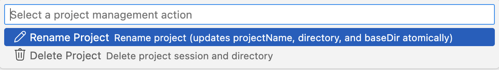

# 多项目管理

> **场景**：在多个项目间无缝切换  
> **耗时**：切换 < 10 秒

---

## 项目是如何隔离的

- 每个项目在工作区根目录下有独立文件夹：`SRS.md`、`requirements.yaml`、`prototype/` 等  
- `.session-log/`（位于工作区根目录）存储每个项目的会话文件，用于切换与恢复  
- Git 默认工作分支为 `wip`，切换时会校验并自动切换到 `wip`

---

## 快速切换项目

1. 在命令面板（`Cmd+Shift+P` / `Ctrl+Shift+P`）运行 **SRS Writer: Control Panel**

2. 选择 **切换项目 Swtich Project**  

3. 从列表选择目标项目（会显示会话状态、最近修改时间及目录有效性）  
4. 如有执行中的计划，会提示先安全停止；确认后完成切换

切换后：
- 状态栏显示当前项目名（如 `SRS: CRMSystem`）
- 加载该项目的会话上下文和文件路径
- 聊天上下文清空，避免串话

---

## 创建新项目

**推荐方式：聊天触发**: 打开聊天面板（`Cmd+Shift+I` / `Ctrl+Shift+I`）

```
@srs-writer 创建一个名为 "MobileAppBackend" 的新项目，
这是移动应用后端 API，请先生成骨架文档。
```

`project_initializer` 会：
- 创建项目目录（必要时自动重命名避免冲突）
- 在 `wip` 分支下初始化 `SRS.md`、`requirements.yaml`、`prototype/`
- 更新会话并记录到 `.session-log/`

> 不需要手动复制模板或创建会话文件；保持在已初始化的工作区内操作即可。

---

## 常见场景与建议

### 并行处理多个客户/产品
- 切换前先提交当前项目的变更（避免混合提交）
- 切换后确认状态栏项目名正确，再继续对话
- 若遇到路径错误或目录缺失，使用SRS的控制面板的 **同步状态检查 Sync Status Check** 或 **项目管理 Project Management** 修复

### 从老项目迁移/重命名
- 使用控制面板 → **项目管理Project Management → 重命名项目 Rename Project**，会原子更新目录与会话  

- 避免手动改文件夹，否则会触发路径校验失败

### 清理不再需要的项目
- 控制面板 → **项目管理Project Management → 删除项目 Delete Project**  
- 会将项目目录和会话文件移至回收站，并切回主会话

---

## 最佳实践

- **命名清晰**：包含产品/客户名和年份或版本，例如 `ClientPortal_2025`、`EcommerceAPI_Redesign`。  
- **保持 `wip` 工作分支**：切换后如发现不在 `wip`，先运行同步检查或强制同步。  
- **提交粒度小**：每个项目单独提交，避免跨项目混合变更。  
- **定期检查同步状态**：尤其在手动移动文件或拉取远程仓库后，使用 **同步状态检查** 识别潜在问题。

---

[⬅️ 上一篇：更新需求](scenario-update-requirements.md) | [下一篇：质量改进 ➡️](scenario-quality-improvement.md)
